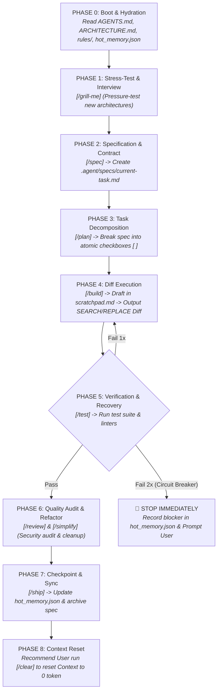

# 🔄 MASTER AGENT OPERATIONAL WORKFLOW & STATE MACHINE

> **Audience**: AI Coding Agents (`jcode`, `antigravity`, `claude`, `cursor`, `roo code`, etc.)
> **Purpose**: Complete end-to-end execution algorithm, state transitions, and recovery protocols.

---

## 🗺️ 1. END-TO-END STATE MACHINE DIAGRAM



---

## ⚡ 2. TWO EXECUTION PATHWAYS

### Path A: Standard Feature Pathway (Full SDD)
Use when implementing any new feature, major refactor, or multi-file change.
- **Sequence**: `/grill-me` (optional) ➔ `/spec` ➔ `/plan` ➔ `/build` ➔ `/test` ➔ `/review` ➔ `/ship` ➔ `/clear`.

### Path B: Fast-Track Pathway (Mini Bug Fix)
Use ONLY for trivial 1-liner bug fixes, typo fixes, or single configuration tweaks.
- **Sequence**: Read `hot_memory.json` ➔ Draft quick plan in `.agent/scratchpad.md` ➔ `/build` Diff Edit ➔ `/test` ➔ `/ship`.

---

## 📋 3. STEP-BY-STEP PHASE ALGORITHM

### Phase 0: Boot & State Hydration
- **Actions**:
  1. Inspect `AGENTS.md` and `.agent/rules/00-core.md`.
  2. Inspect `ARCHITECTURE.md` to understand tech stack and directory boundaries.
  3. Inspect `.agent/memory/hot_memory.json` to load active milestone and checkpoint.
- **Constraint**: DO NOT modify static files to preserve 95%+ Prompt Caching discount.

### Phase 1: Interactive Stress-Test (`/grill-me`)
- **Trigger**: New architectural idea, underspecified feature, or user request.
- **Algorithm**:
  - Ask ONE focused question per turn.
  - Provide a sensible default recommended answer based on codebase inspection.
  - Iterate until all edge cases (error handling, security, performance) are resolved.

### Phase 2: Feature Specification (`/spec`)
- **Trigger**: `/spec <feature-name>`
- **Output**: Write `.agent/specs/current-task.md` containing:
  - Goal statement (1 sentence).
  - Scope boundaries & affected files.
  - Verification commands (project test runner).

### Phase 3: Task Decomposition (`/plan`)
- **Trigger**: `/plan`
- **Output**: Populate `.agent/specs/current-task.md` with atomic checkboxes `[ ]`. Each task must be < 15 minutes of work.

### Phase 4: Diff Execution (`/build`)
- **Trigger**: `/build`
- **Algorithm**:
  1. Write active thought process into `.agent/scratchpad.md`.
  2. Modify code ONLY using Search & Replace Diff blocks:
```diff
<<<<<<< SEARCH
[exact original code chunk]
=======
[replacement code chunk]
>>>>>>> REPLACE
```
  3. **Auto-check Completion**: Mark `- [ ]` as `- [x]` in `.agent/specs/current-task.md` for completed items.

### Phase 5: Automated Verification & Failure Recovery (`/test`)
- **Trigger**: `/test`
- **Algorithm**:
  1. Execute project test suite / linter.
  2. **If Pass**: Proceed to Phase 6.
  3. **If Fail Attempt 1**: Append error stdout/stderr to `.agent/scratchpad.md`, attempt 1 minimal diff fix, re-test.
  4. **If Fail Attempt 2 (Circuit Breaker)**: STOP immediately. Record blocker in `hot_memory.json` (`active_blockers`) and request User guidance. DO NOT loop infinitely.

### Phase 6: Code Audit & Simplification (`/review` & `/simplify`)
- **Trigger**: `/review` or `/simplify`
- **Algorithm**: Audit for OWASP top 10, memory leaks, and cyclomatic complexity. Simplify logic via Diff blocks.

### Phase 7: Checkpoint & Memory Sync (`/ship`)
- **Trigger**: `/ship <summary>`
- **Algorithm**:
  1. Ensure all `.agent/specs/current-task.md` checkboxes are completed `[x]`.
  2. Update `.agent/memory/hot_memory.json` (`last_successful_checkpoint`, `learnings`).
  3. Append major ADRs to `.agent/memory/cold_memory.md` if applicable.
  4. Move `.agent/specs/current-task.md` to `.agent/specs/archive/`.
  5. Reset `.agent/scratchpad.md`.

### Phase 8: Context Window Reset (`/clear`)
- **Action**: Inform User task is shipped and recommend running `/clear` to reset context window to 0 tokens.
