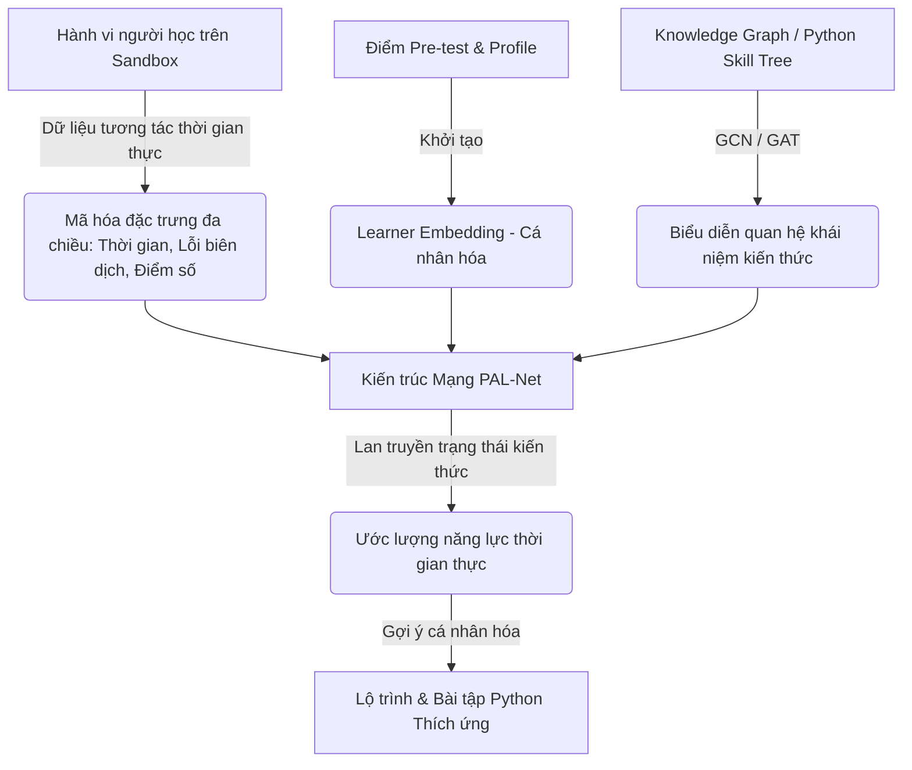

# TÀI LIỆU CHUẨN BỊ PHẢN BIỆN TRƯỚC HỘI ĐỒNG
## Đề tài: Xây dựng hệ thống học tập lập trình trực tuyến thích ứng dựa trên khung mô hình PAL-Net
---

Dưới đây là nội dung phân tích học thuật, logic và mang tính phản biện cao, được biên soạn dưới vai trò một chuyên gia AI trong lĩnh vực EdTech và Knowledge Tracing. Tài liệu này giúp bạn tự tin trả lời câu hỏi của Hội đồng tuyển chọn/bảo vệ đề cương về việc so sánh và chứng minh sự vượt trội của **PAL-Net** so với **BKT** và **DKT**.

---

### 1. Nhược điểm cốt lõi của các mô hình truyền thống trong ngữ cảnh dạy lập trình

Để chứng minh tính ưu việt của PAL-Net, trước hết chúng ta cần chỉ ra những giới hạn mang tính hệ thống của các phương pháp Knowledge Tracing (Theo dõi kiến thức) truyền thống khi áp dụng vào một miền kiến thức đặc thù và có tính thực hành cao như **Lập trình (Programming)**.

#### a. Bayesian Knowledge Tracing (BKT) – Cơ chế và Điểm yếu cốt lõi
*   **Cơ chế:** BKT là mô hình dựa trên mạng Bayes tĩnh và Mô hình Markov ẩn (Hidden Markov Model - HMM). Nó giả định trạng thái kiến thức của người học đối với một khái niệm (kỹ năng) cụ thể là một biến nhị phân ẩn (Binary Hidden State: *Đã làm chủ* hoặc *Chưa làm chủ*). Mô hình cập nhật trạng thái này dựa trên chuỗi câu trả lời đúng/sai thông qua 4 tham số xác suất: 
    *   $P(L_0)$ (Năng lực ban đầu),
    *   $P(T)$ (Xác suất chuyển trạng thái từ chưa biết sang biết sau khi thực hành),
    *   $P(G)$ (Xác suất đoán mò đúng - Guess),
    *   $P(S)$ (Xác suất làm sai do bất cẩn - Slip).
*   **Điểm yếu trong dạy lập trình:**
    *   **Giả định các kỹ năng độc lập (Skill Independence Assumption):** BKT giả định rằng mỗi khái niệm kiến thức (Knowledge Component - KC) hoạt động độc lập và được mô hình hóa bằng một chuỗi Markov riêng biệt. Tuy nhiên, trong lập trình Python, kiến thức có tính phân cấp và tích lũy rất cao (được mô tả bằng một cây kỹ năng hoặc đồ thị tri thức). Ví dụ, để viết được một vòng lặp `for` duyệt qua danh sách và lọc phần tử (List Slicing kết hợp `if-else`), người học phải đồng thời vận dụng kiến thức về biến, kiểu dữ liệu tuần tự, cấu trúc điều kiện, và vòng lặp. BKT hoàn toàn bất lực trong việc mô hình hóa mối quan hệ phụ thuộc chéo (Prerequisite/Dependency relationships) phức tạp này.
    *   **Giới hạn trạng thái nhị phân (Binary Constraint):** BKT chỉ coi trạng thái kiến thức là $0$ hoặc $1$. Trong khi đó, việc học lập trình yêu cầu đo lường năng lực theo các cấp độ nhận thức phi tuyến tính (như thang đo Bloom: nhớ cú pháp, hiểu luồng chạy, áp dụng thuật toán, tối ưu hóa code).

#### b. Deep Knowledge Tracing (DKT) – Cơ chế và Điểm yếu cốt lõi
*   **Cơ chế:** DKT sử dụng các kiến trúc mạng nơ-ron hồi quy như RNN (Recurrent Neural Network) hoặc LSTM (Long Short-Term Memory) để xử lý chuỗi hành động của người học theo thời gian. Đầu vào là chuỗi tương tác (câu hỏi $x_t$ và kết quả đúng/sai $y_t$), trạng thái ẩn $h_t$ đại diện cho toàn bộ trạng thái kiến thức tích lũy của học viên, và đầu ra là dự đoán xác suất trả lời đúng các câu hỏi tiếp theo.
*   **Điểm yếu trong dạy lập trình:**
    *   **Tính chất "Hộp đen" (Black-Box Nature - Thiếu tính giải thích được):** DKT có độ chính xác dự đoán cao nhưng các vector trạng thái ẩn $h_t$ nằm ở không gian nhiều chiều phi tuyến tính và hoàn toàn không có ý nghĩa ngữ nghĩa trực quan. Hệ thống không thể giải thích rõ ràng cho người học hoặc giáo viên biết *tại sao* hệ thống lại đưa ra bài tập này, hoặc học viên đang hổng chính xác ở mảnh ghép kiến thức nào (ví dụ: lỗi logic lặp vô hạn hay lỗi thụt lề `IndentationError` trong Python). Điều này làm giảm độ tin cậy khi xây dựng module gợi ý lộ trình thích ứng.
    *   **Thiếu cá nhân hóa sâu theo đặc thù lập trình:** DKT truyền thống chỉ học từ chuỗi nhị phân $0/1$ (đúng/sai). Trong thực hành code Python, hành vi của học viên phong phú hơn nhiều: thời gian viết code, số lần bấm nút biên dịch (compile), các loại lỗi trả về từ Sandbox (SyntaxError, TypeError, IndexError) hay cấu trúc code thay đổi qua mỗi lần submit. DKT không thể tích hợp các đặc trưng tương tác đa chiều này vào mạng nơ-ron một cách hiệu quả.
    *   **Vấn đề Khởi tạo lạnh (Cold-start):** Với học viên mới chưa có lịch sử làm bài, DKT hoạt động kém hiệu quả do thiếu chuỗi thời gian để cập nhật trạng thái ẩn.

---

### 2. Kiến trúc và cơ chế vượt trội của PAL-Net

**PAL-Net (Personalized Adaptive Learning Network)** được thiết kế để khắc phục triệt để các giới hạn của cả BKT và DKT bằng cách kết hợp biểu diễn đa chiều: **Mô hình hóa người học**, **Đồ thị tri thức (Knowledge Graph)** và **Dữ liệu tương tác thực tế**.

#### a. Nguyên lý hoạt động tổng quát
*   **Tích hợp Đồ thị Tri thức (Knowledge Graph Integration):** Thay vì coi các khái niệm lập trình độc lập, PAL-Net nhúng trực tiếp cây kỹ năng lập trình (ví dụ: cấu trúc Python Skill Tree) vào mô hình. Sử dụng mạng tích chập đồ thị (GCN - Graph Convolutional Network) hoặc mạng chú ý đồ thị (GAT - Graph Attention Network), PAL-Net học được biểu diễn không gian (spatial representation) của các kỹ năng. Khi học viên làm bài về "Hàm trong Python", năng lực của họ ở các khái niệm liên quan như "Biến cục bộ/toàn cục" hoặc "Tham số truyền vào" cũng được cập nhật đồng thời dựa trên trọng số liên kết của đồ thị.
*   **Cơ chế chú ý (Attention Mechanism):** Thay vì chỉ tóm tắt lịch sử học tập vào một vector ẩn duy nhất như LSTM (dễ bị lu mờ thông tin theo thời gian), cơ chế Attention trong PAL-Net cho phép mô hình nhìn lại toàn bộ lịch sử học tập và tìm ra mối tương quan trực tiếp giữa bài tập hiện tại với các hành vi cụ thể trong quá khứ của người học.

#### b. Tính "Cá nhân hóa" (Personalized) và "Thích ứng" (Adaptive) ở cấp độ kiến trúc
*   **Tính Cá nhân hóa (Personalized) ở mức kiến trúc mạng:**
    *   PAL-Net không chỉ dự đoán dựa trên lịch sử làm bài của đám đông. Nó tích hợp một thành phần gọi là **Learner Embedding (Nhúng người học)** vào các lớp ẩn của mạng nơ-ron. Vector Learner Embedding này được khởi tạo ban đầu thông qua **bài đánh giá năng lực đầu vào (Pre-test)** (giải quyết bài toán Cold-start) và liên tục được làm mịn bằng các đặc trưng tĩnh/động như: phong cách học tập, tốc độ tiếp thu, tỷ lệ lỗi biên dịch code Python.
    *   Do có Learner Embedding tham gia điều phối trọng số (weights) của mạng nơ-ron, hai học viên có cùng chuỗi câu trả lời đúng/sai giống nhau nhưng có năng lực nền tảng và thói quen sửa lỗi khác nhau sẽ nhận được dự đoán trạng thái kiến thức hoàn toàn khác nhau.
*   **Tính Thích ứng (Adaptive) ở mức kiến trúc mạng:**
    *   Quá trình thích ứng diễn ra qua **Cơ chế cập nhật trạng thái kiến thức thời gian thực (Real-time State Update)**. Ngay khi người học thực hiện submit code Python và nhận phản hồi từ Sandbox (ví dụ: vượt qua 4/5 testcases hoặc gặp lỗi logic `RecursionError`), thông tin này lập tức được mã hóa thành vector tương tác và đẩy vào PAL-Net.
    *   Mô hình thực hiện lan truyền xuôi trên đồ thị tri thức để cập nhật mức độ làm chủ (Mastery Level) của từng kỹ năng. Từ trạng thái kiến thức mới này, module đề xuất sẽ xác định **Vùng phát triển gần nhất (ZPD - Zone of Proximal Development)** của người học để tự động điều chỉnh độ khó và lựa chọn bài học/bài tập Python thích hợp nhất tiếp theo, tạo nên một vòng lặp thích ứng khép kín hoàn hảo.

---

### 3. Bảng so sánh tổng quan (Dùng để chiếu slide trình bày)

Bảng này cung cấp cái nhìn trực quan, cô đọng giúp Hội đồng dễ dàng nhận thấy sự khác biệt vượt trội của mô hình bạn lựa chọn:

| Tiêu chí so sánh | BKT (Bayesian Knowledge Tracing) | DKT (Deep Knowledge Tracing) | PAL-Net (Khung mô hình đề xuất) |
| :--- | :--- | :--- | :--- |
| **Cơ chế cốt lõi** | Mô hình Markov ẩn (HMM) tĩnh. | Mạng nơ-ron hồi quy (RNN / LSTM). | Mạng đồ thị tri thức (GCN/GAT) + Cơ chế Attention + Learner Embedding. |
| **Khả năng nắm bắt quan hệ kỹ năng** | **Kém / Không có** (Giả định các kỹ năng lập trình hoàn toàn độc lập). | **Trung bình** (Học ngầm định mối liên quan qua chuỗi thời gian, không có cấu trúc tường minh). | **Xuất sắc** (Tích hợp đồ thị tri thức/Skill Tree của Python trực tiếp vào kiến trúc mạng). |
| **Tính giải thích được (Interpretability)** | **Cao** (Các tham số xác suất rõ ràng về mặt toán học). | **Rất thấp (Hộp đen)** (Trạng thái ẩn phi tuyến tính, không thể giải thích lý do gợi ý bài tập). | **Cao** (Chỉ rõ sự thiếu hụt kiến thức dựa trên vị trí cụ thể trên đồ thị tri thức Python). |
| **Khả năng cá nhân hóa (Personalization)** | **Thấp** (Chỉ theo dõi mức độ thành thạo chung của từng kỹ năng). | **Trung bình** (Theo dõi chuỗi hành vi cá nhân nhưng nhạy cảm với nhiễu). | **Xuất sắc** (Kết hợp Learner Embedding, điểm Pre-test và lịch sử biên dịch lỗi đa chiều). |
| **Mức độ phù hợp với lập trình (Python)** | **Rất kém** (Không xử lý được các kỹ năng chồng chéo và thực hành đa tác vụ). | **Trung bình** (Phù hợp với trắc nghiệm Đúng/Sai, khó thích nghi với lỗi biên dịch/logic code). | **Tối ưu nhất** (Xử lý hoàn hảo các đặc trưng thực hành biên dịch code Python kết hợp đồ thị kỹ năng lập trình). |

---

### 4. Lập luận chốt (Takeaway message để trình bày trước Hội đồng)

Khi kết thúc phần trả lời câu hỏi này, bạn nên trình bày một cách tự tin, mạch lạc bằng đoạn phát biểu dưới đây để thuyết phục hoàn toàn Hội đồng:

> *"Kính thưa Hội đồng, việc quyết định lựa chọn khung mô hình PAL-Net thay vì các mô hình truyền thống như BKT hay DKT là một lựa chọn mang tính chiến lược và khoa học của đề tài. PAL-Net không chỉ khắc phục được hạn chế 'độc lập kỹ năng' của BKT nhờ vào việc nhúng trực tiếp Đồ thị tri thức Python tường minh, mà còn giải quyết được bài toán 'hộp đen' của DKT để cung cấp khả năng giải giải thích rõ ràng cho lộ trình gợi ý học tập.* 
> 
> *Sự kết hợp giữa đánh giá năng lực đầu vào (Pre-test) để giải quyết điểm yếu khởi tạo lạnh, cùng cơ chế cập nhật trạng thái kiến thức đa chiều theo thời gian thực (real-time) dựa trên tương tác code thực tế, giúp hệ thống cá nhân hóa sâu sắc lộ trình học lập trình Python cho từng học viên.*
>
> *Đây chính là cơ sở vững chắc đảm bảo tính khả thi, tính cập nhật công nghệ và giá trị thực tiễn vượt trội của hệ thống học tập thích ứng mà em đang xây dựng."*
