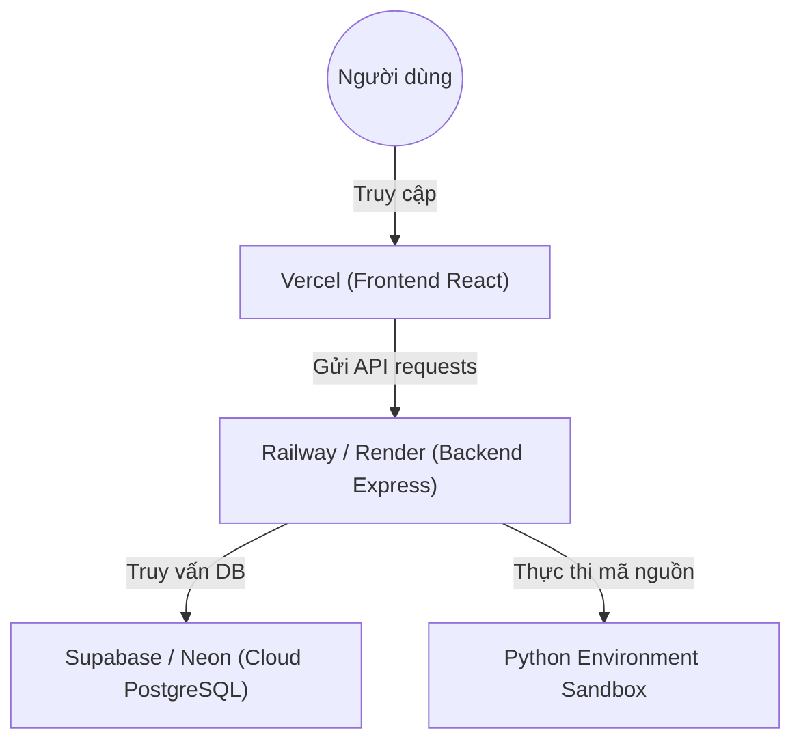

# Hướng Dẫn Deploy Ứng Dụng (Deployment Guide)

Việc deploy dự án này lên **Vercel** là khả thi nhưng sẽ cần chia nhỏ kiến trúc ra để deploy, bởi vì đây là một dự án Full-stack có tính năng biên dịch mã nguồn (chạy code Python).

Dưới đây là phân tích chi tiết và giải pháp tối ưu cho từng phần:

---

## 1. Phân Tích & Giải Pháp Cho Từng Thành Phần

### 1.1. Phần Frontend (React/Vite)
*   **Khả thi trên Vercel:** Rất tốt (100%)
*   **Chi tiết:** Vercel được tối ưu hoàn hảo cho các ứng dụng Frontend như React/Vite. Bạn chỉ cần kết nối repo GitHub vào Vercel, hệ thống sẽ tự động cấu hình build và deploy mỗi khi bạn push code mới.

### 1.2. Phần Backend (Express + Compiler Sandbox)
*   **Khả thi trên Vercel:** Không khuyến khích (Rất khó khăn)
*   **Lý do 1 (Stateless):** Backend của bạn sử dụng hệ thống hàng đợi (`codeExecutionQueue`) để xử lý các luồng biên dịch. Vercel Functions hoạt động theo dạng Serverless (vô trạng thái - stateless), tức là nó sẽ tắt đi khi không dùng và khởi động lại, điều này làm mất hàng đợi trong RAM.
*   **Lý do 2 (Sandbox chạy Python):** Tính năng chạy thử và chấm bài của ứng dụng cần gọi tiến trình con (child process) để thực thi lệnh python. Trên Vercel Serverless, bạn không thể cài đặt thêm môi trường Python tùy biến hoặc có đủ quyền chạy các sandbox bảo mật để thực thi code của người dùng.
*   **Giải pháp thay thế tốt nhất:** Deploy lên **Render**, **Railway**, hoặc **Fly.io**. Các nền tảng này cung cấp máy chủ dạng container chạy 24/7 (persistent server), hỗ trợ đầy đủ môi trường Node.js và cho phép cài đặt sẵn Python để biên dịch code bình thường.

### 1.3. Phần Cơ sở dữ liệu (PostgreSQL)
*   **Chi tiết:** Hiện tại bạn đang chạy PostgreSQL dưới máy local. Khi deploy, bạn cần chuyển cơ sở dữ liệu lên đám mây.
*   **Giải pháp tốt nhất:** Sử dụng dịch vụ PostgreSQL miễn phí của **Supabase** hoặc **Neon**. Sau đó, bạn chỉ cần lấy chuỗi kết nối (`DATABASE_URL`) cấu hình vào Prisma.

---

## 2. Mô Hình Triển Khai Tối Ưu (Deployment Architecture)

---

## 3. Các Bước Chuẩn Bị Triển Khai

### 3.1. Cơ sở dữ liệu (Database)
1. Tạo một dự án PostgreSQL miễn phí trên **Supabase** hoặc **Neon**.
2. Lấy đường dẫn kết nối `postgresql://...` và thay vào file `.env` của Backend.
3. Chạy lệnh `npx prisma db push` từ máy local để đồng bộ cấu trúc bảng (schema) lên cơ sở dữ liệu cloud.

### 3.2. Backend (Đẩy lên Render/Railway)
1. Khai báo môi trường chứa cả Node.js và Python (trên Render chỉ cần chọn thêm buildpack/Docker hoặc chọn môi trường hỗ trợ Python).
2. Cấu hình các biến môi trường: `DATABASE_URL`, `JWT_SECRET`, và cấu hình CORS để cho phép Frontend gọi API.

### 3.3. Frontend (Đẩy lên Vercel)
1. Thay đổi địa chỉ gọi API trong Frontend (thay vì gọi `http://localhost:3000` thì đổi thành địa chỉ backend mới deploy trên Render/Railway).
2. Deploy trực tiếp lên Vercel thông qua giao diện web chỉ bằng vài lượt click chuột kết nối GitHub.

---

> Bạn có muốn tôi hướng dẫn chi tiết cách tạo tài khoản DB trên Cloud (ví dụ: Supabase/Neon) để thử nghiệm bước đầu tiên không?
