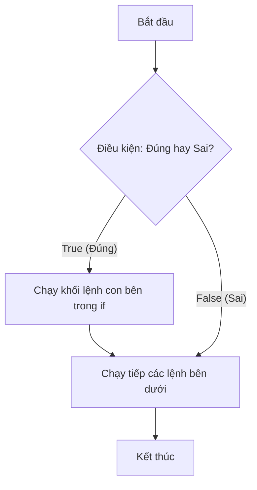

# 📘 Lesson 02.02: Khái niệm rẽ nhánh và Lệnh if

---

## 1. Khái niệm & Vấn đề

Mặc định, mã nguồn Python sẽ được thực thi tuần tự từ trên xuống dưới. Tuy nhiên, thế giới thực không vận hành đơn giản như vậy. Một ứng dụng cần biết tự rẽ nhánh xử lý trong các tình huống khác nhau:
* **Nếu** đăng nhập thành công ➔ Chuyển hướng vào trang chủ.
* **Nếu** tài khoản đủ số dư ➔ Thực hiện thanh toán.

Lệnh rẽ nhánh cơ bản nhất trong Python là câu lệnh **`if`**. Khối mã nguồn con nằm bên trong lệnh `if` chỉ được chạy khi điều kiện đi kèm của nó được đánh giá là Đúng (`True`).



| Thuật ngữ | Định nghĩa thực tế | Phép ẩn dụ |
| :--- | :--- | :--- |
| **Cấu trúc rẽ nhánh (Branching)** | Kỹ thuật kiểm soát luồng chạy của chương trình dựa trên điều kiện thực tế. | Giống như **ngã ba đường**: Bạn sẽ chọn đi rẽ hướng nào tùy thuộc vào biển báo giao thông phía trước. |

---

## 2. Cú pháp & Vận hành

Trong Python, dấu hai chấm `:` và **quy tắc thụt đầu dòng (Indentation)** được sử dụng để định nghĩa khối lệnh con thuộc về `if`.

```python
tuoi = 20
if tuoi >= 18:
    print("Bạn đã đủ tuổi bầu cử!")
    print("Hãy thực hiện quyền công dân của mình.")
print("Chương trình kết thúc.")
```

**Bảng theo dõi thực thi (Execution Trace Table):**
| Dòng mã | Lệnh được chạy | Trạng thái biến | Hành động của máy tính |
|:---:|:---|:---|:---|
| 1 | `tuoi = 20` | `tuoi: 20` | Khởi tạo biến `tuoi` |
| 2 | `if tuoi >= 18:` | `tuoi: 20` | Đánh giá điều kiện `20 >= 18` ➔ `True`. Quyết định chạy khối lệnh con. |
| 3 | `print("Bạn đã...")` | `tuoi: 20` | In dòng chữ "Bạn đã đủ tuổi bầu cử!" |
| 4 | `print("Hãy thực...")` | `tuoi: 20` | In dòng chữ "Hãy thực hiện quyền công dân..." |
| 5 | `print("Chương trình...")` | `tuoi: 20` | Chạy lệnh tiếp theo nằm ngoài khối `if` (không thụt lề). |

---

## 3. Lỗi thường gặp & Tối ưu

> [!WARNING]
> **Hai lỗi cú pháp kinh điển của người mới học:**
> * **Thiếu dấu hai chấm `:`**: Cuối câu lệnh `if` bắt buộc phải có dấu hai chấm `:`. Nếu thiếu, Python sẽ báo lỗi `SyntaxError`.
> * **Lỗi thụt đầu dòng (`IndentationError`)**: Python dùng thụt đầu dòng (thường là 4 dấu cách hoặc 1 phím Tab) để xác định khối mã. Tất cả các lệnh con bên trong khối `if` phải được thụt lề thẳng hàng với nhau. Nếu không thụt lề hoặc thụt lề lệch nhau, chương trình sẽ báo lỗi hoặc chạy sai ý muốn.

---

## 4. Thực hành phân bậc

### Câu hỏi trắc nghiệm (Warm-up)
Để nhóm các câu lệnh con thuộc cùng một khối lệnh `if`, Python sử dụng ký hiệu/phương pháp nào?
* [ ] Cặp ngoặc nhọn `{ }` như C/C++
* [ ] Từ khóa `then` và `endif`
* [x] Thụt đầu dòng (Indentation) thẳng hàng
* [ ] Cặp dấu ngoặc đơn `( )`

### Thử thách sửa lỗi (Debug)
Đoạn code sau đây kiểm tra điểm số để in ra lời khen, tuy nhiên nó đang gặp cả lỗi cú pháp và lỗi thụt lề. Hãy tìm và sửa lại cho đúng:
```python
# Sửa lại đoạn code lỗi dưới đây:
diem = 9.0
if diem >= 8.0
print("Bạn học rất giỏi!")
  print("Hãy tiếp tục phát huy.")
```

### Bài tập lập trình (Mini-task)
Hãy khai báo hai biến `so_tien_hien_co = 15000` và `gia_ve_xem_phim = 45000`. Hãy viết một khối lệnh `if` kiểm tra xem `so_tien_hien_co` có nhỏ hơn `gia_ve_xem_phim` hay không. Nếu đúng, hãy in ra màn hình dòng chữ `"Bạn không đủ tiền mua vé xem phim!"`.
```python
# Nhập code của bạn ở đây
```

---

## 5. Đúc kết & Đi tiếp

* 🔍 Lệnh `if` dùng để rẽ nhánh chạy khối code con khi điều kiện đi kèm là `True`.
* 📏 Hãy luôn nhớ dấu `:` ở cuối dòng lệnh `if` và thụt đầu dòng 4 khoảng trắng cho khối lệnh con.

Trong bài học tiếp theo **[LS-02.03: Lệnh if-else và if-elif-else]**, chúng ta sẽ nâng cấp khả năng rẽ nhánh lên nhiều hướng khác nhau khi điều kiện ban đầu không được thỏa mãn.
