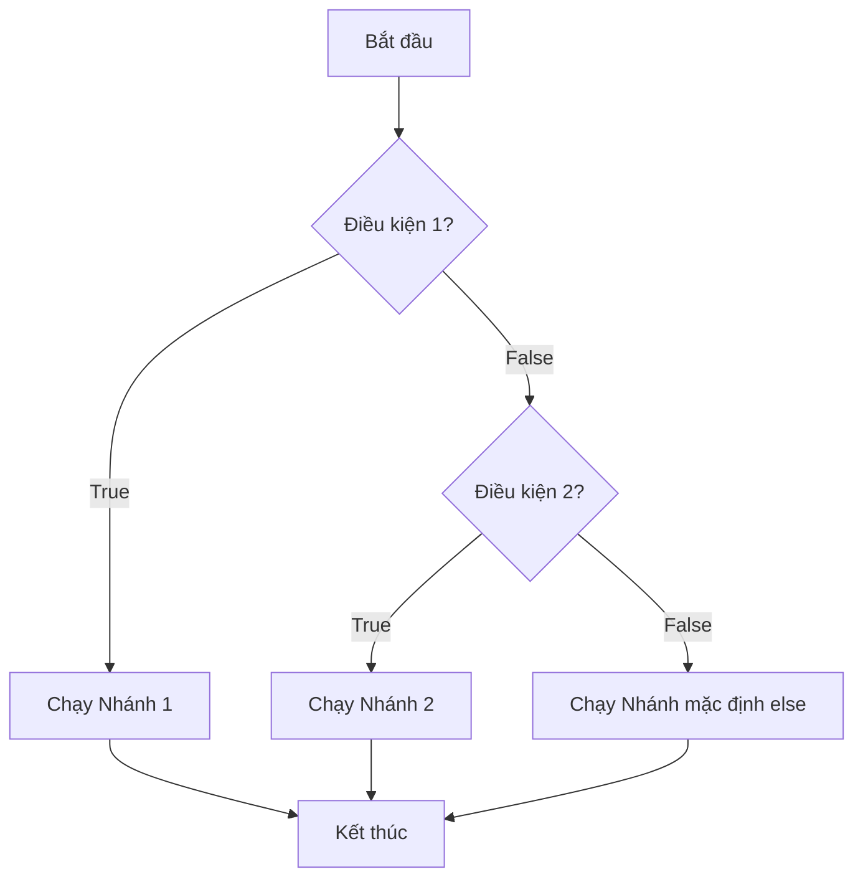

# 📘 Lesson 02.03: Lệnh if-else và if-elif-else

---

## 1. Khái niệm & Vấn đề

Trong thực tế, chúng ta hiếm khi chỉ đối mặt với một lựa chọn rẽ nhánh đơn lẻ. Thông thường, chúng ta có các lựa chọn mang tính loại trừ nhau:
* **Nếu** tài khoản đủ tiền ➔ Cho phép mua hàng; **Ngược lại** ➔ Báo lỗi số dư.
* **Nếu** điểm từ 8.0 trở lên ➔ Xếp loại Giỏi; **Ngược lại nếu** từ 6.5 trở lên ➔ Xếp loại Khá; **Ngược lại** ➔ Xếp loại Trung bình.

Để giải quyết các bài toán rẽ nhiều nhánh này, Python cung cấp thêm từ khóa **`else`** (Ngược lại) và **`elif`** (viết tắt của *else if* - Ngược lại nếu).



| Từ khóa | Vai trò trong cấu trúc rẽ nhánh | Quy tắc sử dụng |
| :--- | :--- | :--- |
| **`if`** | Nhánh kiểm tra đầu tiên và bắt buộc phải có. | Chỉ có tối đa **1** lệnh `if` ở đầu cấu trúc. |
| **`elif`** | Nhánh kiểm tra phụ, chỉ xét khi các nhánh trên đều Sai (`False`). | Có thể có **0 hoặc nhiều** nhánh `elif`. |
| **`else`** | Nhánh mặc định cuối cùng, tự động chạy khi toàn bộ điều kiện trên đều Sai. | Chỉ có tối đa **1** lệnh `else` ở cuối cùng, không có biểu thức điều kiện đi kèm. |

---

## 2. Cú pháp & Vận hành

Hãy xem cấu trúc phân loại học sinh sử dụng `if-elif-else`:

```python
diem = 7.5
if diem >= 8.0:
    print("Học sinh Giỏi")
elif diem >= 6.5:
    print("Học sinh Khá")
else:
    print("Học sinh Trung bình")
```

**Bảng theo dõi thực thi (Execution Trace Table):**
| Dòng mã | Lệnh được chạy | Trạng thái biến | Hành động của máy tính |
|:---:|:---|:---|:---|
| 1 | `diem = 7.5` | `diem: 7.5` | Khởi tạo biến `diem` |
| 2 | `if diem >= 8.0:` | `diem: 7.5` | Đánh giá `7.5 >= 8.0` ➔ `False`. Bỏ qua khối lệnh con nhánh `if`. |
| 4 | `elif diem >= 6.5:` | `diem: 7.5` | Đánh giá `7.5 >= 6.5` ➔ `True`. Quyết định chạy khối lệnh con nhánh `elif`. |
| 5 | `print("Học sinh Khá")` | `diem: 7.5` | In dòng chữ "Học sinh Khá" |
| 6 | `else:` | `diem: 7.5` | Bỏ qua nhánh `else` hoàn toàn vì điều kiện của `elif` đã thỏa mãn. |

---

## 3. Lỗi thường gặp & Tối ưu

> [!WARNING]
> **Các lỗi logic đặc biệt nguy hiểm:**
> * **Sai thứ tự điều kiện**: Python đánh giá các điều kiện từ trên xuống dưới, nhánh nào thỏa mãn trước sẽ chạy và bỏ qua toàn bộ các nhánh còn lại.
>   * Nếu bạn kiểm tra `diem >= 6.5` trước `diem >= 8.0`, một học sinh đạt `9.0` điểm cũng sẽ rơi vào nhánh `diem >= 6.5` và bị xếp loại Khá.
>   * *Quy tắc:* Luôn xếp các điều kiện hẹp/khắt khe nhất ở phía trên.
> * **Viết điều kiện sau `else`**: Lệnh `else` là nhánh mặc định cuối cùng, không được phép viết điều kiện đi kèm (ví dụ: `else diem < 5:` là lỗi cú pháp).

---

## 4. Thực hành phân bậc

### Câu hỏi trắc nghiệm (Warm-up)
Với đoạn code phân loại học sinh ở trên, nếu gán `diem = 8.5` thì màn hình sẽ in ra kết quả gì?
* [x] "Học sinh Giỏi"
* [ ] "Học sinh Khá"
* [ ] Cả hai dòng trên
* [ ] "Học sinh Trung bình"

### Thử thách sửa lỗi (Debug)
Đoạn code sau đây dùng để phân loại một số là số dương, số âm hay số không. Tuy nhiên, khi `n = 0`, chương trình lại in ra `"Số dương"`. Hãy tìm lỗi logic và sửa lại cho đúng:
```python
# Sửa lại đoạn code phân loại số dưới đây:
n = 0
if n >= 0:
    print("Số dương")
elif n == 0:
    print("Số không")
else:
    print("Số âm")
```

### Bài tập lập trình (Mini-task)
Hãy khai báo biến `so_tuoi = 15`. Viết cấu trúc `if-elif-else` để phân loại độ tuổi:
* Nếu `so_tuoi` lớn hơn hoặc bằng `18`: in ra `"Người lớn"`.
* Ngược lại, nếu `so_tuoi` lớn hơn hoặc bằng `12`: in ra `"Thiếu niên"`.
* Ngược lại các trường hợp trên: in ra `"Trẻ em"`.
```python
# Nhập code của bạn ở đây
```

---

## 5. Đúc kết & Đi tiếp

* 🔀 Dùng `elif` để thêm các nhánh điều kiện phụ, và `else` cho trường hợp mặc định cuối cùng.
* ⏳ Luôn chú ý thứ tự ưu tiên của điều kiện từ khắt khe nhất đến bao quát nhất.

Trong bài học tiếp theo **[LS-02.04: Toán tử Logic kết hợp]**, chúng ta sẽ học cách gộp nhiều điều kiện so sánh phức tạp lại với nhau trong cùng một câu lệnh `if` bằng các toán tử `and`, `or`, `not`.
