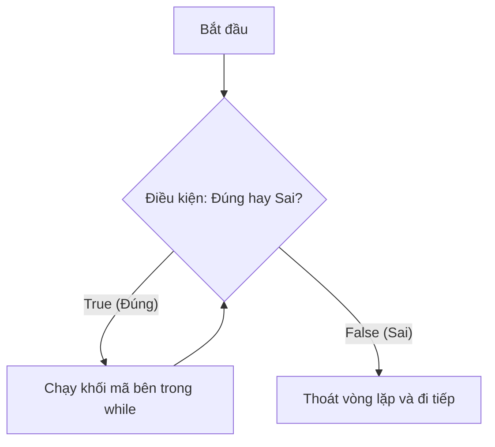

# 📘 Lesson 02.05: Tư duy lặp và Vòng lặp while

---

## 1. Khái niệm & Vấn đề

Máy tính có khả năng tuyệt vời trong việc thực hiện các tác vụ lặp đi lặp lại hàng triệu lần mà không biết mệt mỏi. Nếu không có vòng lặp, để viết chương trình in ra dòng chữ "Hello" 100 lần, ta sẽ phải sao chép câu lệnh `print` 100 lần. Vòng lặp ra đời để giải quyết sự lặp lề và thủ công đó.

**Vòng lặp `while`** trong Python được sử dụng để thực thi liên tục một khối mã nguồn chừng nào một điều kiện logic đi kèm còn Đúng (`True`). Số lần lặp của `while` thường không cố định trước mà phụ thuộc vào việc khi nào điều kiện chuyển sang Sai (`False`).



| Thuật ngữ | Định nghĩa thực tế | Phép ẩn dụ |
| :--- | :--- | :--- |
| **Vòng lặp (Loop)** | Cấu trúc điều khiển luồng lặp lại mã nguồn dựa trên điều kiện cho trước. | Giống như việc **uống nước bằng thìa**: Bạn múc nước uống liên tục *chừng nào* cốc nước chưa cạn sạch. |
| **Vòng lặp vô tận (Infinite Loop)** | Lỗi chương trình chạy mãi mãi không bao giờ dừng do điều kiện lặp luôn luôn Đúng. | Giống như đi vào một **vòng xoay bùng binh không lối thoát**. |

---

## 2. Cú pháp & Vận hành

Cú pháp của câu lệnh `while` yêu cầu dấu hai chấm `:` và khối lệnh con thụt lề 4 dấu cách tương tự lệnh `if`.

```python
count = 1
while count <= 3:
    print("Đếm số:", count)
    count += 1
print("Xong!")
```

**Bảng theo dõi thực thi (Execution Trace Table):**
| Dòng mã | Lệnh được chạy | Trạng thái biến | Hành động của máy tính (Đầu ra màn hình) |
|:---:|:---|:---|:---|
| 1 | `count = 1` | `count: 1` | Khởi tạo biến đếm ban đầu. |
| 2 | `while count <= 3:` | `count: 1` | Kiểm tra điều kiện `1 <= 3` ➔ `True`. Chấp nhận lặp. |
| 3 | `print("Đếm số:", count)`| `count: 1` | In ra màn hình: `Đếm số: 1`. |
| 4 | `count += 1` | `count: 2` | Tăng biến `count` lên 1 đơn vị. Quay lại đầu vòng lặp. |
| 2 | `while count <= 3:` | `count: 2` | Kiểm tra điều kiện `2 <= 3` ➔ `True`. Tiếp tục lặp. |
| 3 | `print(...)` | `count: 2` | In ra màn hình: `Đếm số: 2`. |
| 4 | `count += 1` | `count: 3` | Tăng biến `count` lên 1 đơn vị. Quay lại đầu vòng lặp. |
| 2 | `while count <= 3:` | `count: 3` | Kiểm tra điều kiện `3 <= 3` ➔ `True`. Tiếp tục lặp. |
| 3 | `print(...)` | `count: 3` | In ra màn hình: `Đếm số: 3`. |
| 4 | `count += 1` | `count: 4` | Tăng biến `count` lên 1 đơn vị. Quay lại đầu vòng lặp. |
| 2 | `while count <= 3:` | `count: 4` | Kiểm tra điều kiện `4 <= 3` ➔ `False`. Thoát vòng lặp. |
| 5 | `print("Xong!")` | | Chạy lệnh ngoài vòng lặp. In ra màn hình: `Xong!`. |

---

## 3. Lỗi thường gặp & Tối ưu

> [!WARNING]
> **Lỗi treo máy kinh điển (Vòng lặp vô tận):**
> * Nếu bạn quên viết câu lệnh cập nhật biến đếm (như quên dòng `count += 1`), giá trị của `count` sẽ mãi mãi là `1`. Khi đó, điều kiện `count <= 3` luôn Đúng và chương trình sẽ chạy liên tục không ngừng, tiêu tốn CPU và làm treo máy.
> * *Cách khắc phục:* Nhấn tổ hợp phím **`Ctrl + C`** trên cửa sổ Terminal để buộc dừng chương trình ngay lập tức.

---

## 4. Thực hành phân bậc

### Câu hỏi trắc nghiệm (Warm-up)
Để dừng một chương trình Python đang bị rơi vào vòng lặp vô tận trên Terminal, phím tắt nào được sử dụng?
* [ ] `Ctrl + Z`
* [ ] `Ctrl + Alt + Delete`
* [x] `Ctrl + C`
* [ ] `Ctrl + Shift + Esc`

### Thử thách sửa lỗi (Debug)
Đoạn code sau đây muốn in ra các số chẵn từ 2 đến 6. Tuy nhiên nó đang bị lỗi logic gây treo máy. Hãy tìm lỗi và sửa lại:
```python
# Sửa lại đoạn code treo máy dưới đây:
i = 2
while i <= 6:
    print(i)
```

### Bài tập lập trình (Mini-task)
Hãy khởi tạo biến `so_du = 3`. Hãy viết một vòng lặp `while` kiểm tra điều kiện `so_du > 0`. Bên trong vòng lặp, hãy in ra màn hình dòng chữ `"Đang hoạt động"` và giảm `so_du` đi 1 đơn vị sau mỗi lần lặp.
```python
# Nhập code của bạn ở đây
```

---

## 5. Đúc kết & Đi tiếp

* 🔁 Vòng lặp `while` lặp lại đoạn code chừng nào điều kiện đi kèm của nó còn là `True`.
* 📈 Đảm bảo luôn cập nhật biến điều kiện trong thân vòng lặp để tránh lỗi vòng lặp vô tận.

Trong bài học tiếp theo **[LS-02.06: Dãy số với hàm range()]**, chúng ta sẽ nghiên cứu công cụ tạo ra các dãy số tự động, chuẩn bị cho việc học vòng lặp `for` tối ưu hơn.
