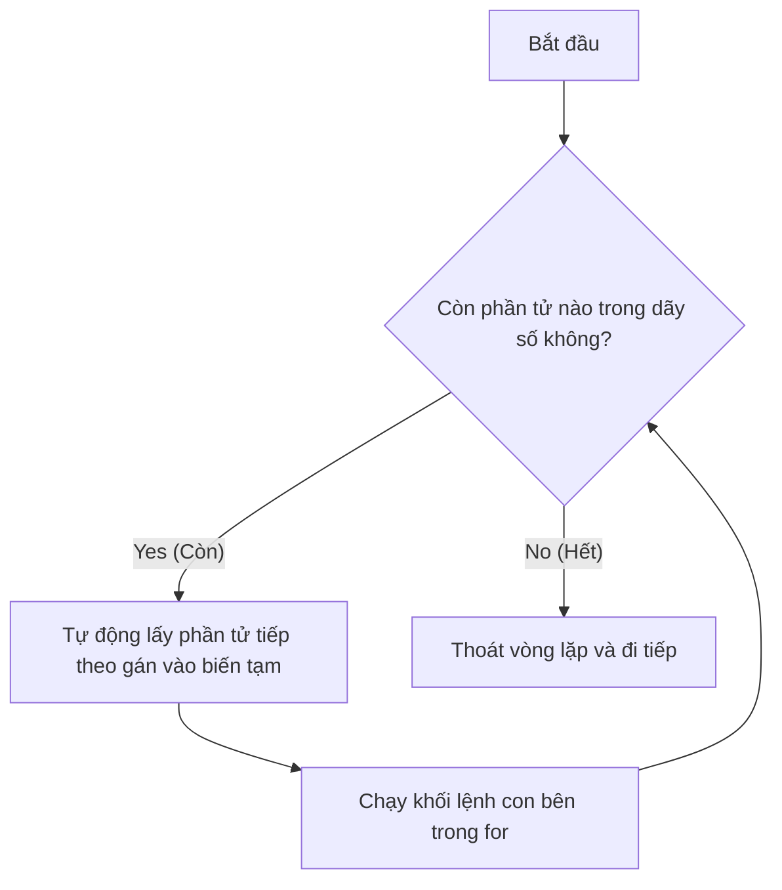

# 📘 Lesson 02.07: Vòng lặp for

---

## 1. Khái niệm & Vấn đề

Với vòng lặp `while`, chúng ta phải tự quản lý biến đếm hoàn toàn thủ công (phải khai báo biến ban đầu, viết điều kiện dừng, và tự tăng biến ở cuối vòng lặp). Việc này rất dễ dẫn tới sơ suất quên cập nhật biến đếm gây lỗi treo máy.

Khi chúng ta đã **xác định trước được số lần lặp** (ví dụ lặp 10 lần), hoặc muốn **duyệt qua lần lượt các phần tử** của một tập hợp dãy số, Python cung cấp câu lệnh **`for`** tối ưu, an toàn và ngắn gọn hơn nhiều.



| Thuật ngữ | Ý nghĩa | Phép ẩn dụ thực tế |
| :--- | :--- | :--- |
| **Vòng lặp `for`** | Cấu trúc lặp qua một tập hợp dữ liệu có thứ tự, tự động gán từng phần tử vào biến tạm sau mỗi vòng. | Giống như **băng chuyền hành lý** tại sân bay: Các vali lần lượt chạy qua trước mặt, bạn chỉ việc nhấc từng cái lên kiểm tra đến hết thì thôi. |

---

## 2. Cú pháp & Vận hành

Cú pháp vòng lặp `for` kết hợp với hàm `range()` để thực hiện lặp theo số lần mong muốn:

```python
for i in range(1, 4):
    print("Lặp lần thứ:", i)
print("Kết thúc chương trình.")
```

**Bảng theo dõi thực thi (Execution Trace Table):**
| Dòng mã | Lệnh được chạy | Trạng thái biến | Hành động của máy tính (Đầu ra màn hình) |
|:---:|:---|:---|:---|
| 1 | `range(1, 4)` | | Tạo dãy số nguyên ảo chứa các giá trị `[1, 2, 3]`. |
| 1 | `for i in range(...)` | `i: 1` | Tự động lấy số đầu tiên (`1`) trong dãy gán vào biến tạm `i`. |
| 2 | `print(...)` | `i: 1` | In ra màn hình: `Lặp lần thứ: 1`. |
| 1 | `for i in range(...)` | `i: 2` | Tự động lấy số tiếp theo (`2`) trong dãy gán đè vào biến tạm `i`. |
| 2 | `print(...)` | `i: 2` | In ra màn hình: `Lặp lần thứ: 2`. |
| 1 | `for i in range(...)` | `i: 3` | Tự động lấy số cuối cùng (`3`) trong dãy gán đè vào biến tạm `i`. |
| 2 | `print(...)` | `i: 3` | In ra màn hình: `Lặp lần thứ: 3`. |
| 1 | `for i in range(...)` | | Dãy số đã hết phần tử. Tự động thoát khỏi vòng lặp `for`. |
| 3 | `print("Kết thúc...")`| | Chạy lệnh ngoài vòng lặp. In ra màn hình: `Kết thúc chương trình.`. |

**Minh họa đường đi phần tử:**
```text
Dãy số:     [  1,   2,   3  ]
               │    │    │
               ▼    ▼    ▼ (Lần lượt gán vào biến chạy)
Biến chạy:     i = 1 ➔ i = 2 ➔ i = 3
```

---

## 3. Lỗi thường gặp & Tối ưu

> [!WARNING]
> **Các lưu ý quan trọng khi sử dụng vòng lặp for:**
> * **Không thay đổi biến chạy trong vòng lặp**: Trong thân vòng lặp `for i in range(...)`, nếu bạn cố tình viết lệnh đổi giá trị `i = 10` thì ở lượt lặp sau, Python vẫn sẽ tự động ghi đè giá trị tiếp theo của `range()` vào `i`. Thay đổi này chỉ làm code bị rối và dễ gây lỗi logic không đáng có.
> * **Đặt tên biến chạy có nghĩa**: Thay vì luôn sử dụng các chữ cái vô nghĩa như `i`, `j`, `k`, hãy đặt tên biến chạy phản ánh đúng mục tiêu (ví dụ: `for nam in range(2020, 2026):`).

---

## 4. Thực hành phân bậc

### Câu hỏi trắc nghiệm (Warm-up)
Với câu lệnh `for x in range(5):`, biến chạy `x` sẽ lần lượt nhận các giá trị số nguyên nào?
* [ ] `1, 2, 3, 4, 5`
* [ ] `0, 1, 2, 3, 4, 5`
* [x] `0, 1, 2, 3, 4`
* [ ] `1, 2, 3, 4`

### Thử thách sửa lỗi (Debug)
Đoạn code sau đây muốn tính tổng các số từ 1 đến 5. Kết quả in ra mong muốn là `15`, tuy nhiên khi chạy chương trình chỉ in ra `10`. Hãy tìm lỗi logic và sửa lại cho đúng:
```python
# Sửa lại đoạn code tính tổng dưới đây:
tong = 0
for i in range(1, 5):
    tong += i
print(tong)
```

### Bài tập lập trình (Mini-task)
Hãy viết chương trình sử dụng vòng lặp `for` kết hợp với hàm `range()` để in ra màn hình các số lẻ từ 1 đến 7 (bao gồm cả số 7), mỗi số được in trên một dòng riêng biệt.
```python
# Nhập code của bạn ở đây
```

---

## 5. Đúc kết & Đi tiếp

* 🛡️ Vòng lặp `for` tự động hóa việc lặp qua một dãy số mà không cần quản lý biến chạy thủ công như `while`.
* 🤝 Kết hợp `for` và `range()` là mô hình chuẩn mực để viết các vòng lặp đếm số lần cố định.

Trong bài học tiếp theo **[LS-02.08: Điều hướng lặp: break & continue]**, chúng ta sẽ tìm hiểu hai câu lệnh đặc biệt cho phép lập trình viên chủ động ngắt sớm vòng lặp hoặc bỏ qua các lượt lặp không cần thiết.
