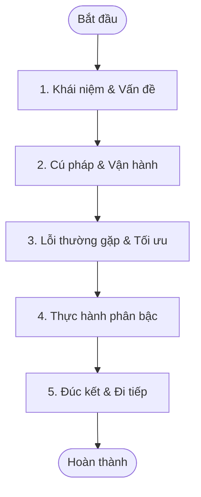

# Python Learning Content Standard v1.0
*Tài liệu Tiêu chuẩn Thiết kế Nội dung Bài học Lập trình Nền tảng (Tối ưu hóa khả năng đọc quét & đi thẳng vào trọng tâm)*

---

## 1. Lesson Standard Overview

### 1.1. Mục tiêu và Sứ mệnh
Tài liệu **Python Learning Content Standard v1.0** thiết lập khung tiêu chuẩn chất lượng nội dung bài học trên nền tảng. Mục tiêu cốt lõi là đảm bảo:
* **Tính đồng nhất**: Tất cả bài học do AI hoặc giảng viên viết đều tuân thủ cùng một cấu trúc tinh gọn.
* **Tối ưu hóa khả năng đọc quét (Scannability)**: Giúp học viên nắm bắt kiến thức cốt lõi nhanh nhất, giảm tải nhận thức (Cognitive Load).
* **Tương thích kỹ thuật**: Cấu trúc nội dung đồng bộ hoàn toàn với database schema và giao diện Frontend.

---

## 2. Lesson Structure (Cấu trúc Tổng thể Bài học Mới)

Mỗi bài học bắt buộc phải tuân theo cấu trúc tuyến tính gồm các phần sau:

| Tên Phần (Section) | Nội dung gộp từ v1.0 | Định dạng hiển thị (UI) |
| :--- | :--- | :--- |
| **[Metadata]** | Section 1 (Metadata) | Ẩn dưới Backend, không hiện lên UI. |
| **1. Khái niệm & Vấn đề** | Hook + Objective + Theory (3.1, 3.2, 3.3) | 1 đoạn văn ngắn đặt vấn đề + Bảng định nghĩa cốt lõi. Bỏ qua các mục tiêu dài dòng. |
| **2. Cú pháp & Vận hành** | Syntax (3.4, 3.5) + Execution Trace + Memory (3.8) | Block code mẫu tối giản + Bảng Trace chạy code từng dòng. Nếu cần, thêm 1 khối ASCII mô tả RAM. |
| **3. Lỗi thường gặp & Tối ưu** | Best Practices + Pitfalls + Anti-patterns (3.9 - 3.15) | Hộp Cảnh báo (Alert Box) liệt kê 2-3 lỗi sai ngớ ngẩn nhất hoặc quy tắc đặt tên. Không lan man. |
| **4. Thực hành phân bậc** | Scaffolded Practice (Section 5) | Đưa thẳng 3 cấp độ bài tập: Trắc nghiệm nhanh (Warm-up) ➔ Sửa code lỗi ➔ Viết code từ đầu (Mini-task). |
| **5. Đúc kết & Đi tiếp** | Summary (Section 6) + Next (Section 9) | 3 gạch đầu dòng cốt lõi nhất + 1 liên kết tóm tắt bài tiếp theo. Bỏ qua sơ đồ tư duy rườm rà. |

---

## 3. Đặc tả chi tiết các Phần nội dung

### SECTION 1: Metadata (Siêu dữ liệu)
* **Ý nghĩa**: Định tuyến bài học và lưu database.
* **Định dạng**: YAML frontmatter ở đầu file.
  ```yaml
  ---
  lessonId: "LS-01.04"
  title: "Khái niệm Biến và Cách đặt tên"
  difficulty: "EASY"
  estimatedDuration: 15
  keywords: ["variable", "naming", "python basics"]
  prerequisites: ["LS-01.03"]
  ---
  ```

### SECTION 2: 1. Khái niệm & Vấn đề
* **Mục đích**: Đặt vấn đề và giới thiệu phép ẩn dụ về khái niệm.
* **Quy tắc viết**:
  - Dùng 1 đoạn văn ngắn đặt vấn đề thực tế (ví dụ: Lưu điểm số của người chơi để cộng dồn).
  - Sử dụng phép ẩn dụ gần gũi (ví dụ: Biến là một chiếc hộp dán nhãn).
  - Dùng bảng Markdown định nghĩa khái niệm cốt lõi.
* **Ví dụ định dạng**:
  ```markdown
  ## 1. Khái niệm & Vấn đề
  Hãy tưởng tượng bạn đang viết một trò chơi và cần ghi nhớ điểm số của người chơi để cộng dồn mỗi khi họ ăn điểm. Nếu không lưu lại, điểm số sẽ biến mất ngay lập tức!
  
  | Thuật ngữ | Định nghĩa thực tế | Phép ẩn dụ |
  | :--- | :--- | :--- |
  | **Biến (Variable)** | Vùng lưu trữ dữ liệu có thể thay đổi trong chương trình. | Như một chiếc hộp dán nhãn đặt trong kho chứa (RAM). |
  ```

### SECTION 3: 2. Cú pháp & Vận hành
* **Mục đích**: Hướng dẫn cú pháp viết code và cách chương trình thực thi.
* **Quy tắc viết**:
  - Viết khối mã nguồn mẫu cực kỳ tối giản.
  - Sử dụng bảng **Execution Trace Table** (Bảng trace chạy từng dòng) để học viên hiểu luồng chạy.
  - Sử dụng sơ đồ ASCII mô tả trạng thái RAM nếu cần thiết.
* **Ví dụ định dạng**:
  ```markdown
  ## 2. Cú pháp & Vận hành
  Để khai báo và gán giá trị cho biến trong Python:
  ```python
  score = 100
  print(score)
  ```
  
  **Bảng theo dõi thực thi (Execution Trace Table):**
  | Dòng mã | Lệnh được chạy | Trạng thái biến | Hành động của máy tính |
  |:---:|:---|:---|:---|
  | 1 | `score = 100` | `score: 100` | Gán giá trị nguyên 100 vào chiếc hộp nhãn `score`. |
  | 2 | `print(score)` | `score: 100` | Đọc dữ liệu trong hộp `score` và in ra màn hình. |
  
  **Trạng thái bộ nhớ RAM:**
  ```text
  [RAM Stack]           [RAM Heap]
  score ─────────────► [ 100 ] (Integer Object)
  ```

### SECTION 4: 3. Lỗi thường gặp & Tối ưu
* **Mục đích**: Giúp học viên tránh các lỗi cơ bản và viết code chuẩn sạch (Best Practices).
* **Quy tắc viết**:
  - Liệt kê 2-3 quy tắc đặt tên hoặc lỗi sai phổ biến nhất bằng hộp Cảnh báo (Alert Box).
  - Trình bày ngắn gọn, đi thẳng vào lỗi sai.
* **Ví dụ định dạng**:
  ```markdown
  ## 3. Lỗi thường gặp & Tối ưu
  > [!WARNING]
  > **Các lỗi đặt tên biến thường gặp cần tránh:**
  > * **Bắt đầu bằng số**: `1_score = 100` ➔ Lỗi cú pháp (`SyntaxError`).
  > * **Chứa khoảng trắng**: `my score = 100` ➔ Lỗi cú pháp (`SyntaxError`).
  > * **Trùng từ khóa**: `print = 100` ➔ Ghi đè hàm hệ thống làm chương trình chạy sai.
  
  > [!TIP]
  > Tuân thủ chuẩn **snake_case** khi đặt tên biến trong Python (ví dụ: `player_score`, `user_name`).
  ```

### SECTION 5: 4. Thực hành phân bậc
* **Mục đích**: Kiểm tra kiến thức từ nhận biết đến tự viết code.
* **Quy tắc viết**:
  - Gồm 3 cấp độ rõ ràng:
    1. **Trắc nghiệm nhanh (Warm-up)**: Kiểm tra nhận thức lý thuyết.
    2. **Sửa code lỗi (Debug)**: Đọc hiểu và sửa lại đoạn code sai cú pháp.
    3. **Viết code từ đầu (Mini-task)**: Bài tập viết code giải quyết yêu cầu bài toán.
* **Ví dụ định dạng**:
  ```markdown
  ## 4. Thực hành phân bậc
  
  ### Câu hỏi trắc nghiệm (Warm-up)
  Tên biến nào sau đây là **hợp lệ** trong Python?
  * [ ] `user-name`
  * [ ] `2nd_user`
  * [x] `user_name`
  
  ### Thử thách sửa lỗi (Debug)
  Đoạn code sau đây bị lỗi. Hãy tìm lỗi và sửa lại cho đúng:
  ```python
  # Code lỗi:
  user name = "Alice"
  print(user name)
  ```
  
  ### Bài tập lập trình (Mini-task)
  Khai báo biến `apples` gán giá trị bằng `10`, biến `bananas` gán bằng `5`. Tính tổng số trái cây gán vào biến `total` và in giá trị biến `total` ra màn hình.
  ```

### SECTION 6: 5. Đúc kết & Đi tiếp
* **Mục đích**: Chốt lại kiến thức cốt lõi và hướng đến bài học sau.
* **Quy tắc viết**:
  - 3 gạch đầu dòng đúc kết ngắn gọn nhất.
  - 1 liên kết tóm tắt giới thiệu bài học tiếp theo.
* **Ví dụ định dạng**:
  ```markdown
  ## 5. Đúc kết & Đi tiếp
  * Biến là vùng lưu trữ dữ liệu trong RAM, được gắn một chiếc nhãn (tên biến) để dễ gọi lại khi cần.
  * Phép gán `=` hoạt động theo chiều từ **phải sang trái** (gán giá trị bên phải cho biến bên trái).
  * Tên biến phải tuân theo quy tắc đặt tên (không số ở đầu, không khoảng trắng) và nên viết theo chuẩn `snake_case`.
  
  Trong bài học tiếp theo **[LS-01.05: Các kiểu dữ liệu cơ bản]**, chúng ta sẽ tìm hiểu cách Python phân biệt các loại dữ liệu khác nhau như văn bản, số nguyên hay số thập phân để lưu trữ tối ưu nhất.
  ```

---

## 4. Quy chuẩn Văn phong & Trình bày (Style Guide)

* **Hộp thông tin (Alert Boxes)**: Chỉ sử dụng chuẩn Markdown Alert của GitHub (`[!NOTE]`, `[!TIP]`, `[!WARNING]`).
* **Thuật ngữ chuyên ngành**: Viết tiếng Việt kèm tiếng Anh gốc đặt trong dấu ngoặc ở lần đầu xuất hiện (ví dụ: *biến (variable)*).
* **Văn phong**: Ngắn gọn, súc tích, câu dưới 25 từ, tránh giải thích học thuật hàn lâm.

---

## 5. Quy tắc sinh bài học bằng AI (AI Generation Rules)

1. **Tuân thủ đúng 5 phần**: Tuyệt đối không tự ý thêm bớt các phần lớn đã định nghĩa.
2. **Tập trung vào scannability**: Viết ngắn gọn, dùng bảng biểu thay cho các đoạn văn dài.
3. **Tránh sơ đồ rườm rà**: Bỏ qua sơ đồ tư duy phức tạp hoặc sơ đồ Mermaid quá dài ở phần lý thuyết nếu không mang lại giá trị cao.

---

## 6. Sơ đồ Tiến trình Bài học (Lesson Flow Diagram)


