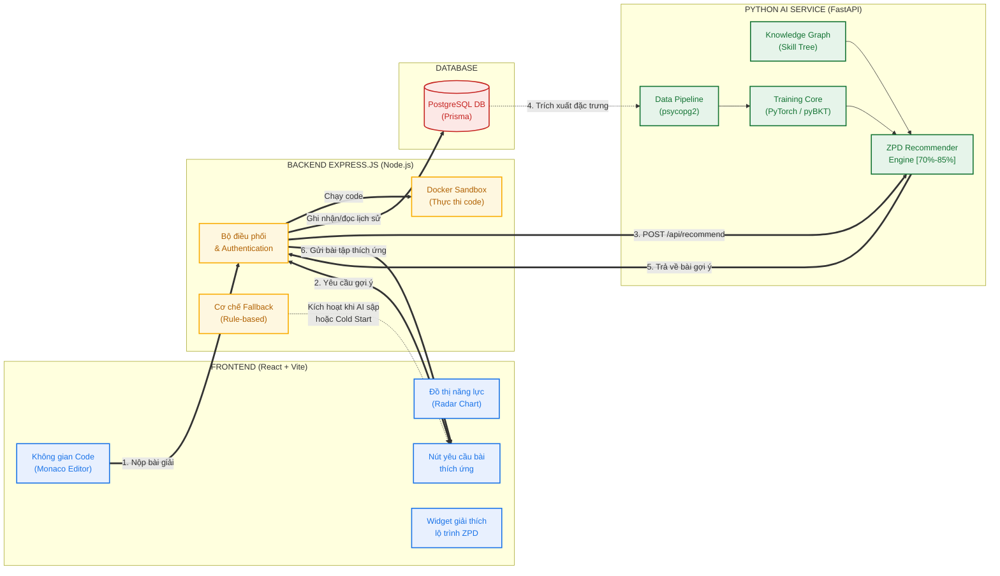
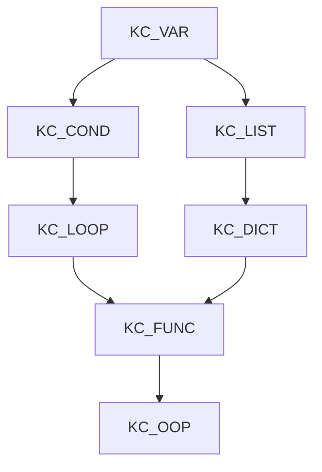
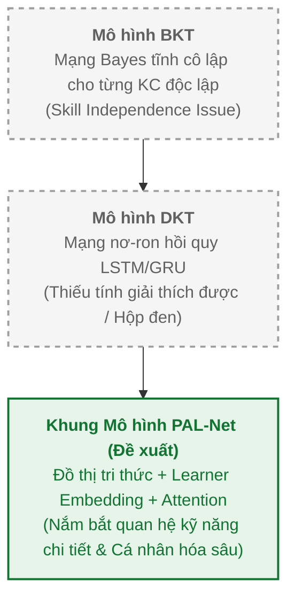

# KẾ HOẠCH TRIỂN KHAI PHÂN HỆ GỢI Ý BÀI TẬP THÍCH ỨNG THÔNG MINH (PAL-NET)
## Dự án: Hệ Thống Gợi Ý Bài Tập Lập Trình Python Thích Ứng (LearnPython)
**Chuyên gia tư vấn:** AI & EdTech Curriculum Architect (20+ Years Experience)  
**Ngày lập kế hoạch:** 24/07/2026  
**Trạng thái:** Sẵn sàng Triển khai  

---

## I. TỔNG QUAN & TRIẾT LÝ THIẾT KẾ CỦA CHUYÊN GIA

Trong lĩnh vực EdTech, đặc biệt là dạy lập trình trực tuyến, bài toán cốt lõi không chỉ là kiểm tra xem học sinh viết đúng hay sai, mà là **đo lường chính xác và khách quan mức độ làm chủ kiến thức (Knowledge State Mastery)** để kịp thời điều chỉnh lộ trình học.

Qua 20 năm kinh nghiệm nghiên cứu mô hình hóa người học (Student Modeling), tôi nhận ra 3 hạn chế nghiêm trọng nhất mà hệ thống cũ thường mắc phải:
1. **Sự tuyến tính ép buộc:** Bắt học sinh làm từ bài dễ đến bài khó một cách tuần tự mà không màng tới năng lực thực tế.
2. **Triệu chứng chán nản (Boredom) / Quá tải (Frustration):** Cho bài quá dễ khiến học sinh nhàm chán, hoặc cho bài quá khó khiến học sinh nản lòng và từ bỏ.
3. **Mù mờ logic gợi ý (Hộp đen):** Sử dụng các mô hình Deep Learning thuần túy (như DKT) khiến giáo viên và học sinh không biết tại sao hệ thống lại điều hướng như vậy.

**Giải pháp đề xuất: Khung Kiến trúc PAL-Net (Personalized Adaptive Learning Network).**  
PAL-Net giải quyết triệt để 3 vấn đề trên bằng cách nhúng **Đồ thị Tri thức (Knowledge Graph)** tường minh kết hợp với **Định dạng Nhúng Học Viên (Learner Embedding)** và **Cơ chế Chú ý (Attention)** trên chuỗi lịch sử tương tác đa chiều (thời gian làm bài, mã lỗi biên dịch, số lần chạy code).

Dưới đây là kế hoạch chi tiết từng bước để đội ngũ phát triển tiến hành code và tối ưu hóa hệ thống này.

---

## II. SƠ ĐỒ KIẾN TRÚC HỆ THỐNG TOÀN CẢNH



---

## III. CHI TIẾT 6 GIAI ĐOẠN TRIỂN KHAI THỰC TẾ

### GIAI ĐOẠN 1: THIẾT KẾ ĐỒ THỊ TRI THỨC (PYTHON KNOWLEDGE GRAPH / SKILL TREE)
Để mô hình PAL-Net hoạt động hiệu quả, chúng ta phải chuyển hóa mối quan hệ giữa các khái niệm lập trình thành cấu trúc Đồ thị Tri thức. Mỗi Node đại diện cho một Kỹ năng (Knowledge Component - KC), và các cạnh (Edges) đại diện cho mối liên hệ phụ thuộc (Prerequisites).

#### 1. Định nghĩa các Kỹ năng chính (Python Skills List):
*   `KC_VAR`: Biến và kiểu dữ liệu cơ bản (int, float, string, boolean).
*   `KC_COND`: Cấu trúc rẽ nhánh điều kiện (`if-elif-else`).
*   `KC_LOOP`: Vòng lặp (`for`, `while`).
*   `KC_LIST`: Danh sách và các thao tác trên mảng (`list`, `index`, `slice`).
*   `KC_DICT`: Từ điển và cấu trúc ánh xạ (`dict`, `keys`, `values`).
*   `KC_FUNC`: Định nghĩa và sử dụng hàm (`def`, `parameters`, `return`).
*   `KC_OOP`: Lập trình hướng đối tượng cơ bản (`class`, `object`, `methods`).

#### 2. Biểu diễn cấu trúc Đồ thị phụ thuộc (Skill Graph Dependencies):


#### 3. Nhiệm vụ lập trình:
*   Xây dựng file `skill_graph.json` định nghĩa danh sách Node và Edges.
*   Ánh xạ các bài tập hiện tại (`coding_exercises` và `practice_problems`) sang các ID kỹ năng tương ứng trong database. Thiết lập mối quan hệ nhiều-nhiều trong cơ sở dữ liệu nếu một bài tập chứa nhiều kỹ năng.

---

### GIAI ĐOẠN 2: THIẾT KẾ DỮ LIỆU ĐA CHIỀU & PIPELINE TIỀN XỬ LÝ (DATA PIPELINE)
Khác với DKT chỉ lấy dữ liệu $0 / 1$ (Đúng / Sai), PAL-Net thu thập dữ liệu phong phú từ Sandbox của học viên:

#### 1. Các thuộc tính dữ liệu đầu vào:
*   `user_id`: UUID học viên.
*   `exercise_id`: UUID bài tập.
*   `sequence_order`: Thứ tự thực hiện giải bài của user.
*   `correctness`: $0$ nếu FAILED, $1$ nếu PASSED.
*   `runtime_ratio`: Tỷ lệ thời gian chạy code của user so với thời gian chạy trung bình của bài tập đó (phát hiện thuật toán tối ưu).
*   `error_type`: Loại lỗi biên dịch/runtime gặp phải (nếu có: `SyntaxError`, `TypeError`, `IndexError`, `None` - PASSED).
*   `attempt_count`: Số lần thử chạy code (Run Code) trước khi nộp thành công (Submit).

#### 2. Dữ liệu Phân tích Năng lực Đầu vào (Pre-test) giải quyết bài toán Cold Start:
*   Mỗi học viên mới đăng ký sẽ trải qua một bài kiểm tra Pre-test gồm 5 câu hỏi nhanh bao quát các mức độ khó từ dễ tới trung bình.
*   Kết quả của Pre-test dùng để tính toán vector nhúng ban đầu (Initial Learner Embedding $E_{learner}^0$) của học viên.

#### 3. Nhiệm vụ lập trình:
*   Viết module `data_loader.py` trong Python AI Service để query trực tiếp từ PostgreSQL và parse thành mảng DataFrame của Pandas.
*   Chuẩn hóa dữ liệu theo chuỗi thời gian (Sequential Data) cho từng `user_id`.

---

### GIAI ĐOẠN 3: HIỆN THỰC HÓA CÁC MÔ HÌNH HỌC MÁY ĐỂ SO SÁNH

Chúng ta sẽ hiện thực hóa cả 3 mô hình từ đơn giản đến phức tạp để chạy so sánh kết quả phục vụ nghiên cứu và đánh giá khoa học cho đề tài:



#### 1. Mô hình Bayesian Knowledge Tracing (BKT)
*   **Kiến trúc:** Mỗi kỹ năng (KC) sử dụng một mô hình Markov ẩn riêng biệt không có liên kết chéo.
*   **Tham số:** Học 4 tham số $P(L_0), P(T), P(G), P(S)$ cho từng KC bằng thuật toán Expectation-Maximization (EM).
*   **Công cụ:** Sử dụng thư viện `pyBKT` phiên bản mới nhất hoặc giải thuật tùy chỉnh viết trên thư viện HMM.

#### 2. Mô hình Deep Knowledge Tracing (DKT)
*   **Kiến trúc:** Mạng LSTM/GRU.
*   **Đầu vào:** Biểu diễn vector one-hot kết hợp của bài tập vừa làm và kết quả (Đúng/Sai).
*   **Đầu ra:** Xác suất học viên sẽ trả lời đúng mọi bài tập khác tại thời điểm tiếp theo.
*   **Công cụ:** Hiện thực hóa bằng framework `PyTorch`.

#### 3. Khung Mô hình Đề xuất PAL-Net
*   **Kiến trúc:**
    *   **Phân hệ Đồ thị (GCN Module):** Dùng một mạng Graph Convolutional Network (GCN) 2 lớp để học các vector đặc trưng của các kỹ năng dựa trên cấu trúc `skill_graph.json`.
    *   **Phân hệ Người học (Learner Embedding):** Lớp Linear chuyển hóa thông tin đặc trưng cá nhân (Pre-test, tỷ lệ sửa lỗi) thành một vector nhúng động $E_{learner}$.
    *   **Phân hệ Đầy đủ (Sequential Attention):** Sử dụng mạng GRU kết hợp với cơ chế Self-Attention để liên kết trạng thái học qua thời gian.
    *   **Lớp Đầu ra (Output Layer):** Kết hợp vector nhúng của kỹ năng + vector nhúng người học + trạng thái lịch sử đã qua cơ chế chú ý để dự đoán xác suất trả lời đúng $P(\text{correct})$ của bài tập tiếp theo.
*   **Công cụ:** Viết bằng `PyTorch` để dễ dàng tùy biến kiến trúc mạng và hàm mất mát (Loss Function).

---

### GIAI ĐOẠN 4: THIẾT KẾ CƠ CHẾ GỢI Ý THÍCH ỨNG THEO VÙNG ZPD
Sau khi mô hình PAL-Net được huấn luyện và ước lượng được xác suất giải đúng $P_{correct}^i$ của từng bài tập $i$ còn lại đối với học viên:

1. **Định nghĩa Vùng phát triển gần nhất (ZPD - Zone of Proximal Development):**
   *   Nếu $P_{correct}^{i} > 0.85$: Bài tập **quá dễ**, học sinh đã nắm vững kiến thức này $\rightarrow$ Không gợi ý để tránh nhàm chán.
   *   Nếu $P_{correct}^{i} < 0.70$: Bài tập **quá khó**, vượt quá năng lực hiện tại $\rightarrow$ Tránh gợi ý để phòng ngừa sự nản lòng.
   *   Ngưỡng ZPD vàng: **$0.70 \le P_{correct}^{i} \le 0.85$** $\rightarrow$ Đây là những bài tập mang tính thử thách vừa phải, giúp nâng cao năng lực tốt nhất.

2. **Thuật toán Chọn bài (Recommendation Selection Strategy):**
   *   Bước 1: Lọc ra tất cả các bài tập chưa làm của Module/Lesson hiện tại.
   *   Bước 2: Sử dụng PAL-Net để dự đoán $P_{correct}$ cho danh sách bài tập này.
   *   Bước 3: Lọc ra các bài nằm trong khoảng ZPD vàng.
   *   Bước 4: Ưu tiên chọn bài tập củng cố các kỹ năng mà học viên vừa bị đánh giá là "yếu" trên đồ thị hoặc các kỹ năng tiên quyết chưa vững. Nếu có nhiều lựa chọn, lấy ngẫu nhiên có trọng số (weighted random).

---

### GIAI ĐOẠN 5: XÂY DỰNG API PYTHON AI SERVICE
Hệ thống FastAPI sẽ đóng vai trò là Engine cốt lõi cho các thuật toán.

#### 1. Cấu trúc thư mục `/ai-service`:
```text
ai-service/
│
├── requirements.txt            # Danh sách thư viện cần thiết
├── main.py                     # File entry point khởi động server FastAPI
│
├── core/                       # Lõi xử lý mô hình
│   ├── __init__.py
│   ├── graph.py                # Xây dựng ma trận kề & GCN cho Skill Tree
│   ├── models.py               # Kiến trúc mạng PyTorch cho BKT, DKT và PAL-Net
│   └── recommender.py          # Logic gợi ý bài tập theo ZPD và giải thích lộ trình
│
├── data/                       # Chứa dữ liệu offline và mô hình đã lưu
│   ├── skill_graph.json        # Định nghĩa cây kỹ năng Python
│   ├── models/                 # Lưu file weight: pal_net.pt, dkt.pt, bkt.pkl
│   └── mock_data_generator.py  # Script tạo dữ liệu giả lập lớn (>5000 records) để huấn luyện thử
│
├── scripts/                    # Scripts tiện ích
│   └── train.py                # File chạy huấn luyện định kỳ
│
└── utils/                      # Các Module hỗ trợ
    ├── db_connector.py         # Kết nối PostgreSQL (chuyển đổi database_test.py)
    └── helpers.py
```

#### 2. Các API Endpoint chính cần thiết lập:
*   `POST /api/train`: Trigger quá trình huấn luyện offline thủ công hoặc định kỳ. Đọc dữ liệu, huấn luyện 3 mô hình, xuất file trọng số, so sánh hiệu năng (RMSE, AUC) để tự động lưu lại phiên bản tốt nhất.
*   `POST /api/recommend`: Nhận `userId` và trả về danh sách các bài tập được gợi ý tốt nhất kèm theo mức độ tự tin (Confidence score) và diễn giải logic gợi ý (Feature Attribution).
*   `GET /api/user-mastery/{userId}`: Lấy xác suất mức độ làm chủ của học viên đối với tất cả 7 kỹ năng Python phục vụ vẽ biểu đồ Radar trên Frontend.

---

### GIAI ĐOẠN 6: TÍCH HỢP HỆ THỐNG (NODE.JS BACKEND & REACT FRONTEND)

#### 1. Tích hợp tại Node.js Backend:
*   **Middleware hoặc Hook:** Khi học viên hoàn thành một bài tập (`SubmissionStatus` chuyển thành `PASSED`/`FAILED`), Backend sẽ ghi nhận vào DB đồng thời gửi một trigger chạy bất đồng bộ sang Python AI Service để cập nhật nhúng người học (hoặc mô hình sẽ cập nhật offline hàng ngày).
*   **API `/api/lessons/:id/next-problem`:**
    *   Gọi sang API `POST /api/recommend` của Python AI Service.
    *   **Cơ chế Fallback (Rule-based):** Nếu Python AI Service gặp sự cố hoặc học viên có lịch sử nộp bài quá ít (< 5 lần) và chưa làm bài Pre-test, Backend sẽ chọn bài tiếp theo theo thứ tự logic mặc định (`orderIndex`) trong Database.

#### 2. Tích hợp tại React Frontend:
*   **Giao diện Dashboard Học Viên:** Vẽ biểu đồ Radar năng lực học lập trình (Mastery Chart) sử dụng thư viện Recharts để mô tả trực quan 7 kỹ năng Python của học sinh.
*   **Nút "Học Tiếp Thích Ứng":** Nhấp vào sẽ nhảy thẳng tới bài tập được gợi ý bởi PAL-Net thay vì đi theo thứ tự cứng nhắc.
*   **Chức năng Hiển thị Giải thích:** Hiển thị thông báo nhỏ, ví dụ: *"Chúng tôi gợi ý bài tập này vì bạn cần cải thiện kỹ năng Vòng lặp (độ làm chủ hiện tại là 65%) trước khi bắt đầu học Hàm."*

---

## IV. TIẾN ĐỘ THỰC HIỆN CHI TIẾT (LỘ TRÌNH 1 TUẦN)

| Ngày | Công việc chi tiết | Sản phẩm bàn giao (Deliverable) |
| :--- | :--- | :--- |
| **Ngày 1** | - Lập kế hoạch chi tiết (Đã hoàn thành)<br>- Thiết kế cấu trúc cây kỹ năng Python trong `skill_graph.json`<br>- Ánh xạ dữ liệu bài tập trong DB sang các Node kỹ năng. | `skill_graph.json` và cập nhật cơ sở dữ liệu. |
| **Ngày 2** | - Cài đặt môi trường Python AI Service, chỉnh sửa `requirements.txt`<br>- Viết script `mock_data_generator.py` tạo tập dữ liệu giả lập phong phú.<br>- Viết `db_connector.py` để lấy lịch sử nộp bài thực tế. | Tập dữ liệu huấn luyện mock & Module kết nối DB. |
| **Ngày 3** | - Hiện thực hóa mô hình BKT bằng thư viện `pyBKT`.<br>- Hiện thực hóa mô hình DKT bằng `PyTorch` (LSTM). | Code huấn luyện và đánh giá BKT & DKT (`core/models.py`). |
| **Ngày 4** | - Hiện thực hóa kiến trúc PAL-Net đầy đủ (GCN + Learner Embedding + Attention).<br>- Viết script liên kết các lớp của mạng nơ-ron bằng `PyTorch`. | Model framework PAL-Net hoàn chỉnh (`core/models.py`). |
| **Ngày 5** | - Viết script huấn luyện và đánh giá hiệu năng so sánh chéo (`scripts/train.py`).<br>- So sánh chỉ số AUC, RMSE của BKT, DKT và PAL-Net.<br>- Đóng gói hàm xuất ra model tốt nhất. | Bản đánh giá so sánh chéo lưu trong file log huấn luyện. |
| **Ngày 6** | - Xây dựng các Endpoint API của Server FastAPI (`main.py`).<br>- Viết logic gợi ý theo vùng ZPD (`core/recommender.py`).<br>- Viết mã kiểm thử tích hợp (Unit test cho API). | API Server FastAPI chạy ổn định cục bộ. |
| **Ngày 7** | - Tích hợp gọi API từ backend Node.js.<br>- Thiết lập cơ chế Fallback an toàn.<br>- Dựng biểu đồ Radar hiển thị kỹ năng ở Frontend. | Hệ thống hoạt động trơn tru từ đầu-cuối (End-to-End). |

---

## V. CÁC BIỆN PHÁP CHẤM DỨT VÀ PHÒNG NGỪA RỦI RO (RISK MANAGEMENT)

1. **Rủi ro Dữ liệu Quá Ít (Cold-Start & Thiếu Dữ Liệu):**
   *   *Giải pháp:* Dùng bài Pre-test ngắn lúc ban đầu và tự động kích hoạt bộ sinh dữ liệu giả lập (Synthetic Student Data) dựa trên phân phối thực tế của học viên khóa trước để huấn luyện thô mô hình (Pre-train), sau đó Fine-tune theo thời gian thực dựa trên tương tác thật.
2. **Rủi ro Độ Trễ API Gợi Ý:**
   *   *Giải pháp:* Việc huấn luyện mô hình (Training) thực hiện hoàn toàn offline hoặc bất đồng bộ vào ban đêm. Khi chạy Online (Inference), mô hình chỉ cần tính toán lan truyền xuôi (Forward pass) rất nhẹ nhàng, đảm bảo phản hồi gợi ý bài tập dưới **100ms**.
3. **Rủi ro Lỗi Mạng / Sập Service AI:**
   *   *Giải pháp:* Backend Node.js thiết lập cơ chế giải quyết vòng lặp mở (Circuit Breaker) và Fallback thông minh. Bất kể khi nào FastAPI phản hồi lỗi hoặc timeout (> 1 giây), Node.js tự động truy vấn bài tập tiếp theo theo cơ chế Rule-based truyền thống (chọn bài tập tiếp theo trong danh sách tuyến tính). Học sinh hoàn toàn không nhận thấy bất kỳ sự gián đoạn nào.

---
**Ký tên phê duyệt:**  
*Chuyên gia AI & Machine Learning*
