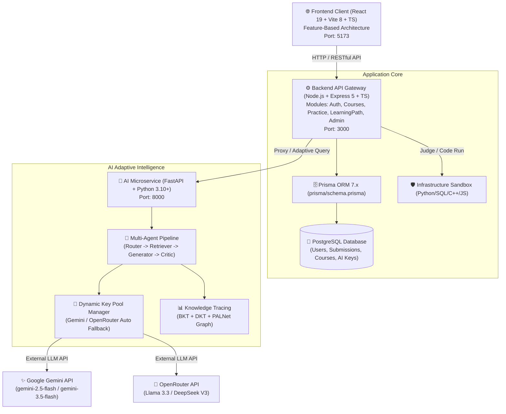

# 🏛️ TỔNG QUAN CẤU TRÚC DỰ ÁN HỆ THỐNG HỌC LẬP TRÌNH THÍCH ỨNG (LEARNPYTHON) - KIẾN TRÚC V2

> **Cập nhật lần cuối:** 11/09/2026  
> **Kiến trúc:** Feature-Based / Domain-Driven Microservices (Frontend React SPA + Backend Node.js/Express API Gateway + AI Service Python FastAPI/PyTorch Multi-Agent + PostgreSQL DB).

---

## 📑 MỤC LỤC
1. [Sơ Đồ Kiến Trúc Hệ Thống (Architecture Overview)](#1-sơ-đồ-kiến-trúc-hệ-thống)
2. [Cây Thư Mục Tổng Thể Cấp Cao (High-Level Tree)](#2-cây-thư-mục-tổng-thể-cấp-cao)
3. [Chi Tiết Microservice AI Service (`/ai-service`)](#3-chi-tiết-microservice-ai-service-ai-service)
4. [Chi Tiết Backend RESTful API (`/backend`)](#4-chi-tiết-backend-restful-api-backend)
5. [Chi Tiết Frontend Web Client (`/frontend`)](#5-chi-tiết-frontend-web-client-frontend)
6. [Chi Tiết Tài Liệu & Giáo Trình (`/docs`)](#6-chi-tiết-tài-liệu--giáo-trình-docs)
7. [Luồng Hoạt Động Của Hệ Thống (Core Workflows)](#7-luồng-hoạt-động-của-hệ-thống-core-workflows)

---

## 1. Sơ Đồ Kiến Trúc Hệ Thống



---

## 2. Cây Thư Mục Tổng Thể Cấp Cao

```text
LearnPython/
├── ai-service/                # 🧠 Microservice AI: Multi-agent, Knowledge Tracing, LLM Pool
├── backend/                   # ⚙️ Backend API: Node.js Express, Prisma ORM, Sandbox Runner
├── frontend/                  # 🌐 Frontend SPA: React, Vite, Tailwind CSS, Monaco Editor
├── docs/                      # 📚 Tài liệu kiến trúc, giáo trình, tính năng, deployment
├── assets/                    # 🎨 Tài nguyên ảnh, sơ đồ hệ thống
├── docker-compose.yml         # 🐳 Cấu hình triển khai container hóa toàn bộ hệ thống
├── Kế hoạch deploy.md         # 📋 Hướng dẫn triển khai Production / VPS
├── Lệnh chạy.txt             # ⚡ Lệnh khởi động nhanh 3 tầng dịch vụ
├── PROJECT_STRUCTURE.md       # 🏛️ Tài liệu cấu trúc thư mục v2 (File này)
└── README.md                  # 📖 Giới thiệu dự án và hướng dẫn cài đặt cơ bản
```

---

## 3. Chi Tiết Microservice AI Service (`/ai-service`)

Microservice xử lý toàn bộ logic thông minh: định tuyến ý định người học, tra cứu đồ thị kỹ năng (DAG), sinh bài tập thích ứng bằng LLM, thẩm định độ khó (Critic) và chấm điểm năng lực (BKT / DKT / PALNet).

```text
ai-service/
├── app/
│   ├── api/                            # 🔌 FastAPI endpoints & schemas
│   ├── agents/                         # ⭐ Multi-Agent AI System
│   │   └── adaptive_agent_orchestrator.py # Router, Retriever, Generator, Critic, Orchestrator
│   ├── adaptive/                       # 🗺️ Lộ trình thích ứng & ZPD
│   │   └── path_generator.py           # Sinh cây bài học thích ứng theo năng lực
│   ├── knowledge_tracing/              # 📈 Các mô hình đánh giá tri thức
│   │   ├── bkt.py                      # Bayesian Knowledge Tracing
│   │   ├── dkt.py                      # Deep Knowledge Tracing (PyTorch LSTM)
│   │   └── palnet.py                   # Path-Adaptive Learning Network (GNN)
│   ├── llm/                            # 🔑 Điều phối LLM & Key Pool
│   │   ├── key_pool_manager.py         # Quản lý xoay vòng API Key động từ DB
│   │   └── omniroute_client.py         # Client kết nối LLM Gateway
│   ├── retrieval/                      # 📊 Tra cứu đồ thị tri thức
│   └── config/                         # ⚙️ Cấu hình hệ thống
├── core/                               # 🔄 Re-export shims cho tương thích ngược
├── data/                               # 📊 Dữ liệu đồ thị kỹ năng và tham số BKT
│   ├── skill_graph.json                # Đồ thị kỹ năng Python (DAG 33 nodes)
│   ├── bkt_parameters.json             # Tham số BKT khởi tạo
│   └── mock_user_history.csv           # Dữ liệu học tập giả lập
├── models/                             # 🏋️ Trọng số PyTorch đã huấn luyện (.pth)
│   ├── dkt_model.pth
│   └── palnet_model.pth
├── scripts/                            # 🛠️ Scripts phụ trợ
│   ├── training/                       # train_bkt.py, train_dkt.py, train_palnet.py
│   ├── data_generation/                # mock_data_generator.py, seed_lots_of_practice_problems.py
│   └── testing/                        # database_test.py, check_user.py, test_recommendation.py
├── tests/                              # 🧪 Kiểm thử tự động
│   └── test_adaptive_agent.py
├── main.py                             # 🚀 Entry point FastAPI (Port: 8000)
├── Dockerfile                          # 🐳 Docker build AI Service
├── requirements.txt                    # 📦 Python dependencies
└── .env                                # 🔒 Biến môi trường
```

---

## 4. Chi Tiết Backend RESTful API (`/backend`)

Tổ chức theo **Feature-Based Architecture**. Tách biệt rõ ràng giữa Business Modules, Hạ tầng (Infrastructure) và Thành phần dùng chung (Shared).

```text
backend/
├── prisma/                             # 🗄️ Prisma đặt tại root backend theo chuẩn
│   ├── schema.prisma                   # Toàn bộ database schema
│   ├── migrations/                     # Lịch sử migration SQL
│   └── seed/                           # Dữ liệu nạp gốc
│       ├── seed.ts
│       ├── seed_course_data.json
│       ├── exercises_data.ts
│       └── seed_problems.ts
├── src/
│   ├── app.ts                          # 🚀 Entrypoint Express app & route mounting
│   ├── config/                         # ⚙️ Cấu hình môi trường
│   │   └── prisma.ts                   # Re-export Prisma Client
│   ├── infrastructure/                 # 🛡️ Hạ tầng kỹ thuật (Infrastructure Layer)
│   │   ├── database/                   # Khởi tạo Prisma Client kết nối PostgreSQL
│   │   │   └── prisma.ts
│   │   ├── sandbox/                    # 🛡️ Trình chạy mã an toàn cô lập (Runner Pattern)
│   │   │   ├── python/                 # 🐍 Runner chuyên biệt cho Python
│   │   │   │   └── python.runner.ts    # Docker python:3.10-alpine & Local subprocess
│   │   │   ├── sql/                    # 🗄️ Runner chuyên biệt cho SQL
│   │   │   │   ├── sql.runner.ts       # SQL runner TypeScript wrapper
│   │   │   │   └── sql.runner.py       # SQLite in-memory runner & mock schema
│   │   │   ├── js/                     # 🌐 Runner chuyên biệt cho JavaScript
│   │   │   │   └── js.runner.ts        # Node.js runner (Docker & Local)
│   │   │   ├── cpp/                    # ⚡ Runner chuyên biệt cho C / C++
│   │   │   │   └── cpp.runner.ts       # GCC/G++ compilation & execution
│   │   │   ├── utils/                  # 🛠️ Tiện ích dùng chung
│   │   │   │   └── docker.utils.ts     # Daemon check, timing microsecond, temp files
│   │   │   ├── sandbox.service.ts      # Dispatcher trung tâm điều phối và đăng ký runner
│   │   │   ├── sandbox.types.ts        # Interface ICodeRunner, ExecuteResult, Options
│   │   │   └── sandboxService.ts       # Re-export shim tương thích ngược 100%
│   │   ├── email/                      # Dịch vụ gửi email thông báo / OTP
│   │   │   └── emailService.ts
│   │   └── queue/                      # Hàng đợi xử lý chấm code song song
│   │       └── queueService.ts
│   ├── modules/                        # ⭐ Domain / Feature-Based Modules
│   │   ├── admin/                      # Quản trị viên
│   │   │   ├── adminController.ts
│   │   │   ├── adminAnalyticsController.ts
│   │   │   └── adminRoutes.ts
│   │   ├── ai-keys/                    # Quản lý AI Key Pool
│   │   │   ├── aiKey.controller.ts
│   │   │   └── aiKey.routes.ts
│   │   ├── auth/                       # Xác thực & tài khoản
│   │   │   ├── authController.ts
│   │   │   ├── auth.service.ts
│   │   │   └── authRoutes.ts
│   │   ├── courses/                    # Khóa học & bài học
│   │   │   ├── courseController.ts
│   │   │   └── courseRoutes.ts
│   │   ├── exercises/                  # Bài tập & nộp bài
│   │   │   ├── exerciseController.ts
│   │   │   ├── exercise.service.ts     # Business logic & sandbox evaluation
│   │   │   └── exerciseRoutes.ts
│   │   ├── learning-path/              # Lộ trình học thích ứng & AI Chat
│   │   │   ├── learningPath.controller.ts
│   │   │   └── learningPathRoutes.ts
│   │   ├── practice/                   # Sân chơi thực hành Arena
│   │   │   ├── practiceController.ts
│   │   │   └── practiceRoutes.ts
│   │   └── recommendations/            # Đề xuất bài tập thông minh
│   │       ├── recommendationController.ts
│   │       └── recommendationRoutes.ts
│   └── shared/                         # 🤝 Thành phần dùng chung xuyên suốt
│       ├── middleware/                 # auth.ts, adminAuth.ts
│       └── types/                      # express.d.ts
├── scripts/                            # 🛠️ Scripts vận hành Admin & Database
│   ├── adminSeeder.ts
│   ├── createAdminUser.ts
│   ├── seed_sql_course.ts
│   ├── restore_test_cases.ts
│   └── test_api.ts
├── Dockerfile                          # 🐳 Dockerfile cho Backend
├── package.json                        # 📦 Dependencies Node.js
├── prisma.config.ts                    # 📐 Cấu hình Prisma 7
└── tsconfig.json                       # ⚙️ Cấu hình biên dịch TypeScript
```

---

## 5. Chi Tiết Frontend Web Client (`/frontend`)

Tổ chức theo **Feature-Based Architecture**, gom toàn bộ giao diện, components và services liên quan vào từng feature domain tại `src/features/`.

```text
frontend/src/
├── features/                           # ⭐ Domain / Feature Modules
│   ├── admin/                          # 👨‍💼 Hợp nhất toàn bộ phân hệ Admin
│   │   ├── pages/                      # AdminDashboard, Analytics, UserManagement, AIKeyManagement...
│   │   ├── components/                 # AdminStats, AdminTable, ConfirmDialog, ErrorDisplay...
│   │   ├── lesson-studio/              # LessonStudioEditor, TipTapLessonEditor, studio/components...
│   │   ├── services/                   # adminApi.ts
│   │   └── hooks/                      # useAdminData.ts
│   ├── auth/                           # 🔐 Xác thực & tài khoản
│   │   ├── pages/                      # Login.tsx, Register.tsx
│   │   └── services/                   # authService.ts
│   ├── course/                         # 📚 Khóa học
│   │   ├── pages/                      # CourseDetail.tsx
│   │   └── components/                 # CourseCard.tsx, course-detail/*
│   ├── lesson/                         # 🎓 Bài học & Trắc nghiệm
│   │   ├── pages/                      # Lesson.tsx, Quiz.tsx, ModulePracticeSelect.tsx
│   │   └── components/                 # lesson/* (ContentRenderer, Header, Meta, Footer)
│   ├── practice/                       # 💻 Sân chơi thực hành trực tuyến
│   │   ├── pages/                      # Practice.tsx, PracticeList.tsx, PracticeWorkspace.tsx
│   │   └── components/                 # practice/* (Monaco Editor, Terminal, Description)
│   ├── adaptive-learning/              # 🎯 Học tập thích ứng cá nhân hóa
│   │   ├── pages/                      # AdaptivePractice, PersonalizedPath, PersonalizedPathWorkspace
│   │   └── components/                 # PersonalizedLessonViewer, KnowledgeGraphTree
│   ├── ai-tutor/                       # 🤖 Trợ lý ảo AI Tutor
│   │   └── components/                 # AITutorChat.tsx, AITutorIllustrations.tsx
│   └── dashboard/                      # 🏠 Bảng điều khiển học viên & trang chủ
│       └── pages/                      # Home.tsx, Dashboard.tsx, Profile.tsx
├── components/                         # 🌐 Thành phần UI dùng chung toàn ứng dụng (ThemeToggle, UserMenuDropdown)
├── pages/                              # 🔄 Re-export shims đảm bảo tương thích ngược
├── services/                           # 🌐 API client (api.ts) & shims
├── hooks/                              # 🌐 Global hooks & shims
├── utils/                              # 🎨 Tiện ích: themeHelper, quizParser, exportUtils
├── data/                               # 📊 pythonSkillGraph.json
├── App.tsx                             # 🚦 Cấu hình React Router và luồng điều hướng
├── index.css                           # 🎨 CSS toàn cục và Tailwind classes
└── main.tsx                            # 🚀 Điểm vào chính ứng dụng React
```

---

## 6. Chi Tiết Tài Liệu & Giáo Trình (`/docs`)

```text
docs/
├── architecture/                       # 📐 Kiến trúc hệ thống, Backend, Frontend, AI
│   └── ARCHITECTURE_REFACTOR_PROPOSAL.md
├── curriculum/                         # 📚 Giáo trình gốc Markdown (Python 8 modules, SQL)
│   └── Dữ liệu nội dung bài học/
├── features/                           # 📋 Đặc tả tính năng (Video Chapter, Adaptive Learning...)
│   └── Kế hoạch phát triển tính năng Video Chapter.md
├── deployment/                         # 🚀 Kế hoạch triển khai VPS, Docker
│   └── Kế hoạch deploy.md
├── research/                           # 📑 Báo cáo nghiên cứu khoa học & đề án
│   ├── Bao_cao_review_refactor_LearnPython.docx
│   ├── Ke_Hoach_Trien_Khai_Adaptive_Learning_Multi_Agent.docx
│   └── Y_Tuong_Va_Kich_Ban_Adaptive_Learning.docx
└── changelog/                          # 📝 Nhật ký tiến độ công việc theo ngày
    └── Nội dung đã làm trong mỗi ngày/
```

---

## 7. Luồng Hoạt Động Của Hệ Thống (Core Workflows)

### 🔄 Luồng 1: Học viên học bài & Nộp bài thực hành
1. Học viên mở bài học tại [frontend/src/features/lesson/pages/Lesson.tsx](file:///d:/Project/LearnPython/frontend/src/features/lesson/pages/Lesson.tsx).
2. Học viên gõ code và bấm **"Chạy Thử"** hoặc **"Nộp Bài"**.
3. Yêu cầu được gửi tới [backend/src/modules/exercises/exerciseController.ts](file:///d:/Project/LearnPython/backend/src/modules/exercises/exerciseController.ts).
4. Backend đưa code vào [backend/src/infrastructure/sandbox/sandboxService.ts](file:///d:/Project/LearnPython/backend/src/infrastructure/sandbox/sandboxService.ts) chạy trong môi trường cô lập, kiểm thử qua từng TestCase và đo lường thời gian thực thi.
5. Kết quả (Passed/Failed, runtimeMs, console log) lưu vào bảng `submissions` và trả về hiển thị tại Terminal Panel.

---

### 🤖 Luồng 2: Học tập thích ứng cá nhân hóa với AI Tutor
1. Học viên truy cập [frontend/src/features/adaptive-learning/pages/PersonalizedPath.tsx](file:///d:/Project/LearnPython/frontend/src/features/adaptive-learning/pages/PersonalizedPath.tsx) và tương tác với AI Tutor Mascot.
2. Tin nhắn được gửi qua [backend/src/modules/learning-path/learningPath.controller.ts](file:///d:/Project/LearnPython/backend/src/modules/learning-path/learningPath.controller.ts) và chuyển tiếp tới [ai-service/main.py](file:///d:/Project/LearnPython/ai-service/main.py).
3. Tại AI Service, [adaptive_agent_orchestrator.py](file:///d:/Project/LearnPython/ai-service/app/agents/adaptive_agent_orchestrator.py) vận hành:
   * **RouterAgent**: Phân tích ý định (Hỏi bài, xin bài tập, than khó...).
   * **KnowledgeRetriever**: Tra cứu đồ thị kỹ năng [`skill_graph.json`](file:///d:/Project/LearnPython/ai-service/data/skill_graph.json) kết hợp mô hình BKT/DKT để tìm lỗ hổng kiến thức.
   * **KeyPoolManager**: Lấy API Key khả dụng (Gemini / OpenRouter) từ database để gọi LLM.
   * **ExerciseGeneratorAgent**: Sinh bài học thích ứng theo ZPD.
   * **CriticEvaluatorAgent**: Tự động giải và chạy thử mã mẫu trên test cases trong sandbox trước khi bàn giao cho học viên.
4. Học viên bấm nút mở [PersonalizedPathWorkspace.tsx](file:///d:/Project/LearnPython/frontend/src/features/adaptive-learning/pages/PersonalizedPathWorkspace.tsx) để thực hành bài tập do AI tạo riêng cho mình.

---

### 🔑 Luồng 3: Quản trị viên quản lý Key AI (Dynamic Pool)
1. Quản trị viên truy cập [frontend/src/features/admin/pages/AIKeyManagement.tsx](file:///d:/Project/LearnPython/frontend/src/features/admin/pages/AIKeyManagement.tsx).
2. Thêm mới, bật/tắt hoặc kiểm tra trạng thái hoạt động của các Key Google Gemini / OpenRouter.
3. Backend xử lý qua [aiKey.controller.ts](file:///d:/Project/LearnPython/backend/src/modules/ai-keys/aiKey.controller.ts) lưu vào bảng `a_i_provider_keys`.
4. AI Service tự động đồng bộ key từ database qua [key_pool_manager.py](file:///d:/Project/LearnPython/ai-service/app/llm/key_pool_manager.py) mà không cần restart server.

---

> 📌 *Tài liệu này được đồng bộ hoàn toàn với cấu trúc thực tế Kiến trúc v2 của dự án LearnPython.*
