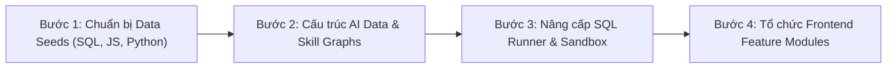

# 🏗️ ĐỀ XUẤT KIẾN TRÚC TÁI CẤU TRÚC (REFACTORING PROPOSAL)
## Nền Tảng Học Lập Trình Đa Ngôn Ngữ & Điều Phối AI Thích Ứng (CodeHub / LearnDev)

> **Tài liệu tham khảo**: Chuyển đổi từ cấu trúc monolithic hiện tại sang kiến trúc **Modular Multi-Service (hoặc Polyglot Monorepo)** chuẩn công nghiệp, tối ưu hóa cho việc tích hợp **Python, JavaScript, SQL, C++** và điều phối lộ trình học tập bằng AI.

---

## 🧭 1. CÂY THƯ MỤC TỔNG THỂ (PROJECT OVERVIEW)

```text
LearnDev-Platform/
├── 📁 .agent/                        # AI Assistant memory, rules, skills & workflows
├── 📁 .github/                       # CI/CD Workflows (tách biệt theo từng service)
│   └── workflows/
│       ├── ci-frontend.yml
│       ├── ci-backend.yml
│       └── ci-ai-service.yml
│
├── 📁 docs/                          # Toàn bộ tài liệu kiến trúc & nghiệp vụ
│   ├── ARCHITECTURE_REFACTOR_PROPOSAL.md
│   └── ...
│
├── 📁 frontend/                      # Ứng dụng Web Học tập (React 19 + Vite + Tailwind CSS v4)
│   ├── public/
│   │   └── monaco-workers/           # Web workers cho trình biên tập Monaco Editor
│   ├── src/
│   │   ├── 📁 app/                   # Điểm khởi tạo ứng dụng, Providers, Routing
│   │   ├── 📁 assets/                # Hình ảnh, icons, animations tĩnh
│   │   ├── 📁 components/            # UI Components nguyên tử dùng chung toàn hệ thống
│   │   │   ├── 📁 ui/                # Button, Modal, Input, Badge, Tooltip, Toast
│   │   │   ├── 📁 layout/            # Navbar, Sidebar, PageContainer, Header
│   │   │   └── 📁 feedback/          # SkeletonLoader, ErrorBoundary, EmptyState
│   │   ├── 📁 config/                # Cấu hình biến môi trường & Zod validation
│   │   ├── 📁 features/              # KIẾN TRÚC THEO TÍNH NĂNG (Feature-driven)
│   │   │   ├── 📁 auth/              # Xác thực, Đăng ký, Đăng nhập, Profile
│   │   │   ├── 📁 courses/           # Danh sách khóa học, xem chi tiết khóa học, module
│   │   │   ├── 📁 lesson-view/       # Giao diện học bài lý thuyết, video, markdown renderer
│   │   │   ├── 📁 code-editor/       # Trình soạn thảo Monaco, selector ngôn ngữ, console stdout
│   │   │   ├── 📁 sql-workspace/     # Giao diện đặc thù cho SQL (Schema Explorer, Result Table)
│   │   │   ├── 📁 roadmap/           # Đồ thị lộ trình học AI, cây kỹ năng tương tác
│   │   │   └── 📁 ai-tutor/          # Trợ lý gia sư AI Chat tương tác thời gian thực
│   │   ├── 📁 hooks/                 # Custom React Hooks dùng chung toàn app
│   │   ├── 📁 lib/                   # Khởi tạo thư viện bên thứ 3 (Axios, React Query, Monaco)
│   │   ├── 📁 store/                 # Global Zustand/Redux stores (Auth store, UI settings)
│   │   ├── 📁 types/                 # Kiểu dữ liệu Typescript tổng quát
│   │   ├── 📁 utils/                 # Hàm tiện ích chung (formatters, helpers)
│   │   ├── App.tsx
│   │   ├── main.tsx
│   │   └── index.css
│   ├── index.html
│   ├── package.json
│   ├── tsconfig.json
│   └── vite.config.ts
│
├── 📁 backend/                       # Máy chủ nghiệp vụ trung tâm (Node.js + Express + Prisma)
│   ├── 📁 prisma/                    # Quản lý Database Schema & Migrations
│   │   ├── schema.prisma             # Schema PostgreSQL
│   │   ├── migrations/
│   │   └── 📁 seeds/                 # DỮ LIỆU NẠP MÔN HỌC (Phân tách rõ ràng)
│   │       ├── 📁 python/            # Khóa học, bài tập, test cases Python
│   │       ├── 📁 javascript/        # Khóa học, bài tập, test cases JS/TS
│   │       ├── 📁 sql/               # Khóa học, schema mẫu (mock DB), bài tập truy vấn SQL
│   │       ├── 📁 cpp/               # Khóa học, bài tập C/C++
│   │       └── seed.ts               # Điều phối chạy toàn bộ seeder
│   ├── 📁 src/
│   │   ├── 📁 config/                # Cấu hình Database, Redis, JWT, Envs
│   │   ├── 📁 common/                # Middleware & Tiện ích dùng chung
│   │   │   ├── 📁 errors/            # Custom AppError, ErrorHandler
│   │   │   ├── 📁 middlewares/       # authGuard, roleGuard, rateLimiter, requestValidator
│   │   │   └── 📁 utils/             # logger, crypto, responseFormatter
│   │   ├── 📁 modules/               # KIẾN TRÚC HƯỚNG MIỀN NGHIỆP VỤ (Domain Modules)
│   │   │   ├── 📁 auth/              # Controller, Service, Routes, DTO xác thực
│   │   │   ├── 📁 user/              # Quản lý tài khoản, hồ sơ học viên
│   │   │   ├── 📁 curriculum/        # Quản lý Course, Module, Chapter, Lesson
│   │   │   ├── 📁 submission/        # Tiếp nhận nộp bài, lưu kết quả, điểm số
│   │   │   ├── 📁 ai-proxy/          # Proxy giao tiếp sang AI Service, rate limit token, log prompt
│   │   │   └── 📁 analytics/         # Thống kê tiến độ, tỷ lệ hoàn thành, kỹ năng đạt được
│   │   ├── 📁 services/
│   │   │   ├── 📁 sandbox/           # HỆ THỐNG THỰC THI CODE AN TOÀN
│   │   │   │   ├── codeRunner.ts     # Trình chạy Python, Node.js, C++
│   │   │   │   └── sqlRunner.ts      # Trình tạo SQLite/Postgres temp session để test query SQL
│   │   │   └── queueService.ts       # Hàng đợi Redis / BullMQ xử lý chấm code bất đồng bộ
│   │   ├── 📁 clients/               # Clients gọi dịch vụ ngoài (AI Service FastAPI, Cloudinary)
│   │   │   └── aiServiceClient.ts
│   │   ├── app.ts
│   │   └── server.ts
│   ├── package.json
│   └── tsconfig.json
│
├── 📁 ai-service/                    # Dịch vụ AI & Thuật toán thích ứng (Python 3.11+ + FastAPI)
│   ├── 📁 app/
│   │   ├── 📁 api/                   # Tầng API Endpoints (FastAPI Routers)
│   │   │   └── 📁 v1/
│   │   │       ├── 📁 endpoints/
│   │   │       │   ├── roadmap.py    # Sinh lộ trình học thích ứng
│   │   │       │   ├── assessment.py # Đánh giá năng lực & cập nhật Knowledge Tracing
│   │   │       │   └── tutor_chat.py # AI Socratic Tutor giải thích code & gợi ý
│   │   │       ├── api_router.py     # Tổng hợp router v1
│   │   │       └── dependencies.py   # FastAPI Dependency Injection
│   │   ├── 📁 core/                  # Cấu hình lõi (Config, Security, Logging)
│   │   ├── 📁 engines/               # CÁC BỘ MÁY THUẬT TOÁN HỌC MÁY & ĐỒ THỊ
│   │   │   ├── 📁 knowledge_tracing/ # Thuật toán BKT, DKT
│   │   │   │   ├── bkt_engine.py
│   │   │   │   └── dkt_engine.py
│   │   │   ├── 📁 roadmap/           # Thuật toán sinh lộ trình học thích ứng (DAG)
│   │   │   │   ├── graph_builder.py
│   │   │   │   └── prerequisite_solver.py
│   │   │   └── 📁 palnet/            # Mạng nơ-ron cá nhân hóa lộ trình (PyTorch)
│   │   ├── 📁 data/                  # DỮ LIỆU ĐỒ THỊ KỸ NĂNG THEO TỪNG MÔN HỌC
│   │   │   ├── 📁 python/
│   │   │   │   ├── skill_graph.json
│   │   │   │   └── bkt_parameters.json
│   │   │   ├── 📁 sql/
│   │   │   │   ├── skill_graph.json
│   │   │   │   └── bkt_parameters.json
│   │   │   ├── 📁 javascript/
│   │   │   │   ├── skill_graph.json
│   │   │   │   └── bkt_parameters.json
│   │   │   └── 📁 models/            # Lưu trữ model weights (.pth, .pkl)
│   │   ├── 📁 prompts/               # Quản lý Template Prompts cho LLM
│   │   │   ├── 📁 templates/
│   │   │   │   ├── tutor_prompt.jinja2
│   │   │   │   ├── code_feedback.jinja2
│   │   │   │   └── sql_explainer.jinja2
│   │   │   └── prompt_manager.py
│   │   ├── 📁 schemas/               # Pydantic Data Models (Request / Response validation)
│   │   │   ├── roadmap_schema.py
│   │   │   ├── assessment_schema.py
│   │   │   └── tutor_schema.py
│   │   └── 📁 services/              # Kết nối LLM Providers (OpenAI, Gemini, Ollama...)
│   │       └── llm_provider.py
│   ├── main.py                       # Điểm khởi chạy FastAPI
│   └── requirements.txt
```

---

## 🎯 2. CHI TIẾT CẢI TIẾN TRỌNG TÂM THEO TỪNG PHÂN HỆ

### 🖥️ A. Tầng Frontend (`frontend/src/features/`)
Áp dụng mô hình **Feature-driven**, đóng gói trọn vẹn từng miền nghiệp vụ:

| Feature Directory | Trách nhiệm chính |
| :--- | :--- |
| `features/code-editor/` | Chứa Monaco Editor, bộ chọn ngôn ngữ (`python`, `javascript`, `sql`, `cpp`), phím tắt, terminal console hiển thị stdout/stderr. |
| `features/sql-workspace/` | Giao diện chuyên biệt cho SQL: xem cấu trúc bảng CSDL mẫu (Schema Explorer) và hiển thị bảng dữ liệu kết quả (`Result Table`) thay vì chỉ hiện text console. |
| `features/roadmap/` | Trực quan hóa cây tri thức thích ứng (Adaptive Learning Graph), hiển thị các node bài học đã mở khóa/đang khóa dựa trên dữ liệu từ `ai-service`. |
| `features/ai-tutor/` | Cửa sổ hội thoại hỗ trợ theo phương pháp Socratic (hỏi mở, gợi ý tư duy thay vì giải hộ toàn bộ bài). |

---

### ⚙️ B. Tầng Backend (`backend/src/`)
Chuyển đổi từ cấu trúc MVC phẳng sang **Module-based** và nâng cấp bộ nạp dữ liệu:

1. **Thư mục Seed dữ liệu đa môn (`prisma/seeds/`)**:
   - `seeds/python/`: Chứa bài tập Python từ cơ bản đến nâng cao.
   - `seeds/javascript/`: Chứa bài tập JS, ES6+, xử lý mảng, DOM, Async.
   - `seeds/sql/`: Chứa schema DB mẫu (ví dụ: `ecommerce_db.sql`) và các đề bài truy vấn `SELECT`, `JOIN`, `GROUP BY`.
   - `seeds/cpp/`: Chứa bài tập C/C++ thuật toán & cấu trúc dữ liệu.

2. **Dịch vụ Chấm Code đa ngôn ngữ (`services/sandbox/`)**:
   - `codeRunner.ts`: Chạy code Python, JS (Node.js), C++ qua môi trường cách ly process.
   - `sqlRunner.ts`: Khởi tạo database tạm (SQLite in-memory hoặc Postgres Schema cách ly) để thực thi câu truy vấn của học viên và đối chiếu bảng dữ liệu kết quả với bảng mẫu của giáo viên.

---

### 🧠 C. Tầng AI Service (`ai-service/app/`)
Chuẩn hóa kiến trúc AI Service để dễ dàng huấn luyện và mở rộng thêm nhiều môn học:

1. **Phân tách Đồ thị kỹ năng theo Môn (`data/<language>/skill_graph.json`)**:
   - Mỗi môn học (Python, SQL, JS) sở hữu đồ thị tiên quyết kỹ năng độc lập.
   - Dễ dàng tính toán độ thành thạo (Mastery Level) của học viên cho từng môn mà không bị chồng chéo dữ liệu.
2. **Tách biệt Prompt Templates (`prompts/templates/`)**:
   - Quản lý các prompt của AI Tutor, giải thích lỗi code, sinh bài tập dưới dạng file Jinja2 độc lập, giúp việc tinh chỉnh prompt không cần sửa code Python.
3. **Pydantic Schemas (`schemas/`)**:
   - Đảm bảo đầu ra từ các thuật toán AI và LLM luôn tuân thủ JSON Schema nghiêm ngặt trước khi gửi về Backend/Frontend.

---

## 📋 3. LỘ TRÌNH TRIỂN KHAI THỰC TẾ (RECOMMENDED NEXT STEPS)



1. **Giai đoạn 1 (Ưu tiên cao)**: Tạo cấu trúc `backend/prisma/seeds/` cho `sql/` và `javascript/`, sau đó tạo thư mục `ai-service/data/` tương ứng.
2. **Giai đoạn 2**: Xây dựng `sqlRunner.ts` trong Backend để hỗ trợ chấm bài tập truy vấn SQL.
3. **Giai đoạn 3**: Gom các component trong `frontend/src/` về các `features/` theo chuẩn thiết kế.
