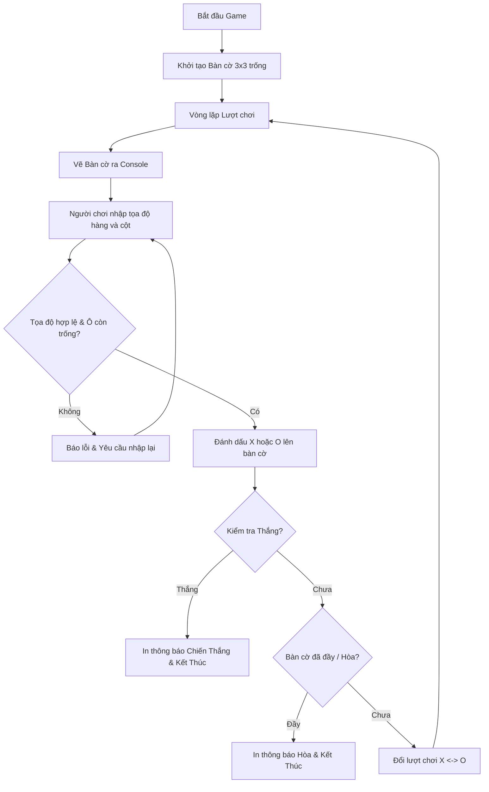

# Ma trận Động vector 2 Chiều và Dự án Game Console: Tic-Tac-Toe

## 1. Khái niệm & Vấn đề

Trong lập trình thực tế, kích thước của một bàn cờ hay một lưới dữ liệu thường không cố định lúc viết code mà phụ thuộc vào cài đặt của người chơi (ví dụ bàn cờ 3x3, 5x5, hay 10x10). Việc khai báo mảng tĩnh cố định `a[100][100]` vừa lãng phí RAM, vừa tiềm ẩn nguy cơ tràn mảng khi kích thước vượt quá giới hạn.

Giải pháp tối thượng của Modern C++ là **`std::vector` 2 chiều (`std::vector<std::vector<T>>`)**:
- Ma trận có kích thước động, được cấp phát an toàn trên Heap.
- Không bao giờ phải lo lắng về việc tràn bộ nhớ Stack.
- Cho phép truyền vào hàm mượt mà mà không cần phải ghim cứng kích thước số cột.

Để kết thúc trọn vẹn Khóa học **C++ Cơ bản & Tư duy Thuật toán**, chúng ta sẽ tích hợp toàn bộ kiến thức từ Biến, Rẽ nhánh, Vòng lặp, Hàm đến Mảng 2 chiều để phát triển một tựa game hoàn chỉnh: **Game Cờ Caro Tic-Tac-Toe 3x3 chạy trên Console**.

---

## 2. Cú pháp & Vận hành

### 1. Cú pháp khởi tạo `std::vector` 2 chiều chuẩn C++

```cpp
#include <vector>

// Khởi tạo ma trận động gồm R hàng, C cột với giá trị mặc định initVal:
int R = 3, C = 3;
char emptyChar = ' ';
std::vector<std::vector<char>> board(R, std::vector<char>(C, emptyChar));

// Truy xuất phần tử y hệt mảng tĩnh:
board[0][0] = 'X';
int numRows = board.size();       // Lấy số hàng
int numCols = board[0].size();    // Lấy số cột
```

### 2. Thiết kế Kiến trúc Dự án Game Tic-Tac-Toe



---

## 3. Toàn bộ Mã nguồn Dự án Hoàn chỉnh (Clean Code)

```cpp
#include <iostream>
#include <vector>

const int SIZE = 3;

// Hàm 1: Hiển thị bàn cờ giao diện trực quan
void drawBoard(const std::vector<std::vector<char>>& board) {
    std::cout << "
    0   1   2
";
    std::cout << "  +---+---+---+
";
    for (int i = 0; i < SIZE; ++i) {
        std::cout << i << " | ";
        for (int j = 0; j < SIZE; ++j) {
            std::cout << board[i][j] << " | ";
        }
        std::cout << "
  +---+---+---+
";
    }
    std::cout << "
";
}

// Hàm 2: Kiểm tra xem người chơi hiện tại đã chiến thắng chưa
bool checkWin(const std::vector<std::vector<char>>& board, char player) {
    // 1. Kiểm tra từng hàng
    for (int i = 0; i < SIZE; ++i) {
        if (board[i][0] == player && board[i][1] == player && board[i][2] == player) return true;
    }
    // 2. Kiểm tra từng cột
    for (int j = 0; j < SIZE; ++j) {
        if (board[0][j] == player && board[1][j] == player && board[2][j] == player) return true;
    }
    // 3. Kiểm tra 2 đường chéo
    if (board[0][0] == player && board[1][1] == player && board[2][2] == player) return true;
    if (board[0][2] == player && board[1][1] == player && board[2][0] == player) return true;

    return false;
}

// Hàm 3: Kiểm tra xem bàn cờ đã kín ô chưa (Hòa cờ)
bool isBoardFull(const std::vector<std::vector<char>>& board) {
    for (int i = 0; i < SIZE; ++i) {
        for (int j = 0; j < SIZE; ++j) {
            if (board[i][j] == ' ') return false;
        }
    }
    return true;
}

int main() {
    // Khởi tạo bàn cờ 3x3 với các ký tự khoảng trắng
    std::vector<std::vector<char>> board(SIZE, std::vector<char>(SIZE, ' '));
    char currentPlayer = 'X';
    bool gameOver = false;

    std::cout << "========================================
";
    std::cout << "   CHÀO MỪNG ĐẾN VỚI GAME TIC-TAC-TOE   
";
    std::cout << "========================================
";

    while (!gameOver) {
        drawBoard(board);
        int r, c;
        std::cout << "Lượt của Người chơi [" << currentPlayer << "].
";
        std::cout << "Nhập tọa độ hàng và cột (0-2), cách nhau bởi dấu cách: ";

        if (!(std::cin >> r >> c)) {
            std::cout << "Dữ liệu nhập không hợp lệ! Thoát game.
";
            break;
        }

        // Kiểm tra tính hợp lệ của tọa độ
        if (r < 0 || r >= SIZE || c < 0 || c >= SIZE) {
            std::cout << ">> [CẢNH BÁO]: Tọa độ nằm ngoài bàn cờ! Vui lòng nhập từ 0 đến 2.
";
            continue;
        }

        if (board[r][c] != ' ') {
            std::cout << ">> [CẢNH BÁO]: Ô (" << r << ", " << c << ") đã được đánh rồi! Hãy chọn ô khác.
";
            continue;
        }

        // Ghi nước đi vào bàn cờ
        board[r][c] = currentPlayer;

        // Kiểm tra trạng thái kết thúc
        if (checkWin(board, currentPlayer)) {
            drawBoard(board);
            std::cout << "****************************************
";
            std::cout << "  CHÚC MỪNG NGƯỜI CHƠI [" << currentPlayer << "] ĐÃ CHIẾN THẮNG! 
";
            std::cout << "****************************************
";
            gameOver = true;
        } else if (isBoardFull(board)) {
            drawBoard(board);
            std::cout << "========================================
";
            std::cout << "          TRẬN ĐẤU BẤT PHÂN THẮNG BẠI (HÒA)!          
";
            std::cout << "========================================
";
            gameOver = true;
        } else {
            // Đổi lượt người chơi
            currentPlayer = (currentPlayer == 'X') ? 'O' : 'X';
        }
    }

    return 0;
}
```

---

## 4. Thực hành phân bậc

### 4.1. Trắc nghiệm nhanh (Warm-up)
**Câu hỏi:** Khai báo nào sau đây tạo ra một ma trận động `std::vector` có 4 hàng, mỗi hàng có 5 phần tử kiểu số thực `double` khởi tạo bằng giá trị 0.0?
- A. `std::vector<double> v(4, 5);`
- B. `std::vector<std::vector<double>> v(4, std::vector<double>(5, 0.0));`
- C. `std::vector<std::vector<double>> v(5, std::vector<double>(4, 0.0));`
- D. `std::vector<double> v[4][5];`

**Đáp án đúng:** **B**
*Giải thích:* Cú pháp chuẩn tạo ma trận 2D trong C++ là khởi tạo vector cha gồm 4 phần tử, mỗi phần tử là 1 vector con gồm 5 phần tử giá trị 0.0.

### 4.2. Thử thách nâng cấp dự án (Mini-task)
**Nhiệm vụ kết khóa:** Hãy nâng cấp chương trình Tic-Tac-Toe ở trên:
1. Thêm tính năng đếm tổng số bước đi của cả 2 người chơi.
2. Thêm chế độ hỏi người chơi: `"Bạn có muốn chơi ván mới không? (y/n)"` sau khi trận đấu kết thúc bằng cách áp dụng vòng lặp `do-while`.

---

## 5. Tổng kết Khóa học & Hành trình Tiếp theo

🎉 **CHÚC MỪNG BẠN ĐÃ XUẤT SẮC HOÀN THÀNH TOÀN BỘ KHÓA HỌC C++ CƠ BẢN!**

Bạn đã đi qua một hành trình vững chắc và toàn diện:
1. **Module 1:** Môi trường biên dịch, Biến, Kiểu dữ liệu và Nhập xuất Console.
2. **Module 2:** Tư duy Logic rẽ nhánh `if-else`, `switch-case` và cơ chế đoản mạch.
3. **Module 3:** Bậc thầy Vòng lặp `for`, `while` và các chuyên đề số học kinh điển.
4. **Module 4:** Tư duy Phân rã bài toán với Hàm, Tham chiếu `&`, `const &` và Đệ quy.
5. **Module 5:** Cấu trúc dữ liệu Mảng 1 chiều, Thuật toán Sắp xếp và `std::vector`.
6. **Module 6:** Làm chủ Ký tự ASCII, xử lý chuỗi an toàn với `std::string`.
7. **Module 7:** Ma trận 2 chiều, Tối ưu bộ nhớ Cache và Hoàn thành Dự án Game Console.

*Điểm đến tiếp theo:* Bạn đã sở hữu nền tảng lập trình vững như bàn thạch để tự tin bước vào **Khóa 2: C++ Lập trình Hướng đối tượng (OOP)**, nơi bạn sẽ học cách thiết kế các hệ sinh thái phần mềm quy mô lớn bằng `Class`, `Object`, Kế thừa, Đa hình và Quản lý bộ nhớ con trỏ chuyên sâu!
