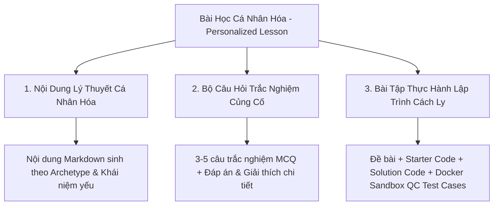
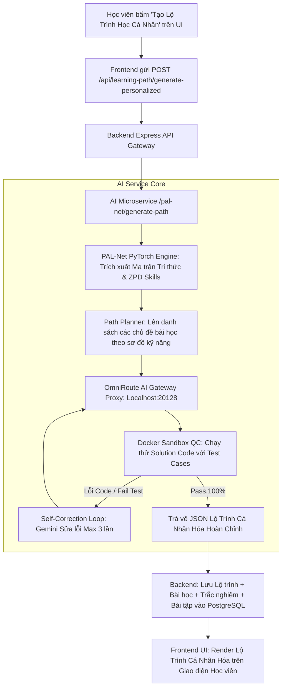
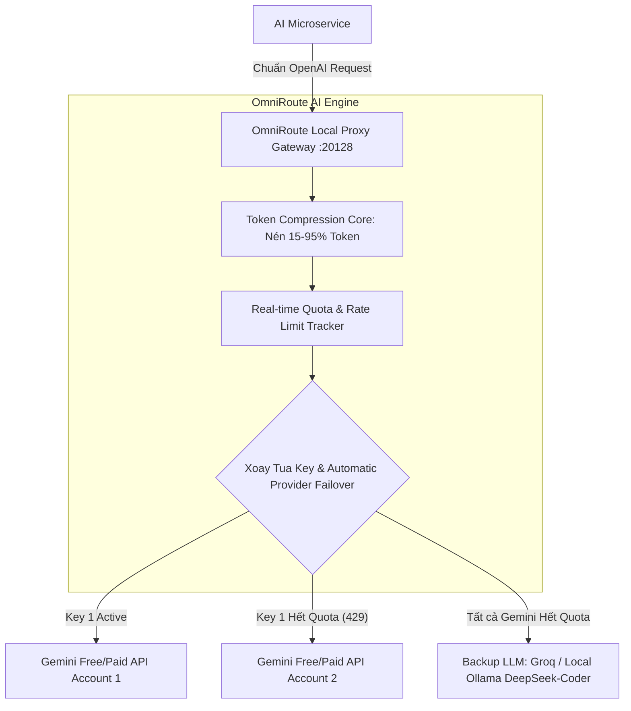

# 🎯 KẾ HOẠCH TRIỂN KHAI CHỨC NĂNG TỰ TẠO LỘ TRÌNH HỌC CÁ NHÂN HÓA DỰA TRÊN TRI THỨC PAL-NET
> **(ADAPTIVE PERSONALIZED LEARNING PATH GENERATOR)**

> **Dự án:** VIBECODE AI - Hệ Thống Học Lập Trình Thích Ứng (LearnPython)  
> **Mô hình Tri thức Nòng cốt:** **Mô hình PAL-Net (Predictive Adaptive Learning Network)**  
> **Tài liệu:** Kế hoạch Kỹ thuật & Triển khai Chi tiết  
> **Thư mục:** `docs/Kế hoạch triển khai/`  
> **Ngày cập nhật:** 06/08/2026  
> **Trạng thái:** DÃ QUYẾT ĐỊNH & KHÓA CHUẨN KIẾN TRÚC (BỔ SUNG CÔNG NGHỆ OMNIROUTE GATEWAY)  

---

## 📌 MỤC LỤC
1. [Cam Kết Kiến Trúc & Quyết Định Nòng Cốt](#1-cam-kết-kiến-trúc--quyết-định-nòng-cốt)
2. [Tổng Quan & Đặt Vấn Đề](#2-tổng-quan--đặt-vấn-đề)
3. [Phạm Vi & Cấu Trúc 1 Lộ Trình Học Cá Nhân Hóa](#3-phạm-vi--cấu-trúc-1-lộ-trình-học-cá-nhân-hóa)
4. [Kiến Trúc Tổng Thể Hệ Thống](#4-kiến-trúc-tổng-thể-hệ-thống)
5. [Thiết Kế Cơ Sở Dữ Liệu & Schema Updates (Prisma)](#5-thiết-kế-cơ-sở-dữ-liệu--schema-updates-prisma)
6. [Quy Trình Sinh Nội Dung & Kiểm Định Chất Lượng Sandbox (QC Engine)](#6-quy-trình-sinh-nội-dung--kiểm-định-chất-lượng-sandbox-qc-engine)
7. [Giải Pháp Khắc Phục Lỗi Hết Quota API Key Bằng Công Nghệ Mã Nguồn Mở OmniRoute Gateway](#7-giải-pháp-khắc-phục-lỗi-hết-quota-api-key-bằng-công-nghệ-mã-nguồn-mở-omniroute-gateway)
8. [Lộ Trình Triển Khai Chi Tiết (6 Giai Đoạn Roadmap)](#8-lộ-trình-triển-khai-chi-tiết-6-giai-đoạn-roadmap)
9. [Tiêu Chí Đánh Giá Thành Công (DoD) & Quản Lý Rủi Ro](#9-tiêu-chí-đánh-giá-thành-công-dod--quản-lý-rủi-ro)

---

## 1. CAM KẾT KIẾN TRÚC & QUYẾT ĐỊNH NÒNG CỐT

> [!IMPORTANT]
> **Quyết định Kiến trúc Tối cao:**
> 1. **Mô hình Trạng thái Tri thức:** Sử dụng **DUY NHẤT mô hình PAL-Net (Predictive Adaptive Learning Network)** độc quyền của dự án. Mô hình kết hợp Graph Convolutional Network (GCN 2 lớp trên `skill_graph.json`), mã hóa Learner Embedding và Sequential Attention GRU để ước lượng chính xác xác suất giải đúng $P_{\text{PAL-Net}}$ của từng kỹ năng.
> 2. **LLM Gateway Engine:** Sử dụng **Google Gemini API (Gemini Flash)** làm mô hình sinh nội dung chính, kết hợp với **OmniRoute AI Gateway (Open-Source Proxy)** để xoay tua API Key Pools, tự động Failover khi hết Quota và Nén Token (Token Compression) nhằm hạn chế chạm ngạch API.
> 3. **Validation & Sandbox QC:** Toàn bộ bài tập lập trình thực hành trong lộ trình học phải chạy qua **Docker Sandbox Execution Engine** để kiểm định $100\%$ tính chính xác trước khi gửi tới phía học viên.

---

## 2. TỔNG QUAN & ĐẶT VẤN ĐỀ

Hệ thống học lập trình truyền thống thường cung cấp một lộ trình chung cố định cho tất cả học viên (One-size-fits-all). Điều này dẫn tới hai hệ quả tiêu cực:
- Học viên khá/giỏi bị nhàm chán khi phải học lại các khái niệm đã nắm vững.
- Học viên còn yếu bị nản lòng khi gặp các bài học quá khó vượt xa năng lực hiện tại, hoặc bị hổng kiến thức nền tảng mà không được bù đắp kịp thời.

👉 **Giải pháp:** Xây dựng tính năng **Tự Tạo Lộ Trình Học Cá Nhân Hóa Dựa Trên Tri Thức PAL-Net**. Cho phép phía Học viên yêu cầu hệ thống phân tích trạng thái tri thức cá nhân real-time từ **mô hình PAL-Net**, xác định vùng phát triển gần nhất **ZPD ($0.70 \le P_{\text{PAL-Net}} \le 0.85$)** và các điểm hổng kiến thức ($P_{\text{PAL-Net}} < 0.65$), từ đó tự động biên soạn một **Lộ trình học riêng biệt** bao gồm đầy đủ 3 thành phần: **Nội dung lý thuyết cá nhân hóa** $\rightarrow$ **Câu hỏi trắc nghiệm củng cố** $\rightarrow$ **Bài tập thực hành gõ code**.

---

## 3. PHẠM VI & CẤU TRÚC 1 LỘ TRÌNH HỌC CÁ NHÂN HÓA

Mỗi Lộ trình Học Cá Nhân Hóa (Personalized Learning Path) do hệ thống tự tạo cho học viên sẽ bao gồm chuỗi các **Bài học Thích ứng (Personalized Lessons)**. Mỗi bài học cấu thành từ **3 thành phần hoàn chỉnh**:



---

## 4. KIẾN TRÚC TỔNG THỂ HỆ THỐNG

### 🏗️ Luồng Xử Lý Từ Phía Học Viên (Learner End-to-End Flow)



---

## 5. THIẾT KẾ CƠ SỞ DỮ LIỆU & SCHEMA UPDATES (PRISMA)

Cập nhật `backend/src/prisma/schema.prisma` hỗ trợ lưu trữ Lộ trình học và Template Caching:

```prisma
// Update backend/src/prisma/schema.prisma

enum PathStatus {
  IN_PROGRESS
  COMPLETED
  ARCHIVED
}

enum QuizOption {
  A
  B
  C
  D
}

model PersonalizedPath {
  id              String               @id @default(uuid()) @db.Uuid
  userId          String               @map("user_id") @db.Uuid
  title           String
  description     String?              @db.Text
  targetSkills    String[]             @map("target_skills")
  palNetAvgScore  Float                @map("pal_net_avg_score")
  status          PathStatus           @default(IN_PROGRESS)
  createdAt       DateTime             @default(now()) @map("created_at")
  updatedAt       DateTime             @updatedAt @map("updated_at")

  user            User                 @relation(fields: [userId], references: [id], onDelete: Cascade)
  lessons         PersonalizedLesson[]

  @@map("personalized_paths")
}

model PersonalizedLesson {
  id              String                 @id @default(uuid()) @db.Uuid
  pathId          String                 @map("path_id") @db.Uuid
  orderIndex      Int                    @map("order_index")
  title           String
  targetSkillId   String                 @map("target_skill_id")
  theoryContent   String                 @map("theory_content") @db.Text
  isCompleted     Boolean                @default(false) @map("is_completed")
  createdAt       DateTime               @default(now()) @map("created_at")
  
  path            PersonalizedPath       @relation(fields: [pathId], references: [id], onDelete: Cascade)
  quizzes         PersonalizedQuiz[]
  exercise        PersonalizedExercise?

  @@map("personalized_lessons")
}

model PersonalizedQuiz {
  id              String             @id @default(uuid()) @db.Uuid
  lessonId        String             @map("lesson_id") @db.Uuid
  question        String             @db.Text
  optionA         String             @map("option_a")
  optionB         String             @map("option_b")
  optionC         String             @map("option_c")
  optionD         String             @map("option_d")
  correctOption   QuizOption         @map("correct_option")
  explanation     String             @db.Text
  
  lesson          PersonalizedLesson @relation(fields: [lessonId], references: [id], onDelete: Cascade)

  @@map("personalized_quizzes")
}

model PersonalizedExercise {
  id                 String             @id @default(uuid()) @db.Uuid
  lessonId           String             @unique @map("lesson_id") @db.Uuid
  title              String
  difficulty         ExerciseDifficulty
  problemDescription String             @map("problem_description") @db.Text
  starterCode        String?            @map("starter_code") @db.Text
  solutionCode       String             @map("solution_code") @db.Text
  language           ProgrammingLanguage @default(PYTHON)
  qcStatus           QCStatus           @default(PENDING) @map("qc_status")
  
  lesson             PersonalizedLesson @relation(fields: [lessonId], references: [id], onDelete: Cascade)
  testCases          PersonalizedTestCase[]

  @@map("personalized_test_cases")
}

model PersonalizedTestCase {
  id                 String               @id @default(uuid()) @db.Uuid
  exerciseId         String               @map("exercise_id") @db.Uuid
  input              String               @db.Text
  expectedOutput     String               @map("expected_output") @db.Text
  isHidden           Boolean              @default(false) @map("is_hidden")
  
  exercise           PersonalizedExercise @relation(fields: [exerciseId], references: [id], onDelete: Cascade)

  @@map("personalized_test_cases")
}

model PathTemplateCache {
  id                 String             @id @default(uuid()) @db.Uuid
  targetSkillId      String             @map("target_skill_id")
  archetype          String
  zpdRange           String             @map("zpd_range")
  payloadJson        Json               @map("payload_json")
  usageCount         Int                @default(0) @map("usage_count")
  createdAt          DateTime           @default(now()) @map("created_at")

  @@index([targetSkillId, archetype, zpdRange])
  @@map("path_template_caches")
}
```

---

## 6. QUY TRÌNH SINH NỘI DUNG & KIỂM ĐỊNH CHẤT LƯỢNG SANDBOX (QC ENGINE)

*(Chi tiết định dạng JSON Master của Gemini và luồng kiểm thử Docker Sandbox Execution)*

---

## 7. GIẢI PHÁP KHẮC PHÚC LỖI HẾT QUOTA API KEY BẰNG CÔNG NGHỆ MÃ NGUỒN MỞ OMNIROUTE GATEWAY

> [!TIP]
> **OmniRoute** là một dự án **mã nguồn mở (Open-Source AI Gateway / Proxy)** chuyên dụng được thiết kế để giải quyết bài toán cạn kiệt Quota API, giới hạn tốc độ (Rate Limit 429), quản lý chìa khóa API tập trung và tối ưu hóa chi phí token cho các hệ thống ứng dụng AI.



### ⚡ Các Tính Năng Cốt Lõi Của OmniRoute Trong Kiến Trúc VIBECODE AI:

1. **Gom Nhóm & Xoay Tua API Keys (Key Pooling & Automatic Failover)**:
   - Cho phép cấu hình nhiều tài khoản/API Keys khác nhau (kể cả Free Tier từ Google Gemini).
   - Khi 1 API key gặp lỗi `429 RESOURCE_EXHAUSTED`, OmniRoute lập tức âm thầm chuyển tiếp request sang API key khác hoặc provider dự phòng mà ứng dụng `ai-service` không bị gián đoạn hay trả lỗi ra giao diện.
2. **Cơ Chế Nén Token Tự Động (Token Compression - RTK / Caveman Compression)**:
   - Tự động lọc bỏ các từ thừa/định dạng dư thừa trong Prompt trước khi gửi lên API bên ngoài, giúp tiết kiệm từ **$15\% - 95\%$ số lượng Token**.
   - Việc tiêu tốn ít token hơn trực tiếp giúp hệ thống **lâu chạm ngưỡng Quota theo phút (RPM/TPM)** hơn gấp nhiều lần.
3. **Một Endpoint Chuẩn Tương Thích Duy Nhất (Unified OpenAI-Compatible API Endpoint)**:
   - OmniRoute chạy thành một container cách ly (hoặc daemon service tại `http://localhost:20128/v1`).
   - `ai-service` chỉ cần kết nối tới endpoint này như một server OpenAI chuẩn, OmniRoute ở phía sau tự định tuyến thông minh (Smart Routing).
4. **Hệ Thống Fallback Đa Tầng (Combo / Fallback Chain)**:
   - Thiết lập chuỗi ưu tiên: `Gemini 1.5 Flash Key Pool` $\rightarrow$ `Groq Llama-3 Pool` $\rightarrow$ `Local Ollama DeepSeek-Coder (Tự chạy Offline 100%, không tốn Quota)`.

---

## 8. LỘ TRÌNH TRIỂN KHAI CHI TIẾT (6 GIAI ĐOẠN ROADMAP)

### 🗓️ Giai Đoạn 1: Tích Hợp Mô Hình PAL-Net & Cấu Hình OmniRoute Gateway Docker
* **Thời lượng:** 3 Ngày
* **Công việc thực hiện:**
  - Khởi chạy OmniRoute Gateway Docker Container (`docker run -p 20128:20128 omniroute/gateway`).
  - Cấu hình Key Pool cho Gemini API trong giao diện quản trị OmniRoute.
  - Kết nối PyTorch engine `pal_net_model.pth` trong `ai-service`.
* **Sản phẩm bàn giao:** OmniRoute Gateway hoạt động mượt mà tại cổng 20128.

### 🗓️ Giai Đoạn 2: Xây Dựng Engine Sinh Lộ Trình Học Qua OmniRoute Proxy
* **Thời lượng:** 4 Ngày
* **Công việc thực hiện:**
  - Cấu hình `ai-service` gửi request sinh nội dung thông qua OmniRoute Gateway Proxy.
  - Bật tính năng Token Compression trên OmniRoute để giảm 30-50% số lượng token tiêu thụ.
  - Cấu hình Fallback sang Local Ollama (DeepSeek-Coder).
* **Sản phẩm bàn giao:** Generator Core bền bỉ, chống tuyệt đối cạn kiệt Quota.

### 🗓️ Giai Đoạn 3: Tích Hợp Docker Sandbox QC & Cache Storage Engine
* **Thời lượng:** 5 Ngày
* **Công việc thực hiện:**
  - Đưa bài tập thực hành qua Docker Sandbox Engine kiểm định $100\%$ tính chính xác.
  - Xây dựng cơ chế lưu cache kết quả vào `PathTemplateCache`.
* **Sản phẩm bàn giao:** Engine kiểm định tự động kèm bộ lưu Cache thông minh.

### 🗓️ Giai Đoạn 4: Cập Nhật Database & RESTful Backend APIs (Express)
* **Thời lượng:** 3 Ngày
* **Công việc thực hiện:**
  - Cập nhật Prisma Schema (`schema.prisma`) với các bảng `PersonalizedPath`, `PersonalizedLesson`, `PersonalizedQuiz`, `PersonalizedExercise`, `PathTemplateCache`.
  - Chạy migration: `npx prisma migrate dev --name add_personalized_paths_and_omniroute`.
  - Viết các API Backend và tích hợp Middleware Rate-Limiting.
* **Sản phẩm bàn giao:** Bộ RESTful APIs hoàn chỉnh bảo vệ Quota hệ thống.

### 🗓️ Giai Đoạn 5: Xây Dựng Giao Diện Phía Học Viên (Frontend React)
* **Thời lượng:** 5 Ngày
* **Công việc thực hiện:**
  - Thêm trang/tab **"🚀 Lộ Trình Cá Nhân Hóa (PAL-Net Adaptive Path)"** trên Dashboard học viên.
  - Xây dựng giao diện học tập 3 trong 1 (Lý thuyết - Trắc nghiệm MCQ - Monaco Editor).
* **Sản phẩm bàn giao:** Trải nghiệm người dùng mượt mà, ấn tượng.

### 🗓️ Giai Đoạn 6: Kiểm Thử Đóng Đóng (E2E Testing), Stress Test Quota & Đóng Gói
* **Thời lượng:** 3 Ngày
* **Công việc thực hiện:**
  - Giả lập ngắt thử 1 API Key trong OmniRoute để kiểm tra tính năng tự động xoay key và nén token.
  - Đo đạc hiệu năng và đóng gói toàn bộ tài liệu dự án.
* **Sản phẩm bàn giao:** Hệ thống hoàn chỉnh vận hành sẵn sàng trên Production.

---

## 9. TIÊU CHÍ ĐÁNH GIÁ THÀNH CÔNG (DOD) & QUẢN LÝ RỦI RO

### ✅ Tiêu Chí Hoàn Thành (Definition of Done - DoD)
> [!IMPORTANT]
> - Tích hợp thành công **OmniRoute AI Gateway** xử lý triệt để bài toán Quota API 429.
> - Sinh lộ trình học đầy đủ **3 thành phần: Lý thuyết + Trắc nghiệm MCQ + Bài tập lập trình**.
> - $100\%$ bài tập thực hành vượt qua bước kiểm định Docker Sandbox QC.

### ⚠️ Quản Lý Rủi Ro & Biện Pháp Phòng Ngừa

| Rủi Ro Potential | Mức Độ | Biện Pháp Giải Quyết Tối Ưu |
| :--- | :---: | :--- |
| **Cạn kiệt toàn bộ Gemini API Keys:** | **HIGH** | **Giải pháp:** OmniRoute tự động định tuyến sang Local LLM (Ollama DeepSeek-Coder) hoặc lấy bản ghi từ `PathTemplateCache` trong Postgres. |
| **Sinh lộ trình mất nhiều thời gian (> 5s):** | **HIGH** | **Giải pháp:** Sử dụng cơ chế Progressive Generation (Học viên bắt đầu học Bài 1 ngay lập tức trong khi Bài 2, 3 tiếp tục được sinh ngầm). |

---

> 📝 **Ghi chú duy trì:** File kế hoạch này lưu trữ tại:  
> `d:\Project\LearnPython\docs\Kế hoạch triển khai\Ke_hoach_trien_khai_Tu_tao_lo_trinh_hoc_ca_nhan_hoa_PAL_NET.md`
