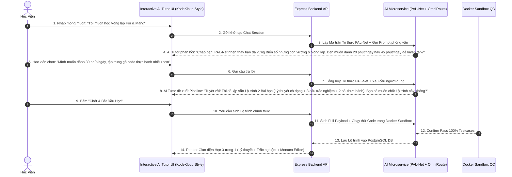

# 🎬 KỊCH BẢN TƯƠNG TÁC GIAO DIỆN & ĐỐI THOẠI AI TUTOR TỰ TẠO LỘ TRÌNH HỌC CÁ NHÂN HÓA

> **Dự án:** VIBECODE AI - Hệ Thống Học Lập Trình Thích Ứng (LearnPython)  
> **Cảm hứng Giao diện:** KodeKloud AI Tutor (`ai.kodekloud.com`)  
> **Mô hình Tri thức Nòng cốt:** **Mô hình PAL-Net (Predictive Adaptive Learning Network)**  
> **LLM Engine:** Google Gemini API qua **OmniRoute AI Gateway**  
> **Thư mục lưu:** `docs/Kế hoạch triển khai/`  
> **Tài liệu:** Kịch bản Tương tác Chi tiết & Thiết kế Luồng UX  

---

## 📌 MỤC LỤC
1. [Tổng Quan Kiến Trúc Tương Tác AI Tutor](#1-tổng-quan-kiến-trúc-tương-tác-ai-tutor)
2. [Sơ Đồ Luồng Tương Tác (Sequence Diagram)](#2-sơ-đồ-luồng-tương-tác-sequence-diagram)
3. [Kịch Bản Đối Thoại Mẫu (Step-by-Step Interactive Script)](#3-kịch-bản-đối-thoại-mẫu-step-by-step-interactive-script)
4. [Thiết Kế Giao Diện UI/UX (KodeKloud Style Inspiration)](#4-thiết-kế-giao-diện-uiux-kodekloud-style-inspiration)
5. [Thiết Kế System Prompt Cho AI Tutor Đối Thoại](#5-thiết-kế-system-prompt-cho-ai-tutor-đối-thoại)
6. [Cấu Trúc Lưu Trữ Lịch Sử Chat (Prisma Schema Updates)](#6-cấu-trúc-lưu-trữ-lịch-sử-chat-prisma-schema-updates)

---

## 1. TỔNG QUAN KIẾN TRÚC TƯƠNG TÁC AI TUTOR

Khác với các hệ thống sinh bài tập 1 lần thụ động, **Chức năng Sinh Lộ Trình Học Cá Nhân Hóa VIBECODE AI** áp dụng mô hình **AI Tutor Đối thoại Thích ứng (Socratic Clarification Dialogue)**.

### 🌟 Quy trình 3 bước trải nghiệm phía Học viên:
1. **Khởi Tạo Mong Muốn (Initial Prompt Input):** Học viên bắt đầu bằng việc nhập mong muốn ngắn gọn (ví dụ: *"Tôi muốn làm chủ Vòng lặp & Xử lý Mảng trong Python để chuẩn bị thi cuối kỳ"*) hoặc chọn nhanh các thẻ kỹ năng gợi ý (Quick Skill Chips: `Python Loops`, `String Processing`, `Data Structure`...).
2. **Đối Thoại Làm Rõ Mục Tiêu (Interactive Goal Clarification):** AI Tutor đóng vai người thầy định hướng, trao đổi 2-3 câu ngắn với học viên để làm rõ:
   - Thời gian học dự kiến mỗi ngày (15 phút, 30 phút, 1 giờ...).
   - Phong cách học ưu tiên (Tập trung gõ code thực hành, đọc kỹ lý thuyết, hay rèn câu hỏi trắc nghiệm).
   - Đồng thời, AI âm thầm đối chiếu câu trả lời với **Ma trận Tri thức thực tế từ Mô hình PAL-Net** ($P_{\text{PAL-Net}}$, vùng ZPD $0.70 \le P \le 0.85$, và các điểm bị hổng kiến thức trong DB).
3. **Phê Duyệt & Xuất Lộ Trình Cuối Cùng (Final Pipeline Render):** Khi đã đồng thuận mục tiêu, AI Tutor tổng hợp và xuất ra **Lộ Trình Học Cá Nhân Hóa Hoàn Chỉnh (3-trong-1)**:
   - **Lý thuyết Markdown cá nhân hóa** ➔ **Câu hỏi Trắc nghiệm MCQ có giải thích** ➔ **Bài tập Thực hành gõ code chạy Docker Sandbox Execution QC**.

---

## 2. SƠ ĐỒ LUỒNG TƯƠNG TÁC (SEQUENCE DIAGRAM)



---

## 3. KỊCH BẢN ĐỐI THOẠI MẪU (STEP-BY-STEP INTERACTIVE SCRIPT)

### 🎬 Màn 1: Khởi Tạo Mong Muốn
* **Giao diện:** Hiển thị khung chat chính giữa màn hình phong cách KodeKloud AI Tutor với thông điệp:  
  `"Hands-on Learning. On Demand. Hãy chia sẻ mục tiêu học tập của bạn hôm nay..."`
* **Học viên gõ:**
  > *"Tôi muốn học lại phần Vòng lặp For và Mảng trong Python, vì dạo này tôi hay bị sai lỗi index out of range."*

---

### 🎬 Màn 2: Phỏng Vấn & Làm Rõ Mục Tiêu (Clarification Round 1)
* **AI Tutor phản hồi:**
  > *"Chào bạn! 🤖 PAL-Net Engine đã phân tích lịch sử nộp bài của bạn:*  
  > *- Kỹ năng **Biến & Điều kiện (if/else)**: Đã đạt **85%** (Rất tốt).*  
  > *- Kỹ năng **Vòng lặp & Duyệt Mảng (for/list)**: Hiện ở mức **62%** (Vùng ZPD cần củng cố).*  
  >  
  > *Để tôi thiết kế Lộ trình học chính xác nhất cho bạn, hãy cho tôi biết:*  
  > **1. Bạn dự định dành bao nhiêu thời gian mỗi ngày cho Lộ trình này?** (Gợi ý: `15 phút`, `30 phút`, `1 giờ`)  
  > **2. Bạn muốn tập trung vào dạng bài nào hơn?** (Gợi ý: `Gõ code thực hành`, `Lý thuyết & Trắc nghiệm`)*

* **Học viên phản hồi:**
  > *"Tôi có khoảng 30 phút mỗi ngày. Tôi thích gõ code thực hành trực tiếp hơn là đọc lý thuyết dài."*

---

### 🎬 Màn 3: Đề Xuất & Chốt Khóa Pipeline (Pipeline Confirmation Round 2)
* **AI Tutor phản hồi:**
  > *"Cảm ơn bạn! Tôi đã điều chỉnh Lộ trình cá nhân hóa theo phong cách **Persister & Hands-on Coding** với thông số sau:*  
  >  
  > 📌 **Tên Lộ Trình:** *Chinh Phục Vòng Lặp For & Xử Lý Chỉ Số Mảng An Toàn*  
  > ⏱️ **Thời lượng:** *30 phút/ngày (2 bài học thích ứng).*  
  > 🧩 **Cấu trúc bài học:**  
  > - **Bài 1:** Duyệt Mảng & Kỹ thuật tránh lỗi Off-by-one Index Out of Range.  
  >   - *01 Bài giảng lý thuyết cô đọng (3 phút đọc)*  
  >   - *02 Câu trắc nghiệm kiểm tra phản xạ nhanh*  
  >   - *01 Bài tập thực hành gõ code: Tính tổng phần tử chẵn*  
  > - **Bài 2:** Kỹ thuật Slicing & Đảo ngược Danh sách nâng cao.  
  >   - *01 Bài giảng ví dụ mã nguồn thực tế*  
  >   - *02 Câu trắc nghiệm có giải thích đáp án*  
  >   - *01 Bài tập thực hành gõ code: Tìm phần tử lớn nhất*  
  >  
  > Bạn có muốn bổ sung thêm yêu cầu gì nữa không, hay chúng ta **Chốt & Bắt Đầu Học Ngay**?"

* **Học viên bấm nút:** `[🚀 Chốt Lộ Trình & Bắt Đầu Học Ngay]`

---

### 🎬 Màn 4: Hiển Thị Lộ Trình Cuối Cùng (Final Pipeline Render)
* **Hệ thống xử lý ngầm (2 giây):**
  1. AI Service gọi Google Gemini qua **OmniRoute Proxy** sinh toàn bộ nội dung Markdown + Trắc nghiệm + Bài tập code.
  2. Gửi `solution_code` qua **Docker Sandbox QC** chạy thử 100% test cases.
  3. Lưu Lộ trình vào PostgreSQL Database.
* **Giao diện chuyển đổi:** Tự động chuyển sang giao diện học tập 3-trong-1 (**Lý thuyết Markdown** ➔ **Trắc nghiệm MCQ** ➔ **Monaco Editor nộp bài Docker Sandbox**).

---

## 4. THIẾT KẾ GIAO DIỆN UI/UX (KODEKLOUD STYLE INSPIRATION)

### 🎨 4.1 Layout Màn Hình Đối Thoại AI Tutor (KodeKloud Dark Theme)

```text
+-----------------------------------------------------------------------------------+
|  🌐 VIBECODE AI  |  AI Tutor (BETA)                     [Bộ Lọc]  [Lịch Sử]  (VN) |
+-----------------------------------------------------------------------------------+
|                                                                                   |
|                   💻 Interactive Hands-on Learning. On Demand                      |
|                                                                                   |
|            Learn Python, Data Structures & PAL-Net Adaptive Skills                |
|                       With Real Docker Hands-on Practice                          |
|                                                                                   |
|   +---------------------------------------------------------------------------+   |
|   |  I want to learn... (Tôi muốn học về vòng lặp for và mảng trong Python)   |   |
|   |                                                                    [ ⬆ ]  |   |
|   +---------------------------------------------------------------------------+   |
|                                                                                   |
|   Gợi ý nhanh:  [🐍 Python Loops]  [📊 List & Dict]  [⚡ Algorithm ZPD]  [🌐 FastAPI] |
|                                                                                   |
|-----------------------------------------------------------------------------------|
|  🤖 AI Tutor Chat History & Dialogue Area:                                       |
|  - AI: "Chào bạn! PAL-Net nhận thấy bạn cần củng cố Vòng lặp (P_score: 62%)..."   |
|  - User: "Mình có 30 phút/ngày, muốn gõ code nhiều hơn..."                         |
|  - AI: [Hiển Thị Thẻ Preview Pipeline Lộ Trình 2 Bài Học]                        |
|        [ Button: 🚀 Chốt Lộ Trình & Bắt Đầu Học Ngay ]                            |
+-----------------------------------------------------------------------------------+
```

### 🎨 4.2 Thiết Kế Cụm Thẻ Gợi Ý Nhanh (Skill Chips Palette)
- Hiệu ứng Neon Glow viền xanh dương `#58A6FF` trên nền tối `#0D1117`.
- Nhấp vào thẻ chip lập tức điền câu mẫu vào ô prompt input.

---

## 5. THIẾT KẾ SYSTEM PROMPT CHO AI TUTOR ĐỐI THOẠI

```text
Bạn là AI Tutor thông minh của hệ thống VIBECODE AI.
Nhiệm vụ của bạn là trò chuyện với học viên để làm rõ mục tiêu học tập trước khi chốt Lộ trình học cá nhân hóa.

QUY TRÌNH ĐỐI THOẠI (BẮT BUỘC):
1. Lần 1: Nhận câu hỏi ban đầu của học viên -> Nhận chỉ số PAL-Net từ hệ thống -> Đặt 1-2 câu hỏi ngắn làm rõ thời gian học (ví dụ: 15, 30, 45 phút) và hình thức học mong muốn (gõ code hay trắc nghiệm).
2. Lần 2: Nhận câu trả lời -> Đề xuất bản phác thảo Lộ trình (Pipeline Preview) gồm danh sách các bài học (mỗi bài gồm Lý thuyết + Trắc nghiệm + Thực hành code).
3. Khi học viên đồng ý (hoặc bấm Chốt) -> Trả về kết quả JSON Master cuối cùng để kích hoạt giao diện học tập.

YÊU CẦU GIỌNG VĂN:
- Thân thiện, khuyến khích, súc tích, chuyên nghiệp.
- Luôn dẫn dắt học viên tới hành động thực hành gõ code trên Docker Sandbox.
```

---

## 6. CẤU TRÚC LƯU TRỮ LỊCH SỬ CHAT (PRISMA SCHEMA UPDATES)

Cập nhật `backend/src/prisma/schema.prisma` để quản lý các phiên đối thoại phỏng vấn lộ trình:

```prisma
// Update backend/src/prisma/schema.prisma

model PathChatSession {
  id           String            @id @default(uuid()) @db.Uuid
  userId       String            @map("user_id") @db.Uuid
  initialGoal  String            @map("initial_goal") @db.Text
  isFinalized  Boolean           @default(false) @map("is_finalized")
  createdPathId String?          @map("created_path_id") @db.Uuid
  createdAt    DateTime          @default(now()) @map("created_at")
  updatedAt    DateTime          @updatedAt @map("updated_at")

  user         User              @relation(fields: [userId], references: [id], onDelete: Cascade)
  messages     PathChatMessage[]

  @@map("path_chat_sessions")
}

model PathChatMessage {
  id           String          @id @default(uuid()) @db.Uuid
  sessionId    String          @map("session_id") @db.Uuid
  sender       String          // 'USER' | 'AI_TUTOR'
  content      String          @db.Text
  metadata     Json?           // Lưu thông tin gợi ý chip hoặc pipeline preview
  createdAt    DateTime        @default(now()) @map("created_at")

  session      PathChatSession @relation(fields: [sessionId], references: [id], onDelete: Cascade)

  @@map("path_chat_messages")
}
```

---

> 📝 **Ghi chú duy trì:** Tài liệu kịch bản tương tác này được lưu trữ tại:  
> `d:\Project\LearnPython\docs\Kế hoạch triển khai\Kich_ban_tuong_tac_AI_Tutor_Lo_trinh_hoc.md`
