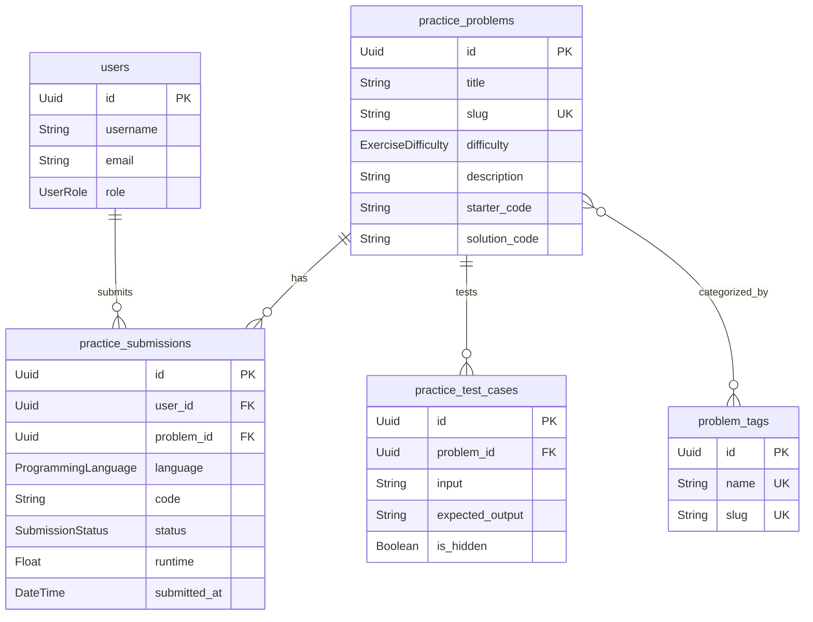

# Kế hoạch phát triển Nền tảng bài tập luyện lập trình độc lập (LeetCode/HackerRank Clone)

Kế hoạch này đề xuất thiết kế kiến trúc hệ thống, mở rộng cơ sở dữ liệu (Prisma Schema) và lộ trình phát triển một phân hệ luyện tập độc lập nhằm cung cấp hàng trăm bài tập lập trình đa dạng cho học viên rèn luyện kỹ năng Python sau khi hoàn thành các khóa học lý thuyết.

---

## 💎 Mục tiêu & Trải nghiệm Người dùng (UX)

Phân hệ bài tập luyện tập độc lập sẽ kế thừa các tính năng bảo mật, trình biên dịch an toàn của hệ thống hiện tại, đồng thời mở rộng các chức năng chuyên sâu về luyện tập thuật toán:

1. **Trang thư viện bài tập (Problem Library)**:
   - Giao diện dạng danh sách hiển thị tên bài tập, độ khó, tỷ lệ giải thành công (Accept Rate) và thẻ phân loại (Tag).
   - Bộ lọc đa năng: lọc theo độ khó (`DỄ`, `TRUNG BÌNH`, `KHÓ`), trạng thái giải (`Chưa làm`, `Đã qua`, `Bị lỗi`) và danh sách thẻ chuyên đề (Chuỗi, List, Vòng lặp, Hàm, OOP).
   - Thanh tìm kiếm bài tập thời gian thực (Real-time Search).

2. **Không gian làm bài (Coding Workspace - Split Screen)**:
   - Thiết kế hai cột cao cấp (Glassmorphism):
     - **Cột trái**: Mô tả chi tiết đề bài dưới dạng Markdown, các ca ví dụ (Examples), ràng buộc (Constraints), lịch sử nộp bài (Submission History) và phần thảo luận ý tưởng giải.
     - **Cột phải**: Trình soạn thảo mã nguồn Python (hỗ trợ hiển thị cú pháp và tự động thụt lề), trình chọn ngôn ngữ, bảng điều khiển (Console) xem kết quả chạy thử (Run Code) và nút nộp bài (Submit).

3. **Thống kê cá nhân & Bảng vinh danh**:
   - Biểu đồ hình quạt hiển thị tỷ lệ giải bài theo độ khó.
   - Bảng vinh danh (Leaderboard) xếp hạng người dùng giải được nhiều bài tập nhất.

---

## 🛠️ Thiết kế Kiến trúc Cơ sở dữ liệu

Để phân biệt các bài tập lý thuyết trong chương trình học (thuộc về mô hình `Lesson`) và các bài tập luyện tập thuật toán độc lập, chúng tôi đề xuất mở rộng cơ sở dữ liệu với các bảng riêng biệt như sau:



### Chi tiết thay đổi Model trong `schema.prisma`

```prisma
// Cập nhật enum ngôn ngữ lập trình hỗ trợ rộng hơn
enum ProgrammingLanguage {
  PYTHON
  JAVASCRIPT
  CPP
  C
}

// 1. Thêm quan hệ vào Model User hiện tại
model User {
  // ... các thuộc tính cũ
  practiceSubmissions PracticeSubmission[]
}

// 2. Định nghĩa Model bài tập luyện tập độc lập
model PracticeProblem {
  id                 String             @id @default(uuid()) @db.Uuid
  title              String
  slug               String             @unique
  difficulty         ExerciseDifficulty
  description        String             @db.Text
  
  // Starter code tương ứng cho từng ngôn ngữ (Lưu dưới dạng JSON hoặc Object riêng biệt)
  starterCodes       Json               @map("starter_codes") // Ví dụ: { "PYTHON": "...", "JAVASCRIPT": "...", "CPP": "...", "C": "..." }
  solutionCodes      Json?              @map("solution_codes")
  
  createdAt          DateTime           @default(now()) @map("created_at")
  updatedAt          DateTime           @updatedAt @map("updated_at")

  testCases          PracticeTestCase[]
  submissions        PracticeSubmission[]
  tags               ProblemTag[]       @relation("ProblemToTag")

  @@map("practice_problems")
}

// 3. Định nghĩa Model TestCase cho bài tập độc lập
model PracticeTestCase {
  id             String          @id @default(uuid()) @db.Uuid
  problemId      String          @map("problem_id") @db.Uuid
  problem        PracticeProblem @relation(fields: [problemId], references: [id], onDelete: Cascade)
  
  input          String          @db.Text
  expectedOutput String          @map("expected_output") @db.Text
  isHidden       Boolean         @default(false) @map("is_hidden")
  
  createdAt      DateTime        @default(now()) @map("created_at")

  @@map("practice_test_cases")
}

// 4. Định nghĩa Model lịch sử nộp bài của bài tập độc lập
model PracticeSubmission {
  id         String          @id @default(uuid()) @db.Uuid
  userId     String          @map("user_id") @db.Uuid
  problemId  String          @map("problem_id") @db.Uuid
  
  user       User            @relation(fields: [userId], references: [id], onDelete: Cascade)
  problem    PracticeProblem @relation(fields: [problemId], references: [id], onDelete: Cascade)

  language   ProgrammingLanguage
  code       String          @db.Text
  status     SubmissionStatus @default(PENDING)
  runtime    Float?          // Thời gian chạy thực tế (ms)
  
  submittedAt DateTime       @default(now()) @map("submitted_at")

  @@map("practice_submissions")
}

// 5. Định nghĩa Model Thẻ phân loại chuyên đề
model ProblemTag {
  id        String            @id @default(uuid()) @db.Uuid
  name      String            @unique // Ví dụ: "Chuỗi", "Mảng (List)", "Vòng lặp"
  slug      String            @unique
  problems  PracticeProblem[] @relation("ProblemToTag")

  @@map("problem_tags")
}
```

---

## 📦 Kiến trúc Sandbox Đa Ngôn Ngữ (Docker Sandbox Execution)

Để hỗ trợ biên dịch và chạy an toàn cả 4 ngôn ngữ mà không gây quá tải hoặc xung đột thư viện, hệ thống sẽ sử dụng các Docker Image riêng biệt cho từng ngôn ngữ:

| Ngôn ngữ | Docker Image | Cơ chế biên dịch & Thực thi |
| :--- | :--- | :--- |
| **Python** | `python:3.10-alpine` | Chạy thông dịch trực tiếp: `python /tmp/solution.py` |
| **JavaScript** | `node:18-alpine` | Chạy thông dịch trực tiếp: `node /tmp/solution.js` |
| **C++** | `gcc:12-alpine` | Biên dịch và chạy file binary: `g++ -O3 /tmp/solution.cpp -o /tmp/solution && /tmp/solution` |
| **C** | `gcc:12-alpine` | Biên dịch và chạy file binary: `gcc -O3 /tmp/solution.c -o /tmp/solution && /tmp/solution` |

---

## 🚀 Các Bước Triển Khai Chi Tiết

### Bước 1: Mở rộng Cơ sở dữ liệu & Tạo API endpoints (Backend)
- [ ] Cập nhật `schema.prisma` với các model mới và chạy lệnh `npx prisma migrate dev` để đồng bộ cơ sở dữ liệu PostgreSQL.
- [ ] Tạo file seed dữ liệu khởi tạo (`seed_problems.ts`) chứa khoảng 10-15 bài tập mẫu từ mức độ Dễ đến Khó, phân loại theo thẻ Tag khác nhau.
- [ ] Xây dựng các router API trong Backend:
  - `GET /api/practice/problems`: Lấy danh sách bài tập kèm theo bộ lọc tìm kiếm, phân trang và trạng thái giải của user.
  - `GET /api/practice/problems/:slug`: Lấy chi tiết thông tin bài tập cùng ca ví dụ của bài đó (không trả về testcase ẩn để tránh hack đáp án).
  - `POST /api/practice/problems/:id/run`: Chạy thử code của học viên với các testcase hiển thị.
  - `POST /api/practice/problems/:id/submit`: Thực thi chấm điểm toàn bộ testcase ẩn trong Docker sandbox và lưu kết quả vào bảng `PracticeSubmission`.
  - `GET /api/practice/problems/:id/submissions`: Xem lịch sử nộp bài của chính học viên đối với bài tập đó.

### Bước 2: Thiết kế & Xây dựng Giao diện (Frontend)
- [ ] Xây dựng trang **PracticeDashboard** (`/practice`): Hiển thị thư viện bài tập, bảng lọc và tiến trình học viên.
- [ ] Xây dựng trang **CodingWorkspace** (`/practice/:slug`): Giao diện hai cột hỗ trợ kéo giãn chiều rộng (split-pane resizing), tích hợp Code Editor mượt mà, tab mô tả bài tập, tab lịch sử chạy, và bảng console trực quan.
- [ ] Thiết kế bảng thống kê tiến trình cá nhân bằng biểu đồ tròn (Pie chart/Radial bar) và lịch sử hoạt động dạng lịch heatmap (giống đồ thị xanh của GitHub).

---

## ❓ Câu hỏi thảo luận với User

> [!IMPORTANT]
> 1. **Kiểu bài tập hỗ trợ**: Ở phiên bản đầu tiên, chúng ta sẽ tập trung hoàn toàn vào các bài tập dạng Standard I/O (Nhập từ `input()` và in ra `print()`) tương tự cấu trúc các bài học hiện tại, hay bạn muốn hỗ trợ cả dạng viết Hàm giải thuật (người dùng chỉ viết nội dung của một hàm, ví dụ `def twoSum(nums, target):` và nhận các đối số đầu vào, trả về kết quả bằng lệnh `return`) giống 100% LeetCode?
> 2. **Chức năng thảo luận**: Bạn có muốn xây dựng luôn mục bình luận / chia sẻ lời giải dưới mỗi bài tập ở phiên bản này không, hay tạm thời tập trung tối ưu không gian code và thư viện bài tập trước?
