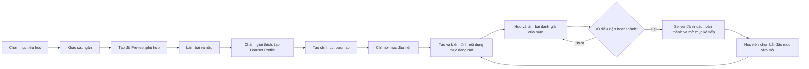

# Kế hoạch: Pre-test, Learner Profile và roadmap học theo nhu cầu

**Trạng thái:** Giai đoạn 0 đã đặc tả; Giai đoạn 1 đã triển khai migration và nghiệm thu trên Supabase cho cả bốn ngôn ngữ; Giai đoạn 2 đã triển khai và nghiệm thu luồng khảo sát. Giai đoạn 3–7 chưa triển khai. Xem [đặc tả Giai đoạn 0](dac_ta_giai_doan_0.md) và [các giai đoạn phát triển](giai_doan_phat_trien.md).

**Mục tiêu:** Giải quyết khởi tạo lạnh cho người học MCODE ở **mọi ngôn ngữ học tập đang có** bằng khảo sát và bài đánh giá đầu vào, sau đó tạo **chỉ mục lộ trình cá nhân hóa**. Chỉ khi người học chọn một mục để học, hệ thống mới tạo nội dung cho mục đó.

## 1. Bối cảnh trong dự án

- Ứng dụng hiện có React frontend, Express/Prisma/PostgreSQL backend và FastAPI AI service. Có khóa học, tiến độ bài học, bài nộp, đồ thị kỹ năng Python/JavaScript/C++/SQL và dữ liệu năng lực dựa trên bài nộp đã kiểm chứng.
- Bốn đồ thị hiện có là Python (35 skills), JavaScript (23), C++ (21), SQL (7). Luồng khảo sát → Pre-test → hồ sơ → roadmap → học tuần tự phải áp dụng cho **cả bốn**, với mục tiêu học, câu hỏi, bài thực hành và `skillId` riêng cho từng ngôn ngữ. Không chuyển âm thầm sang Python khi thiếu cấu hình của ngôn ngữ được chọn.
- Prisma còn có giá trị `C` trong `ProgrammingLanguage`, nhưng repo hiện chưa có đồ thị kỹ năng và nội dung khóa học C tương ứng. Nếu C được đưa vào danh sách ngôn ngữ học roadmap, phải bổ sung đồ thị, ngân hàng câu và đường chấm/kiểm định trước khi cho tạo Pre-test; không dùng đồ thị C++ hoặc Python thay thế.
- `PersonalizedPath` và `PersonalizedLesson` hiện lưu nội dung bài học, quiz, bài tập. Luồng AI hiện hành có thể tạo và phát hành một bài tập đã kiểm định ngay. Tính năng mới cần **tách chỉ mục roadmap khỏi nội dung được tạo** để không gọi pipeline tạo nội dung cho toàn bộ lộ trình lúc khởi tạo.
- `.agent/specs/current-task.md` là hợp đồng thực thi Giai đoạn 0 cho khảo sát, Pre-test, Learner Profile và roadmap của cả bốn ngôn ngữ; các quyết định sản phẩm và bảng kỹ năng chi tiết nằm trong [đặc tả Giai đoạn 0](dac_ta_giai_doan_0.md).

## 2. Phạm vi và nguyên tắc

### Có trong phiên bản đầu

1. Form khảo sát mục tiêu và kinh nghiệm học, gồm câu hỏi về lộ trình MCODE và mức tự tin theo từng khái niệm.
2. Sinh hoặc chọn Pre-test theo câu trả lời khảo sát, đồ thị kỹ năng và bằng chứng học tập đã có.
3. Học viên làm bài, lưu nháp, nộp; hệ thống chấm, giải thích kết quả và tạo Learner Profile có độ tin cậy.
4. Tạo roadmap **chỉ gồm các mục**: tên, kỹ năng, thứ tự, mục tiêu, lý do đề xuất, điều kiện tiên quyết, trạng thái. Không sinh lý thuyết, quiz hoặc bài tập của các mục roadmap lúc này.
5. Học viên học **tuần tự**: chỉ mục đầu tiên được mở; phải hoàn thành mục hiện tại theo kết quả do server xác nhận thì mục kế tiếp mới được mở khóa. Khi bấm **Bắt đầu học** ở mục đã mở, hệ thống mới tạo và kiểm định nội dung mục đó, lưu kết quả để mở lại mà không tạo trùng.

### Chưa có trong phiên bản đầu

- Tạo trước toàn bộ nội dung roadmap, lịch học tự động chi tiết theo từng ngày, hoặc quyết định năng lực chỉ từ lời tự khai.
- Tự động thay thế lộ trình học MCODE hiện có. Roadmap cá nhân hóa là một trải nghiệm bổ sung.

**Phạm vi bắt buộc:** Python, JavaScript, C++ và SQL cùng nằm trong tiêu chí hoàn thành chức năng. Có thể lập trình và kiểm thử từng adapter theo thứ tự, nhưng không coi chức năng hoàn tất khi chỉ Python hoạt động. Mọi API, bảng dữ liệu, ngân hàng câu, learner profile và roadmap đều phải phân vùng theo `language` ngay từ đầu. C cần đạt cùng cổng sẵn sàng nếu sản phẩm công bố lộ trình học C.

| Ngôn ngữ | Skill graph hiện có | Bài thực hành cần kiểm định |
| --- | --- | --- |
| Python | `pythonSkillGraph.json` | Code Python trong sandbox và test ẩn. |
| JavaScript | `javascriptSkillGraph.json` | Code JavaScript trong sandbox và test ẩn. |
| C++ | `cppSkillGraph.json` | Code C++ trong sandbox và test ẩn. |
| SQL | `sqlSkillGraph.json` | Giữ giáo trình SQL Server/T-SQL; xây runner tương thích T-SQL để kiểm định và chấm truy vấn trên fixture, gồm test ẩn, trước khi phát hành đề hoặc bài học. |

## 3. Hành trình người học

1. **Khảo sát:** Học viên chọn ngôn ngữ, mục tiêu và nhóm khái niệm **của ngôn ngữ đó**, quỹ thời gian và khai báo kinh nghiệm. Nếu đã học lộ trình MCODE của ngôn ngữ được chọn, hệ thống đọc tiến độ/bài nộp tương ứng để đối chiếu; nếu học bằng tài khoản khác hoặc ngoài MCODE thì ghi là tự khai.
2. **Pre-test:** Hệ thống chọn các kỹ năng cần kiểm tra và độ khó ban đầu. Đề có số câu giới hạn, có thể đi từ cơ bản lên nâng cao hoặc dừng nhánh khi đã đủ bằng chứng. Người học thấy thời lượng ước tính, tiến độ và khả năng nộp bài.
3. **Chấm bài:** Câu khách quan chấm theo đáp án; bài code chạy bằng sandbox và test đã kiểm định; AI dùng rubric để nhận xét lời giải/giải thích, phát hiện hiểu sai và đề xuất bước tiếp theo. Điểm chính phải truy được về câu hỏi, rubric hoặc kết quả chạy thực tế.
4. **Hồ sơ:** Hiển thị kỹ năng đã vững, đang học, cần củng cố và chưa đủ dữ liệu. Giải thích vì sao một kỹ năng được xếp như vậy; cho học viên xem lại bài và yêu cầu đánh giá lại khi phù hợp.
5. **Roadmap:** Hiển thị toàn bộ chỉ mục theo thứ tự học bắt buộc, nhưng chỉ mục đầu tiên có thể bắt đầu. Các mục sau hiện trạng thái khóa và lý do cần hoàn thành mục trước. Nhấn **Bắt đầu học** ở mục đã mở mới khởi tạo nội dung cho mục ấy. Khi server xác nhận học xong mục hiện tại, mở đúng mục kế tiếp, cập nhật hồ sơ và chỉ điều chỉnh các mục **chưa bắt đầu** mà vẫn giữ thứ tự tuần tự.

## 4. Thiết kế form khảo sát

| Nhóm | Câu hỏi đề xuất | Cách dùng |
| --- | --- | --- |
| Mục tiêu | Bạn muốn học ngôn ngữ nào? Học để làm gì: nhập môn, theo khóa MCODE, làm dự án, phỏng vấn...? | Chọn phạm vi kỹ năng và đích của roadmap. |
| Lịch sử MCODE | Bạn đã học lộ trình MCODE của ngôn ngữ này chưa? Chưa bắt đầu / đang học / đã hoàn thành / không chắc. | Nếu có dữ liệu trên tài khoản, đối chiếu `Enrollment`, `LessonProgress`, `Submission`; trạng thái hoàn thành tự khai không tự động tương đương đã thành thạo. |
| Kinh nghiệm ngoài MCODE | Bạn từng học hoặc làm dự án bằng ngôn ngữ này chưa? Khoảng bao lâu? | Chọn điểm bắt đầu của bài kiểm tra, không cộng điểm năng lực trực tiếp. |
| Tự đánh giá khái niệm | Với từng nhóm như biến/kiểu dữ liệu, điều kiện, vòng lặp, hàm, cấu trúc dữ liệu, OOP: chưa biết / biết sơ / có thể giải thích / đã áp dụng. | Chọn kỹ năng cần kiểm tra; câu hỏi “đã nắm rõ khái niệm này chưa?” phải đi kèm câu kiểm chứng phù hợp. |
| Thói quen và ràng buộc | Mỗi tuần có thể học bao lâu? Muốn ưu tiên lý thuyết, bài code hay cân bằng? Có mục tiêu thời hạn không? | Tùy chỉnh cách trình bày và thứ tự ưu tiên, không thay thế bằng chứng năng lực. |

**Quy tắc phân nhánh:** Câu hỏi tự đánh giá và mục tiêu học được nạp theo `language` và module của skill graph tương ứng; không dùng một bộ nhóm khái niệm Python cho mọi ngôn ngữ. Người mới được hỏi ít khái niệm cơ bản và có câu đầu dễ hơn; người báo đã hoàn thành MCODE hoặc có kinh nghiệm được kiểm tra kỹ năng trung cấp và các kỹ năng tiên quyết quan trọng. Nếu dữ liệu bài nộp có sẵn, ưu tiên kiểm tra khoảng trống hoặc kỹ năng chưa có bằng chứng, không bắt làm lại toàn bộ. Học viên có thể chọn “không biết/không chắc”; biểu mẫu không ép khai là đã học.

## 5. Thiết kế Pre-test

- **Blueprint theo ngôn ngữ:** Mỗi câu gắn `language`, `skillId` có trong đúng skill graph, mục tiêu đo, độ khó, loại câu, đáp án/rubric, nguồn hoặc phiên bản đề. Mỗi ngôn ngữ có tập mục tiêu và gateway skills riêng; số kỹ năng ít như SQL có thể cần nhiều câu cho một kỹ năng, không ép 12 gateway khác nhau. Lấy các nút tiên quyết liên quan đến mục tiêu; giới hạn số câu và thời lượng để tránh bài kiểm tra quá dài.
- **Loại câu:** nhận diện và giải thích ngắn khái niệm, đọc code/truy vấn dự đoán kết quả, tìm/sửa lỗi, và một hoặc vài bài code hoặc truy vấn nhỏ. Không dùng trắc nghiệm đơn thuần để kết luận “thực hành thành thạo”.
- **Tạo đề:** Ưu tiên ngân hàng câu đã được duyệt theo từng ngôn ngữ. Câu do AI sinh phải qua kiểm tra schema, đáp án/rubric, cú pháp/ngữ nghĩa và test case bằng runner đúng ngôn ngữ trước khi phát hành; nếu chưa kiểm định được thì đổi câu hoặc báo không tạo được đề, không phát hành câu hỏi lỗi.
- **Công bằng và chống học tủ:** Có nhiều biến thể câu cho cùng kỹ năng, trộn thứ tự hợp lý, giới hạn tái sử dụng câu khi làm lại. Giữ đáp án và test ẩn ở phía server.
- **Nộp bài:** Lưu từng câu và thời điểm nộp, hỗ trợ tiếp tục phiên đang làm. Nộp một lần theo `submissionId` duy nhất; retry cùng ID không chấm hoặc cập nhật năng lực hai lần. Chính sách làm lại được tính theo **người học + ngôn ngữ**, không để lần làm Python chặn bài kiểm tra JavaScript/C++/SQL.
- **Trường hợp thiếu bằng chứng:** Nếu bỏ trống nhiều câu, hết giờ, AI/sandbox lỗi, hoặc đề không phủ được một kỹ năng, gắn kỹ năng đó là `UNKNOWN`/độ tin cậy thấp và cho kiểm tra bổ sung. Không suy ra điểm 0 hay thành thạo từ việc thiếu dữ liệu.

**Chấm điểm đề xuất:** điểm từng câu dựa trên đáp án hoặc tỷ lệ test case đạt, có trọng số theo độ khó và mức áp dụng; tổng hợp theo từng `skillId`. Dùng rubric cố định cho câu trả lời mở, AI đưa nhận xét có dẫn chứng từ bài làm. Ngưỡng ban đầu để hiệu chỉnh bằng dữ liệu thực tế: `< 0,45` cần nền tảng, `0,45–< 0,75` đang phát triển, `>= 0,75` có thể bỏ qua phần nhập môn **khi đủ độ phủ và độ tin cậy**. Ngưỡng này không phải kết luận cố định; lưu `scoringVersion` và kiểm tra với giảng viên trước khi dùng để bỏ qua kỹ năng tiên quyết.

## 6. Learner Profile và chính sách cold-start

Hồ sơ cần lưu theo **người học + ngôn ngữ**, gồm:

- Mục tiêu, thời gian học, lựa chọn trải nghiệm và câu trả lời khảo sát có phiên bản.
- Theo từng kỹ năng: `masteryScore` (nếu có), `confidence`, `evidenceCount`, `evidenceSources`, `lastAssessedAt`, trạng thái `UNKNOWN | NEEDS_FOUNDATION | DEVELOPING | PROFICIENT`.
- Tóm tắt điểm mạnh, lỗ hổng tiên quyết, kỹ năng cần xác minh thêm; liên kết đến bài làm và lý do đánh giá.
- Phiên bản skill graph, đề, rubric/chính sách chấm và lần đánh giá gần nhất để tái tạo kết quả.

**Nguồn bằng chứng và mức tin cậy:** bài nộp Pre-test đã chấm và bài tập MCODE đã xác thực **trong cùng ngôn ngữ và `skillId`** là bằng chứng năng lực; tiến độ hoàn thành bài học là tín hiệu phụ; câu tự khai chỉ là tín hiệu chọn đề. Người mới hoàn toàn bắt đầu với `UNKNOWN`, không gán sẵn điểm “trung bình”. Khi đã có bằng chứng học trong hệ thống, hợp nhất theo thời gian và tránh đếm lại cùng một bài nộp. Giao diện nên nói rõ “chưa đủ dữ liệu” thay cho phần trăm chính xác giả.

## 7. Roadmap chỉ mục và tạo nội dung theo nhu cầu

### Dữ liệu của một mục roadmap

`id`, `roadmapId`, `orderIndex`, `skillId`/nhóm kỹ năng, `title`, `objective`, `prerequisiteItemIds`, `reason`, `estimatedEffort`, `learningStatus`, `contentStatus`, `contentId?`, `completedAt?`, `profileVersion`, `graphVersion`.

- Trạng thái học tập: `LOCKED → AVAILABLE → IN_PROGRESS → COMPLETED`. Trạng thái nội dung độc lập: `PLANNED → GENERATING → READY`; lỗi thành `FAILED` và cho thử lại. `READY` chỉ nói rằng nội dung đã được tạo, **không** có nghĩa học viên đã hoàn thành mục.
- Khi tạo roadmap, mục đầu tiên là `AVAILABLE`, tất cả mục sau là `LOCKED`; mọi mục có `contentStatus = PLANNED` và `contentId = null`. **Không gọi agent sinh lý thuyết, quiz hoặc bài tập ở bước này.**
- Thuật toán xếp thứ tự: lấy kỹ năng mục tiêu, thêm các tiền đề còn yếu/chưa rõ, sắp theo DAG của **skill graph đúng ngôn ngữ** và ưu tiên khoảng trống quan trọng. Kỹ năng đã có bằng chứng vững chắc có thể không cần đưa vào roadmap; một khi đã đưa vào thì không tự đánh dấu hoàn thành chỉ vì điểm Pre-test hoặc lời tự khai.
- Backend chỉ nhận **Bắt đầu học** cho mục `AVAILABLE` hoặc `IN_PROGRESS`. Yêu cầu mở mục `LOCKED`, kể cả gọi API trực tiếp, phải bị từ chối. Chỉ một job được tạo cho mục hợp lệ; retry hoặc bấm nhiều lần nhận cùng job/kết quả. Agent tạo nội dung cho **mục đang mở bằng đúng ngôn ngữ**, chạy cổng kiểm định phù hợp trước khi gắn `contentId`; nếu thất bại thì giữ mục để thử lại, không mở mục tiếp theo.
- **Điều kiện hoàn thành mục:** nội dung bắt buộc đã được học, quiz đạt ngưỡng và bài thực hành bắt buộc được chấm đạt theo rubric/test case của mục. Mục chỉ có lý thuyết vẫn cần một hoạt động đánh giá đạt. Ngưỡng cụ thể được chốt trong đặc tả từng loại mục. Server xác minh và ghi bằng chứng hoàn thành; thao tác tự đánh dấu hoặc chỉ mở trang bài học không đủ để mở khóa.
- Việc chuyển mục hiện tại sang `COMPLETED` và mục kế tiếp sang `AVAILABLE` phải diễn ra trong cùng một giao dịch, có khóa/idempotency để không mở nhiều mục khi nộp bài lặp. Tại một thời điểm, roadmap chỉ có tối đa **một mục chưa hoàn thành được mở**. Mục `LOCKED` chỉ hiển thị metadata, không có nội dung học được tạo sẵn.
- Nếu hồ sơ đổi sau bài nộp, chỉ sửa chỉ mục của phần chưa bắt đầu và giữ nguyên đoạn đã hoàn thành cùng mục đang học. Mục mới được chèn sau mục đang học; mọi mục phía sau vẫn khóa. Cho người học xem lý do điều chỉnh, nhưng không cho nhảy qua mục đang học.

### Gợi ý tách dữ liệu

Thêm bảng `LearnerSurvey`, `PretestAttempt`, `PretestQuestion`, `PretestAnswer`, `PretestAssessment`, `LearnerSkillState`, `Roadmap`, `RoadmapItem` (tên cuối cùng quyết định khi đặc tả schema). `RoadmapItem` tham chiếu tùy chọn đến nội dung cá nhân hóa đã kiểm định. **Không tạo `PersonalizedLesson` rỗng** để giả lập chỉ mục vì model hiện yêu cầu `theoryContent` và UI hiện hiểu `lessons` là bài học đã có nội dung.

## 8. Ranh giới hệ thống và API dự kiến

Đây là **hợp đồng đề xuất**, chưa phải endpoint đang tồn tại.

| Endpoint | Mục đích | Điều kiện chính |
| --- | --- | --- |
| `POST /api/onboarding/survey` | Lưu khảo sát và mục tiêu. | Xác thực, kiểm tra dữ liệu và phiên bản form. |
| `POST /api/pretests` | Khởi tạo đề từ khảo sát + bằng chứng hiện có. | Chỉ phát hành câu đã kiểm định; lưu snapshot đề. |
| `GET /api/pretests/:id` | Tải đề/tiến độ làm bài. | Chỉ chủ sở hữu; không trả đáp án/test ẩn. |
| `PUT /api/pretests/:id/answers` | Lưu nháp. | Giới hạn kích thước, chỉ khi phiên còn mở. |
| `POST /api/pretests/:id/submit` | Khóa bài, chấm và tạo assessment. | Idempotency key, chấm đúng phiên bản đề, không chấm trùng. |
| `GET /api/learner-profile?language=...` | Xem hồ sơ và căn cứ đánh giá. | Chỉ chủ sở hữu; phân biệt `UNKNOWN` và điểm thấp. |
| `POST /api/roadmaps` | Tạo chỉ mục từ assessment đã hoàn tất. | Một roadmap hoạt động theo người học/ngôn ngữ/mục tiêu hoặc quy tắc phiên bản rõ ràng. |
| `GET /api/roadmaps/:id` | Xem chỉ mục, tiến độ, trạng thái khóa và lý do gợi ý. | Chỉ chủ sở hữu; không gửi nội dung chưa tạo. |
| `POST /api/roadmaps/:id/items/:itemId/start` | Tạo nội dung của đúng một mục đã mở. | Trả lỗi nếu `LOCKED`; chống chạy trùng, kiểm định trước khi công bố. |
| `POST /api/roadmaps/:id/items/:itemId/submit` | Nộp hoạt động đánh giá của mục và xét hoàn thành. | Server chấm và xác nhận đủ điều kiện; hoàn thành và mở khóa mục kế tiếp trong một giao dịch. |

Backend giữ quyền xác thực, trạng thái phiên, dữ liệu gốc và idempotency. AI service nhận ngữ cảnh tối thiểu, tạo/chấm phần cần AI và trả cấu trúc có phiên bản. Sandbox hiện có chấm bài code. Frontend cần các màn: khảo sát, làm bài, kết quả/hồ sơ, chỉ mục roadmap và trạng thái tạo nội dung từng mục.

## 9. Thứ tự triển khai và tiêu chí nghiệm thu

Chi tiết công việc, phụ thuộc và mốc bàn giao của từng giai đoạn nằm trong [Các giai đoạn phát triển](giai_doan_phat_trien.md).

| Giai đoạn | Công việc | Kiểm tra chấp nhận |
| --- | --- | --- |
| 0. Đặc tả | Chốt mục tiêu/gateway skills, blueprint đề và runner cho Python, JavaScript, C++ và SQL; thống nhất rubric, luật hoàn thành và quyền làm lại. | Mỗi câu hỏi/điểm đều truy được đến cặp `language + skillId`; điều kiện mở khóa không mơ hồ. |
| 1. Nền tảng dữ liệu | Migration và hợp đồng trạng thái cho khảo sát, Pre-test, hồ sơ và roadmap. | Dữ liệu có phiên bản; chỉ một mục chưa hoàn thành được mở. |
| 2. Khảo sát | Form có lưu nháp, đối chiếu tiến độ MCODE hiện có. | Tự khai “đã hoàn thành” không tự động tạo trạng thái `PROFICIENT`; người khác không đọc được khảo sát. |
| 3. Pre-test | Chọn/tạo đề đã kiểm định, UI làm bài, lưu nháp và nộp. | Đề không lộ đáp án; phiên đã nộp không nhận sửa bài. |
| 4. Chấm và hồ sơ | Chấm bằng sandbox/rubric, tổng hợp bằng chứng và confidence theo kỹ năng. | Cùng `submissionId` chỉ tạo một kết quả; lỗi hạ tầng không thành điểm 0; thiếu bằng chứng là `UNKNOWN`. |
| 5. Chỉ mục roadmap | Xếp DAG kỹ năng, lưu `RoadmapItem` metadata và trạng thái khóa, UI danh sách mục. | Tạo roadmap không sinh `PersonalizedLesson`, lý thuyết, quiz hoặc bài tập; chỉ mục đầu được mở. |
| 6. Học theo nhu cầu và mở khóa | Tạo nội dung cho mục đang mở, chấm hoạt động bắt buộc và mở mục sau khi hoàn thành. | API từ chối mục khóa; bấm/nộp đồng thời không tạo hai nội dung hoặc mở hai mục. |
| 7. Cập nhật và vận hành | Nạp kết quả học mới, điều chỉnh phần chỉ mục chưa học, đo lỗi và chất lượng theo từng ngôn ngữ. | Luồng đầy đủ đạt nghiệm thu ở Python, JavaScript, C++ và SQL; mục đã học không bị ghi đè, không có đường tắt. |

Ưu tiên kiểm tra độc lập các quy tắc tính điểm, mapping `skillId`, sắp xếp DAG, trạng thái/idempotency và quyền truy cập. Sau đó kiểm tra luồng tích hợp với sandbox/AI thật trên môi trường thử nghiệm. Các lệnh kiểm tra cục bộ theo quy tắc dự án phải tách nhỏ, mỗi lần dưới 5 giây; không xem test giả lập là bằng chứng đã chấm bởi AI hoặc sandbox thật.

## 10. Rủi ro và quyết định cần chốt trước khi lập trình

| Vấn đề | Hướng xử lý đề xuất |
| --- | --- |
| Khảo sát thiên lệch hoặc người học tự đánh giá quá cao | Chỉ dùng để chọn đề; kết luận năng lực cần bài làm hoặc bằng chứng đã xác thực. |
| AI chấm thiếu nhất quán | Điểm khách quan do đáp án/test quyết định; câu mở có rubric, lưu nhận xét và phiên bản model, có thể rà soát thủ công. |
| Đề quá dài hoặc quá dễ/khó | Giới hạn thời lượng, phân nhánh theo kỹ năng, đo tỷ lệ bỏ dở và hiệu chỉnh blueprint. |
| Dữ liệu cũ và trạng thái mới không khớp | Giữ luồng `PersonalizedPath` hiện có; thêm roadmap riêng và migration không phá dữ liệu cũ. |
| Chi phí/độ trễ AI khi mở mục | Chỉ sinh một mục được yêu cầu, hiển thị `GENERATING`, lưu kết quả để dùng lại. |
| Skill graph hoặc nội dung khóa học thay đổi | Gắn phiên bản graph/đề thi/roadmap; tái lập kế hoạch cho mục chưa học, không sửa lịch sử đánh giá. |

**Quy tắc đã chốt:** roadmap mới ở mỗi ngôn ngữ yêu cầu khảo sát và Pre-test đã chấm hợp lệ của chính ngôn ngữ đó. Bằng chứng học MCODE hiện có dùng để chọn đề và bổ sung Learner Profile, không bỏ qua Pre-test.

**Cần chốt khi chuyển sang đặc tả:** thời lượng/số câu mục tiêu; học viên được làm lại sau bao lâu; ngưỡng hoàn thành từng loại mục; và điều kiện để AI tự sinh câu mới thay vì chỉ dùng ngân hàng câu duyệt sẵn.
