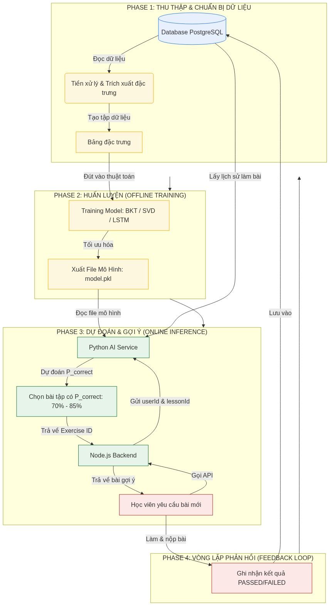
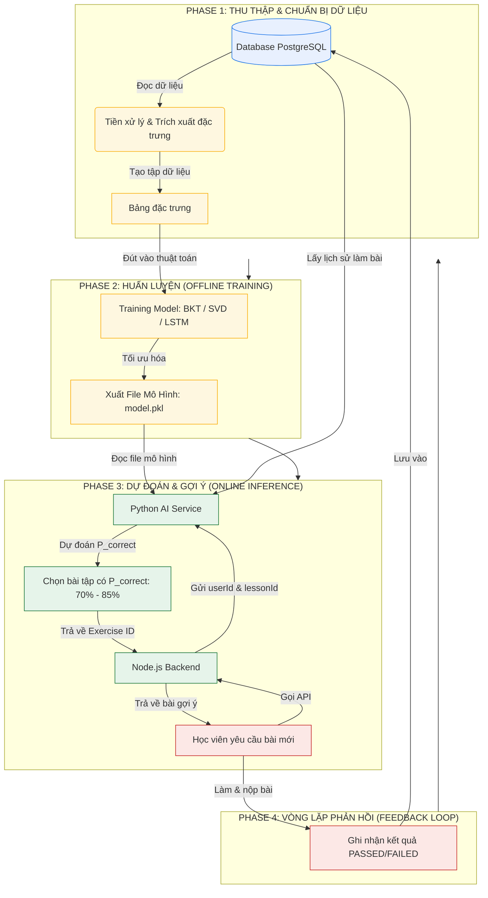

# Hệ Thống Gợi Ý Bài Tập Thông Minh (ML-based Recommendation System)

Tài liệu này giải thích chi tiết nguyên lý hoạt động, quy trình huấn luyện, dự đoán và sơ đồ tích hợp hệ thống gợi ý bài tập dựa trên thuật toán Học Máy (Machine Learning) vào dự án hiện tại của bạn.

---

## 1. Xác nhận cách hiểu của bạn
**Cách hiểu của bạn hoàn toàn chính xác!** Quy trình cơ bản của Học máy (Machine Learning) luôn tuân theo chu kỳ:

1. **Thu thập dữ liệu thô (Data Collection):** Lưu lại lịch sử làm bài của học viên.
2. **Huấn luyện mô hình (Training):** Sử dụng dữ liệu đó để dạy cho mô hình AI hiểu được hành vi học tập. Đầu ra của quá trình này là một **File mô hình đã huấn luyện (Model File - ví dụ: `.pkl`, `.h5` hoặc `.onnx`)** chứa các tham số/trọng số tối ưu.
3. **Đánh giá và Dự đoán (Inference/Evaluation):** Khi học viên học thực tế, ta tải (load) file mô hình này lên, truyền thông tin hiện tại của học viên vào để mô hình tính toán và đưa ra bài tập tiếp theo phù hợp nhất.

> **Bài toán Khởi đầu lạnh (Cold Start Problem):** 
> Khi dự án mới chạy hoặc có học viên mới, chúng ta **chưa có đủ dữ liệu** để AI dự đoán chính xác. Trong giai đoạn đầu, hệ thống sẽ sử dụng **quy tắc mặc định (Rule-based)** (ví dụ: làm theo thứ tự tuyến tính của bài học, hoặc nếu sai 3 lần liên tục thì tự động lùi 1 bậc độ khó). Khi cơ sở dữ liệu đã tích lũy đủ lịch sử (ví dụ: > 1000 lượt nộp bài), ta bắt đầu kích hoạt AI.

---

## 2. Sơ đồ quy trình tổng quan (Flowchart)

Dưới đây là sơ đồ chi tiết các bước từ khâu lưu trữ dữ liệu, huấn luyện offline cho đến việc gợi ý bài tập theo thời gian thực (real-time) khi học viên đang tương tác:



---


## 3. Các bước triển khai thực tế cho Dự án của bạn

Để xây dựng tính năng này cho website LearnPython hiện tại, chúng ta sẽ đi qua 5 bước cụ thể sau:

### Bước 1: Thu thập Dữ liệu (Giai đoạn tích lũy)
Hệ thống của bạn sử dụng **Prisma** với cơ sở dữ liệu **PostgreSQL**. Các bảng chính sẽ tham gia trực tiếp vào việc cung cấp dữ liệu huấn luyện:
*   `Submission`: Cung cấp lịch sử nộp bài (`status` gồm `PASSED`/`FAILED`, `runtime`, `language`, `submittedAt`).
*   `CodingExercise` & `PracticeProblem`: Cung cấp thông tin về bài tập (`difficulty`: `EASY`, `MEDIUM`, `HARD` và liên kết với bài học/tag chủ đề).
*   `LessonProgress`: Cho biết tiến độ hoàn thành các bài học của học viên.

### Bước 2: Xây dựng Python AI Service (Microservice)
Chúng ta sẽ tạo một thư mục độc lập (ví dụ: `/ai-service`) viết bằng **Python** sử dụng framework **FastAPI** hoặc **Flask**:
*   Dùng các thư viện: `pandas`, `scikit-learn` hoặc `pyBKT`.
*   Viết script `train.py` để định kỳ (ví dụ: vào lúc 2 giờ sáng mỗi ngày) kết nối vào database PostgreSQL lấy dữ liệu mới, chạy huấn luyện mô hình, rồi ghi đè file mô hình mới nhất (ví dụ: `best_model.pkl`) vào đĩa.

### Bước 3: Tạo API Gợi ý trên AI Service
Trong file ứng dụng chính của Python (ví dụ: `main.py` của FastAPI), ta viết một API có cấu trúc như sau:
*   **Endpoint:** `POST /api/recommend`
*   **Request Body:** 
    ```json
    {
      "userId": "uuid-cua-hoc-vien",
      "currentLessonId": "uuid-cua-bai-hoc-hien-tai"
    }
    ```
*   **Logic xử lý bên trong Python:**
    1. Lấy thông tin lịch sử giải bài gần nhất của `userId` này từ DB (hoặc Node.js gửi kèm).
    2. Load file `best_model.pkl` lên bộ nhớ.
    3. Đưa lịch sử đó vào mô hình để tính toán xác suất học viên giải đúng các bài tập chưa làm trong bài học hiện tại.
    4. Lọc ra bài tập có xác suất giải đúng nằm trong vùng ZPD (ví dụ: **70% - 85%**).
    5. Trả về `exerciseId` được chọn.

### Bước 4: Tích hợp Backend Node.js
Khi học viên chuyển bài hoặc yêu cầu bài tập mới, **Node.js Express Backend** đóng vai trò là "Cầu nối trung gian":
1. Nhận yêu cầu từ Frontend.
2. Gọi API `POST /api/recommend` của **Python AI Service**.
3. *Trường hợp dự phòng (Fallback):* Nếu AI Service bị lỗi hoặc chưa có đủ dữ liệu để dự đoán (học viên mới tinh), Node.js sẽ tự động lấy bài tiếp theo theo thứ tự mặc định của Lesson.
4. Trả kết quả bài tập về cho Frontend hiển thị.

### Bước 5: Kiểm tra và Tối ưu hóa (A/B Testing)
*   Theo dõi tỉ lệ nộp bài của học viên. Nếu tỉ lệ bỏ cuộc giảm, thời gian giải bài tối ưu hơn $\rightarrow$ Thuật toán gợi ý đã hoạt động hiệu quả.
*   Cập nhật lại các ngưỡng xác suất (ví dụ: thử nghiệm nâng ngưỡng ZPD lên 75% - 90% xem học viên có tiến bộ nhanh hơn không).

---

## Phụ lục: Mã nguồn Mermaid (Mermaid Source Code)
*Nếu bạn muốn chỉnh sửa hoặc tự biên dịch lại sơ đồ quy trình, đây là mã nguồn Mermaid gốc:*



