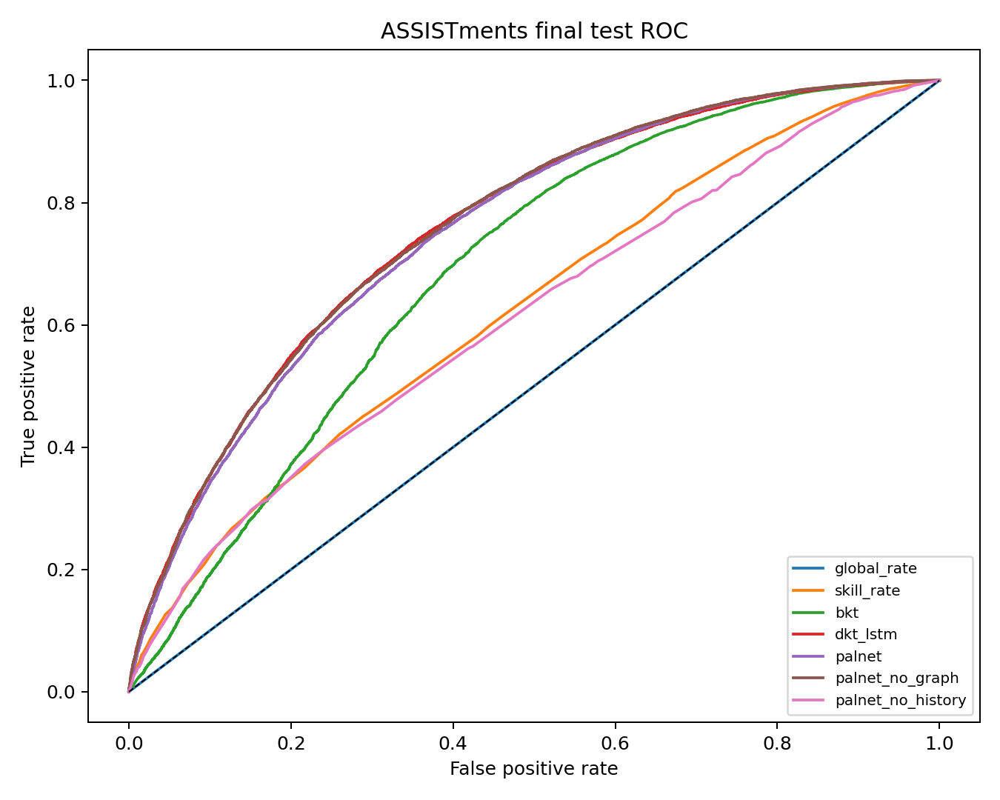
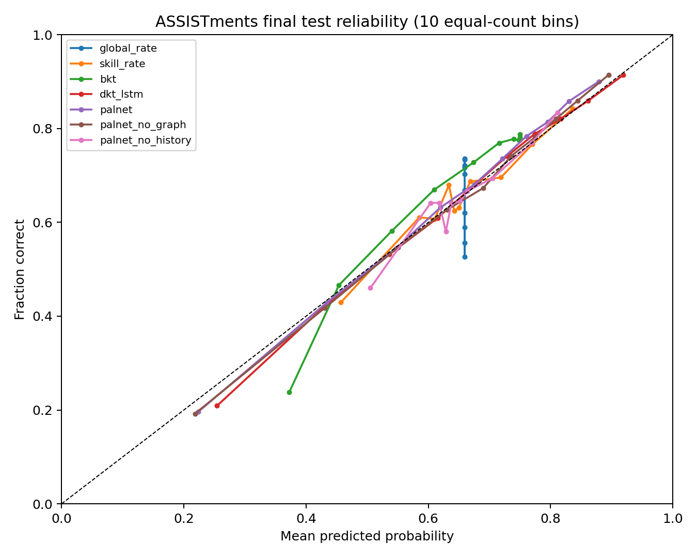

# Giai đoạn 3 — Phân tích benchmark Knowledge Tracing

Run final duy nhất: `final-g2-20261005T182731Z`; protocol `palnet-research-protocol/1.0.0`. Phân tích đọc prediction đã lưu của 769 learner và 38.553 event. Bootstrap 2.000 lần theo learner, seed 20261005, CI percentile 95%. Mỗi lần rút learner, toàn bộ event của learner đó được lấy với cùng bội số. Không huấn luyện hay chọn lại cấu hình.

## Kết quả test cuối và CI 95%

Accuracy dùng ngưỡng 0,5; F1 dùng ngưỡng OOF development khóa trước test. ECE dùng 10 bin đồng số lượng. Nhãn đúng chiếm 65.74%; baseline dự đoán lớp đa số có Accuracy 0.6574.

| Mô hình | AUC [CI 95%] | Accuracy | RMSE | F1 | Log loss | Brier | ECE |
| --- | ---: | ---: | ---: | ---: | ---: | ---: | ---: |
| Global rate | 0.5000 [0.5000, 0.5000] | 0.6574 | 0.4746 | 0.7933 | 0.6428 | 0.2252 | 0.0667 |
| Skill rate | 0.6235 [0.6119, 0.6345] | 0.6734 | 0.4621 | 0.7966 | 0.6161 | 0.2135 | 0.0191 |
| BKT | 0.6901 [0.6747, 0.7061] | 0.7166 | 0.4456 | 0.8138 | 0.5856 | 0.1986 | 0.0490 |
| DKT-LSTM | 0.7580 [0.7464, 0.7695] | 0.7319 | 0.4254 | 0.8190 | 0.5412 | 0.1810 | 0.0108 |
| PAL-Net | 0.7517 [0.7386, 0.7646] | 0.7323 | 0.4267 | 0.8211 | 0.5443 | 0.1820 | 0.0158 |
| PAL-Net không graph | 0.7588 [0.7465, 0.7707] | 0.7354 | 0.4241 | 0.8213 | 0.5384 | 0.1799 | 0.0123 |
| PAL-Net không history | 0.6112 [0.6000, 0.6224] | 0.6701 | 0.4645 | 0.7933 | 0.6211 | 0.2157 | 0.0201 |

| Mô hình | CI Accuracy | CI RMSE | CI F1 | CI log loss | CI Brier | CI ECE |
| --- | ---: | ---: | ---: | ---: | ---: | ---: |
| Global rate | [0.6372, 0.6770] | [0.4679, 0.4813] | [0.7784, 0.8074] | [0.6298, 0.6562] | [0.2190, 0.2317] | [0.0525, 0.0857] |
| Skill rate | [0.6556, 0.6909] | [0.4558, 0.4686] | [0.7822, 0.8104] | [0.6035, 0.6291] | [0.2077, 0.2196] | [0.0122, 0.0300] |
| BKT | [0.7053, 0.7278] | [0.4405, 0.4507] | [0.8019, 0.8251] | [0.5759, 0.5954] | [0.1941, 0.2031] | [0.0378, 0.0600] |
| DKT-LSTM | [0.7201, 0.7441] | [0.4190, 0.4318] | [0.8074, 0.8304] | [0.5285, 0.5540] | [0.1755, 0.1865] | [0.0084, 0.0177] |
| PAL-Net | [0.7207, 0.7440] | [0.4202, 0.4326] | [0.8097, 0.8320] | [0.5319, 0.5562] | [0.1766, 0.1871] | [0.0120, 0.0221] |
| PAL-Net không graph | [0.7237, 0.7473] | [0.4176, 0.4303] | [0.8100, 0.8323] | [0.5256, 0.5506] | [0.1744, 0.1851] | [0.0094, 0.0182] |
| PAL-Net không history | [0.6525, 0.6873] | [0.4581, 0.4709] | [0.7784, 0.8074] | [0.6086, 0.6340] | [0.2099, 0.2217] | [0.0160, 0.0335] |

Accuracy lớp đa số là mốc diễn giải, không thay cho baseline xác suất global rate. Xác suất trong CSV G2 được ghi với 12 chữ số có nghĩa; khi phát lại, AUC BKT thấp hơn kết quả tính trực tiếp lúc final test 0,00000503 do một số xác suất trở thành đồng hạng. CI ở đây dùng CSV đã lưu; số gốc G2 được giữ nguyên trong result và sai khác từng metric được ghi trong JSON.

## Năm fold development (trung bình ± sample SD)

| Mô hình | AUC | Accuracy | RMSE | F1 | Brier |
| --- | ---: | ---: | ---: | ---: | ---: |
| Global rate | 0.5000 ± 0.0000 | 0.6597 ± 0.0108 | 0.4738 ± 0.0036 | 0.7949 ± 0.0078 | 0.2245 ± 0.0035 |
| Skill rate | 0.6181 ± 0.0059 | 0.6705 ± 0.0076 | 0.4632 ± 0.0028 | 0.7963 ± 0.0068 | 0.2145 ± 0.0026 |
| BKT | 0.6774 ± 0.0069 | 0.7124 ± 0.0048 | 0.4480 ± 0.0020 | 0.8123 ± 0.0060 | 0.2007 ± 0.0018 |
| DKT-LSTM | 0.7443 ± 0.0057 | 0.7269 ± 0.0047 | 0.4303 ± 0.0024 | 0.8161 ± 0.0052 | 0.1852 ± 0.0021 |
| PAL-Net | 0.7352 ± 0.0041 | 0.7267 ± 0.0050 | 0.4313 ± 0.0026 | 0.8184 ± 0.0062 | 0.1860 ± 0.0023 |
| PAL-Net không graph | 0.7457 ± 0.0034 | 0.7309 ± 0.0051 | 0.4279 ± 0.0027 | 0.8197 ± 0.0062 | 0.1831 ± 0.0023 |
| PAL-Net không history | 0.6048 ± 0.0057 | 0.6652 ± 0.0092 | 0.4655 ± 0.0029 | 0.7950 ± 0.0079 | 0.2167 ± 0.0027 |

## Chênh lệch AUC cặp trên cùng learner

Dấu dương nghĩa là PAL-Net đầy đủ cao hơn mô hình so sánh. CI lấy từ cùng 2.000 mẫu bootstrap learner. Hai kiểm định ablation tạo một family Holm; p hai phía là tỷ lệ dấu bootstrap với hiệu chỉnh cộng một. Các cặp baseline khác trình bày effect/CI mô tả, không điều chỉnh nhiều phép thử.

| So với PAL-Net đầy đủ | ΔAUC [CI 95%] | p bootstrap | p Holm (RQ2) |
| --- | ---: | ---: | ---: |
| Global rate | +0.2517 [+0.2386, +0.2646] | 0.0010 | — |
| Skill rate | +0.1282 [+0.1130, +0.1436] | 0.0010 | — |
| BKT | +0.0616 [+0.0523, +0.0707] | 0.0010 | — |
| DKT-LSTM | -0.0063 [-0.0100, -0.0025] | 0.0010 | — |
| PAL-Net không graph | -0.0071 [-0.0089, -0.0051] | 0.0010 | 0.0020 |
| PAL-Net không history | +0.1405 [+0.1260, +0.1556] | 0.0010 | 0.0020 |

## Phân tích lỗi và phân nhóm (hậu kiểm mô tả)

Median số event được chấm/người học ở test là 18. Nhóm ngắn gồm learner có số event ≤ median; nhóm dài có số event > median. Phân nhóm dùng độ dài chuỗi toàn bộ để mô tả, không được dùng làm đặc trưng dự đoán tại event.

| Nhóm | Learner | Event | AUC PAL-Net | AUC DKT | AUC không graph |
| --- | ---: | ---: | ---: | ---: | ---: |
| Lịch sử ngắn | 385 | 3100 | 0.7716 | 0.7683 | 0.7791 |
| Lịch sử dài | 384 | 35453 | 0.7499 | 0.7578 | 0.7569 |

| Kỹ năng phổ biến | Event | Tỷ lệ đúng | AUC PAL-Net | AUC DKT |
| ---: | ---: | ---: | ---: | ---: |
| 47 | 3673 | 0.6488 | 0.7088 | 0.7096 |
| 311 | 3308 | 0.6445 | 0.7076 | 0.7180 |
| 277 | 2578 | 0.6051 | 0.7422 | 0.7433 |
| 280 | 2019 | 0.7088 | 0.7350 | 0.7446 |
| 79 | 1560 | 0.6359 | 0.7402 | 0.7430 |
| 279 | 1301 | 0.7994 | 0.7140 | 0.7032 |
| 50 | 1110 | 0.8045 | 0.7648 | 0.7729 |
| 77 | 1043 | 0.5753 | 0.8609 | 0.8567 |
| 18 | 1019 | 0.7920 | 0.6835 | 0.6634 |
| 27 | 1017 | 0.6165 | 0.6171 | 0.6288 |

| Mô hình | False positive | False negative | Lỗi event 1–5 | Lỗi event >20 |
| --- | ---: | ---: | ---: | ---: |
| Global rate | 13210 | 0 | 0.3272 | 0.3436 |
| Skill rate | 11679 | 912 | 0.3154 | 0.3249 |
| BKT | 8283 | 2641 | 0.2716 | 0.2855 |
| DKT-LSTM | 7654 | 2683 | 0.2652 | 0.2696 |
| PAL-Net | 7882 | 2439 | 0.2621 | 0.2683 |
| PAL-Net không graph | 7848 | 2352 | 0.2607 | 0.2652 |
| PAL-Net không history | 11855 | 863 | 0.3196 | 0.3287 |

Phân tích theo mọi kỹ năng có ít nhất 100 event và confusion matrix đầy đủ nằm trong JSON. Các nhóm nhỏ và biểu đồ không dùng để chọn lại model hoặc ngưỡng.

## ROC và calibration

Các điểm calibration là trung bình xác suất và tỷ lệ đúng trong 10 bin đồng số lượng; ECE là tổng sai lệch có trọng số. Một ECE thấp không chứng minh tác động học tập của chính sách gợi ý bài.

## Độ trễ suy luận trên cùng máy

Thiết bị CPU `Intel64 Family 6 Model 140 Stepping 1, GenuineIntel` (Windows-10-10.0.19045-SP0); PyTorch `2.9.1+cpu`, 4 thread. Mẫu gồm 256 learner development và 21378 event được chấm, dùng chung cho bảy model. Có 2 warm-up và 10 lần đo/model. Input, checkpoint và graph được chuẩn bị trước phép đo; thời gian model-only là median. DKT và BKT xử lý theo chuỗi người học; các model còn lại xử lý event. BKT bao gồm cập nhật trạng thái tuần tự. CPU không cần đồng bộ GPU.

| Mô hình | Batch size (đơn vị) | Tải model và chuẩn bị input (s) | Model-only median (ms/1.000 event) |
| --- | ---: | ---: | ---: |
| Global rate | 21634 (history_event) | 0.0006 | 0.0321 |
| Skill rate | 21634 (history_event) | 0.0006 | 0.1252 |
| BKT | 256 (learner_sequence) | 0.0006 | 0.4905 |
| DKT-LSTM | 64 (learner_sequence) | 0.0218 | 3.3033 |
| PAL-Net | 512 (scored_event) | 0.2094 | 1.7693 |
| PAL-Net không graph | 512 (scored_event) | 0.1946 | 1.4928 |
| PAL-Net không history | 512 (scored_event) | 0.1919 | 1.1942 |

Đọc dữ liệu và chuẩn bị phần dùng chung mất 1.3531 s, nằm ngoài thời gian model-only. `g3_latency.json` lưu cả 10 lần đo, phần cứng, phiên bản thư viện và checksum checkpoint. Số đo này dành cho so sánh triển khai kỹ thuật trên máy hiện tại; batch và tính toán khác nhau giữa kiến trúc.

## Tái lập và giới hạn

Chạy `python ai-service/scripts/benchmark_kt_latency.py` rồi `python ai-service/scripts/analyze_kt_final.py` từ gốc repo. Script phân tích kiểm tra SHA-256 của data, split, config, lock, development summary và final result; đối chiếu event ID, user ID, label và metric của cả bảy prediction trước khi xuất JSON, hình và báo cáo. Mỗi checkpoint/parameters và prediction có checksum riêng trong JSON. Phiên bản Python, NumPy, Matplotlib cũng được lưu.

Dữ liệu là bài toán ASSISTments 2009–2010; không suy ra chất lượng chọn bài trong LearnPython. Đồ thị dùng quan hệ chuyển tiếp kỹ năng thống kê, không phải prerequisite được chuyên gia xác nhận. So sánh subgroup là hậu kiểm và không có CI riêng. Các CI bootstrap phản ánh biến thiên người học trong test đã khóa, không bao gồm biến thiên do train seed, dataset khác hoặc domain shift.
