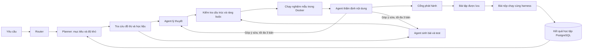

# Pipeline AI V3 — kiến trúc và dẫn chứng

Pipeline không có bài mẫu dự phòng. Bài chỉ được mở khi có đầy đủ kết quả kiểm tra cấu trúc, ràng buộc, chạy nghiệm mẫu trong Docker và thẩm định nội dung. Các lần sửa hoặc provider lỗi vẫn nằm trong báo cáo.

## Luồng thực hiện

Router dùng quy tắc với yêu cầu rõ ràng, gọi LLM khi cần phân loại. Planner là chính sách có thể kiểm tra bằng dữ liệu, không giả danh một model đã được huấn luyện. Agent lý thuyết, sinh bài và thẩm định gọi API model thật. Tra cứu đọc Knowledge Graph và tài liệu cục bộ, có đường dẫn và SHA-256. Bộ kiểm thử sử dụng Docker.

Mỗi run giới hạn 180 giây và 32.000 token theo usage trả về. Trong một stage, mọi key đang khả dụng của cùng provider được thử lần lượt trước khi chuyển provider; 5xx, timeout và lỗi JSON chỉ làm nguội key đã lỗi. Sinh tối đa 3 bản, chỉ sửa phần bị từ chối. Lỗi hạ tầng hoặc hết ngân sách kết thúc run với trạng thái thật, không sinh bài thay thế.

## Dẫn chứng dùng trong báo cáo

- `final-verification-summary.json`: chỉ mục kiểm chứng chính thức, gồm trace ID, toàn bộ bước agent, biên nhận model, kết quả chấm thật và SHA-256 của từng tệp bằng chứng.
- `intent-router-live-summary.json`: hai run thật kiểm tra riêng Router với câu `Def`; một run là nhánh quy tắc minh bạch và một run có receipt LLM Router thật.
- `groq-intent-router-live-summary.json`: kết quả gọi GROQ thật với provider được chọn rõ ràng, gồm model, response ID, usage và RoutingDecision đã qua Pydantic.
- `live-summary.json`: bản đồng nhất của chỉ mục chính thức dành cho công cụ cũ; script kiểm chứng luôn ghi hai tệp cùng lúc.
- `<language>-live-report.json`: báo cáo đầy đủ của run thật: input/output từng bước, model/provider, response ID nếu provider cấp, thời gian, usage, hash, các lần lỗi và sửa.
- `<language>-public-report.json`: bản đã ẩn nghiệm mẫu và dữ liệu test ẩn.
- `<language>-grading.json`: nộp đúng, sai, gửi lại submission và làm lại bài.
- `<language>-docker-smoke.json`: kiểm thử riêng Docker thật; đây không phải bằng chứng sinh bài bằng LLM.
- Unit test có test double chỉ phục vụ hồi quy, không được trình bày như lời gọi model thật.

Báo cáo đầy đủ của fixture chứa nghiệm mẫu và test ẩn để đối chiếu kỹ thuật. Dùng bản public khi trình bày trong vai trò người học. Không có API key hoặc nội dung suy luận nội bộ của model trong báo cáo.

## Xem trong sản phẩm

Mở AI Tutor, gửi yêu cầu tạo bài, rồi mở **Dẫn chứng hoạt động** dưới câu trả lời. Mỗi bước có kết quả, phương thức, lượt chạy, thời gian, input/output hash. Bước gọi LLM có provider, model, response ID và usage.

**Tải JSON** đọc lại bản lưu trên server. **Báo cáo quản trị** yêu cầu tài khoản ADMIN và quyền sở hữu phiên; backend kiểm tra quyền. Các bước vẫn được lưu khi kết nối frontend đóng. API: `GET /api/learning-path/adaptive/runs/:traceId`.

Nút bắt đầu chỉ gửi `exercise_id`; backend lấy bản đã kiểm định từ database. Nghiệm mẫu, SQL fixture và giá trị test ẩn không đưa ra API người học. Container chạy bài chỉ nhận input, không nhận expected output. Mastery cập nhật ở server; gửi lại cùng submission hoặc vượt qua lại cùng bài không cộng thêm năng lực.

## Chạy lại

Từ thư mục gốc: `docker compose up -d --build`. Chuẩn bị image bằng `docker pull python:3.11-alpine`, `docker pull node:20-alpine`, `docker pull gcc:12`. Runner không tự tải image trong khi chấm.

Backend và AI cần chung `ADAPTIVE_INTERNAL_SECRET`; nếu chưa cấu hình, bản hiện tại dùng `JWT_SECRET` đang có. Docker Compose truyền env backend cho AI, cấu hình địa chỉ nội bộ và mount học liệu chỉ đọc. Không đưa file .env vào image.

Có thể chỉ định `ADAPTIVE_PROVIDER` và `ADAPTIVE_<PROVIDER>_MODEL`. Khi chưa cấu hình model, client hỏi danh sách model khả dụng từ provider. Key lấy từ key pool hiện có. Đổi provider là một lời gọi thật khác được ghi lại, không phải bài tập dự phòng.

Kiểm tra offline:
- Tại ai-service: `python -B -m unittest discover -s tests -p test_pipeline_v3.py`
- Tại backend: `npx tsc` rồi `node --test tests/adaptive.test.cjs`
- Tổng hợp và xác minh toàn bộ dẫn chứng đã thu: tại backend chạy `node scripts/buildAdaptiveEvidenceIndex.cjs`

Kiểm tra thật (dùng quota model và tạo fixture QA trong database):
- Tại backend: `node scripts/verifyAdaptiveLive.cjs`
- Kiểm tra Router: `node scripts/verifyIntentRouterLive.cjs`
- Chọn ngôn ngữ: `node scripts/verifyAdaptiveLive.cjs python`
- Bộ chạy độc lập: `node scripts/smokeAdaptiveRunner.cjs sql`

Dữ liệu QA dùng email miền example.invalid, không gửi email. Fixture được giữ để đối chiếu run. Bốn bảng `adaptive_generation_runs`, `adaptive_submissions`, `adaptive_learner_states`, `adaptive_mastery_events` được khởi tạo cộng thêm bằng DDL idempotent; tài khoản database phải có quyền tạo bảng. Không chạy reset database.

## Phạm vi hiện tại

Python/JavaScript dùng hàm solution với JSON arguments/results; C++ dùng stdin/stdout C++17; SQL dùng SQLite và fixture theo test. Thẩm định và chạy test tăng độ tin cậy, không chứng minh tính đúng với mọi đầu vào.

Năng lực là chính sách dựa trên bằng chứng làm bài `evidence_policy_v3`; không gán kết quả này cho PAL-Net. Yêu cầu tạo lộ trình hiện tạo và kiểm định **bài khởi đầu**. Bài cũ chưa có đặc tả V3 cần tạo lại trước khi dùng bộ chấm V3.

Chưa triển khai distributed job queue/resume qua nhiều replica. Khóa phiên và giới hạn concurrency hiện trong tiến trình; các bước hoàn tất được lưu bền trong PostgreSQL nhưng run đang xử lý không tự tiếp tục sau khi restart dịch vụ.
