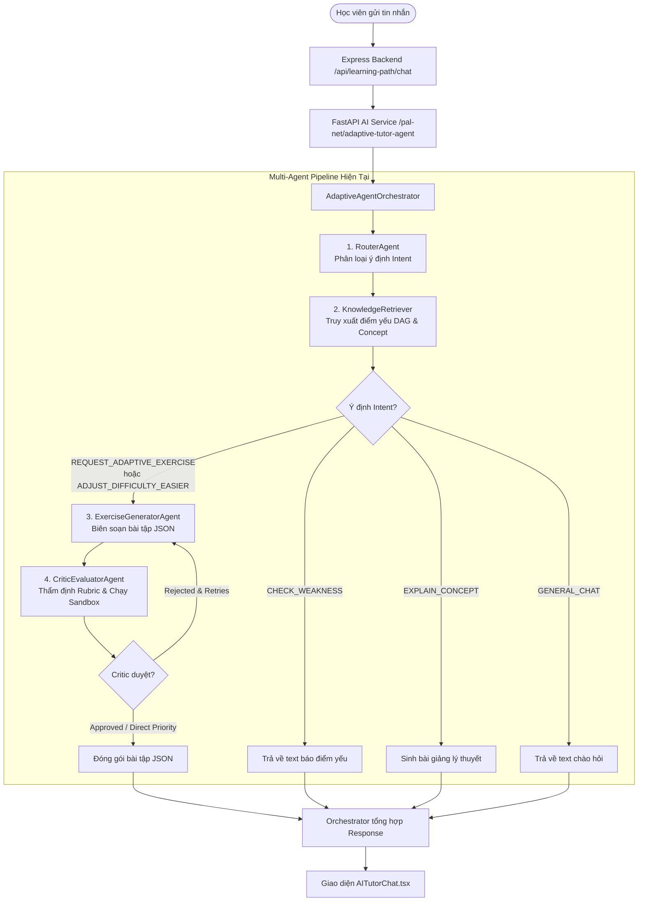
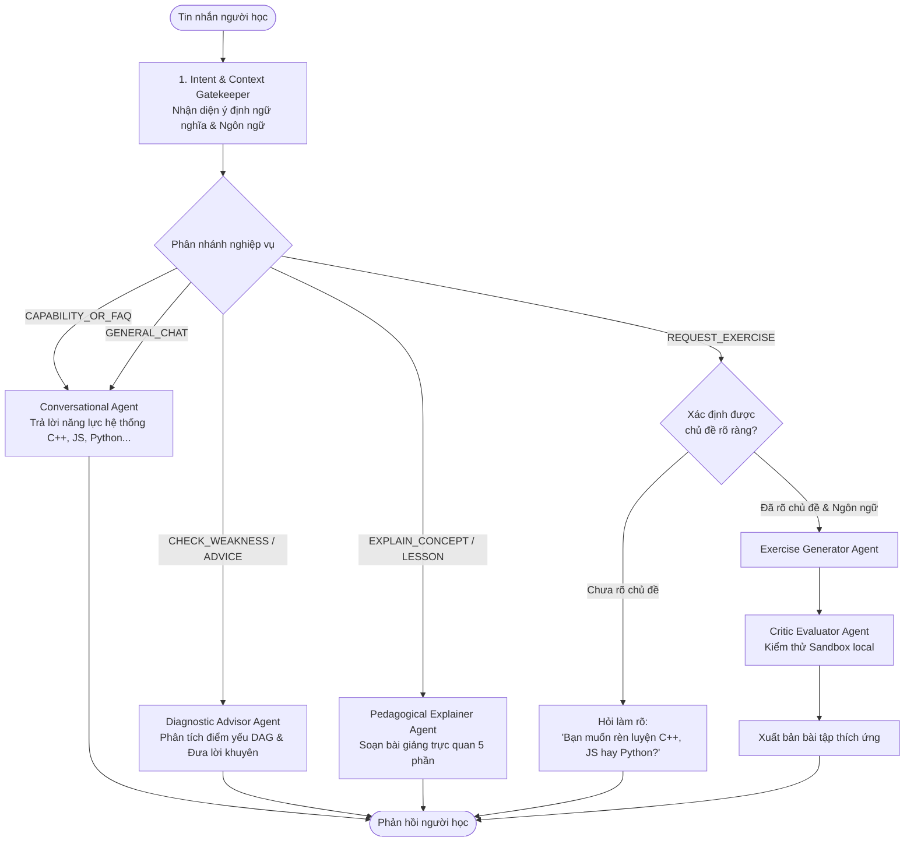

# 📑 BÁO CÁO PHÂN TÍCH TOÀN BỘ LUỒNG MULTI-AGENT VÀ ĐỀ XUẤT TỐI ƯU HỆ THỐNG

---

## 📌 1. TỔNG QUAN HIỆN TRẠNG & NGUYÊN NHÂN CÁC KẾT QUẢ "DỊ"

Gần đây, hệ thống AI Tutor xuất hiện các phản hồi không đúng với mong đợi của người dùng:
- **Tình huống 1 (Ảnh 1):** Người học yêu cầu: *"Hãy tạo cho tôi nội dung bài học OPP môn C++"* $\rightarrow$ AI lại phản hồi một bài tập thực hành thích ứng về **Ép kiểu dữ liệu (Type Casting) trong Python với lỗi `TypeError`**.
- **Tình huống 2 (Ảnh 2):** Người học hỏi thăm dò năng lực: *"Bạn có thể tạo được những nội dung về ngôn ngữ gì"* $\rightarrow$ AI lại phản hồi: *"Được rồi! Dựa trên phân tích năng lực và lỗi thường gặp TypeError, mình đã thiết kế bài thực hành: Module Xử Lý Điểm Số Trận Đấu (Ép kiểu Type Casting)..."*.

Hai tình huống trên cho thấy hệ thống **đang gặp lỗi nghiêm trọng về mặt thiết kế luồng điều phối (Architecture Flow Flaw)**. Hệ thống đang cưỡng ép mọi câu nói của người dùng thành một "yêu cầu sinh bài tập thích ứng gỡ điểm yếu".

---

## 🏗️ 2. TOÀN BỘ LUỒNG HOẠT ĐỘNG CỦA MULTI-AGENT HIỆN TẠI (AS-IS WORKFLOW)

Hệ thống AI Tutor hiện được tổ chức theo mô hình **Thác nước tuyến tính (Linear Waterfall Orchestration)** gồm 4 Agent chính:



### Chi tiết nhiệm vụ và cách thức vận hành của từng Agent:

### 1. `RouterAgent` (Bộ định tuyến ý định)
- **Vị trí file:** `ai-service/app/agents/adaptive_agent_orchestrator.py` (Class `RouterAgent`).
- **Nhiệm vụ:** Đọc tin nhắn mới nhất của người học (`last_user_msg`) và phân loại vào 1 trong 5 nhãn (Intents):
  1. `CHECK_WEAKNESS`: Hỏi điểm yếu, xem hồ sơ năng lực.
  2. `REQUEST_ADAPTIVE_EXERCISE`: Yêu cầu tạo bài tập thực hành.
  3. `ADJUST_DIFFICULTY_EASIER`: Kêu bài khó, xin bài dễ hơn (Scaffolding).
  4. `EXPLAIN_CONCEPT`: Nhờ giải thích lý thuyết, cú pháp, bài giảng.
  5. `GENERAL_CHAT`: Chào hỏi xã giao.
- **Cơ chế thực thi:** Dùng **Regex từ khóa nhanh (Fast-path)**. Nếu không khớp regex nào thì mới gọi LLM phân loại.

### 2. `KnowledgeRetriever` (Bộ truy xuất tri thức)
- **Vị trí file:** `ai-service/app/agents/adaptive_agent_orchestrator.py` (Class `KnowledgeRetriever`).
- **Nhiệm vụ:**
  - Nạp các đồ thị tri thức DAG (`pythonSkillGraph.json`, `cppSkillGraph.json`, `javascriptSkillGraph.json`).
  - Đọc hồ sơ năng lực `user_mastery` của học viên (điểm từ $0.0 \rightarrow 1.0$ trên từng Concept ID).
  - Tìm mắt xích tri thức mục tiêu (`target_concept`):
    - Cách 1: Người dùng truyền `target_concept_id` cụ thể từ giao diện Profile/Cây tri thức.
    - Cách 2: Quét tin nhắn của người học xem có nhắc đến từ khóa kỹ thuật nào không (ví dụ: `vector`, `oop`, `con trỏ`...).
    - Cách 3 (FALLBACK TỰ ĐỘNG): Nếu không tìm thấy chủ đề nào trong câu hỏi, **tự động lấy Concept có điểm Mastery thấp nhất của người học** (`get_learner_weaknesses(mastery_map)[0]`).

### 3. `ExerciseGeneratorAgent` (Tác tử biên soạn bài tập)
- **Nhiệm vụ:** Nhận `concept_id`, `concept_name`, độ thành thạo và các lỗi hay gặp (`associated_errors`).
- **Cơ chế:** Gửi một System Prompt chi tiết cho LLM (qua hồ chứa key `key_pool`), yêu cầu trả về định dạng JSON nghiêm ngặt gồm: `title`, `detailed_theory`, `problem_statement`, `starter_code`, `reference_solution`, `test_cases`.
- **Dự phòng (Fallback Bank):** Nếu LLM không phản hồi hoặc sinh lỗi JSON, Agent kích hoạt ngân hàng bài tập mẫu dựng sẵn (`_get_fallback_exercise`).

### 4. `CriticEvaluatorAgent` (Tác tử kiểm định chất lượng)
- **Nhiệm vụ:** Thẩm định bài tập do Generator vừa tạo ra trước khi gửi cho học viên.
- **Cơ chế:** 
  - Chạy thử nghiệm ngầm mã giải (`reference_solution`) với các testcase trong môi trường Sandbox local (`run_sandbox_verification`).
  - Đánh giá theo Rubric 4 tiêu chuẩn: Tính liên quan (`relevance`), Tính sư phạm (`pedagogy`), Tính chính xác (`correctness`), Độ khó ZPD (`difficulty`).
  - Phản hồi góp ý (`critic_feedback`) để Generator thử lại lần 2 nếu bài tập bị từ chối (`REJECTED`).

---

## 💥 3. MỔ XẺ 5 ĐIỂM NGHẼN NGHIÊM TRỌNG TRONG THIẾT KẾ HIỆN TẠI

Tại sao người học nhắn: *"Bạn có thể tạo được những nội dung về ngôn ngữ gì"* mà AI lại cho ra bài tập Ép kiểu Python?

### 🔴 Điểm nghẽn 1: Bắt từ khóa đơn lẻ (Greedy Keyword Matching) thay vì hiểu ngữ cảnh
Trong `RouterAgent`:
```python
if re.search(r'\b(tạo|cho bài|ra bài|luyện|ôn|thực hành|thử thách|gỡ điểm|làm bài|bài tập|rèn luyện|code thử|viết code|muốn học|luyện tập|bắt đầu học)\b', msg_lower):
    return "REQUEST_ADAPTIVE_EXERCISE"
```
- Khi người dùng hỏi: *"Bạn có thể **tạo** được những nội dung về ngôn ngữ gì"*, từ **`tạo`** lập tức kích hoạt nhánh `REQUEST_ADAPTIVE_EXERCISE`!
- Router không hiểu được cấu trúc câu hỏi khả năng/năng lực (*"Bạn có thể... gì"*, *"Hỗ trợ những gì"*), mà chỉ nhìn thấy từ *"tạo"* và khẳng định ngay: *"À, người này đang đòi tạo bài tập!"*.

### 🔴 Điểm nghẽn 2: Anti-Pattern "Ép gán điểm yếu" (Forced Concept Fallback)
Khi Router đã xác định nhầm là `REQUEST_ADAPTIVE_EXERCISE`, Orchestrator chạy bước tiếp theo:
```python
detected = self.retriever.find_concept_by_query(last_user_msg) # Tìm xem người dùng muốn học bài nào
```
- Câu hỏi *"Bạn có thể tạo được những nội dung về ngôn ngữ gì"* không chứa tên bài học nào cả $\rightarrow$ `detected = None`.
- Thay vì dừng lại để hỏi người học muốn học bài nào, Orchestrator lại tự ý quyết định:
```python
# Tự động lấy điểm yếu nhất trong tài khoản học viên để thay thế!
top_weakness = weaknesses[0] # -> Rơi đúng vào PY-BASICS-02 (Ép kiểu / TypeError)
```
- Kết quả: Học viên hỏi về tính năng của bot, nhưng bot lại tự ý gắp bài **Ép kiểu dữ liệu (Type Casting)** nhét vào tay học viên!

### 🔴 Điểm nghẽn 3: Thiếu hẳn các Intent cơ bản của một trợ lý thông minh
Hệ thống hiện tại chỉ có 5 intents cứng nhắc, thiếu hoàn toàn các nhóm câu hỏi tự nhiên:
1. ❌ **Thiếu Intent `CAPABILITY_QUERY`:** Học viên hỏi bot làm được gì, hỗ trợ môn gì, tính năng ra sao.
2. ❌ **Thiếu Intent `ROADMAP_CONSULTING`:** Học viên hỏi nên học gì trước, học gì sau, lời khuyên lộ trình.
3. ❌ **Thiếu Intent `CLARIFY_QUESTION`:** Khi câu hỏi mơ hồ, hệ thống không biết hỏi lại để làm rõ mà tự tiện suy diễn.

### 🔴 Điểm nghẽn 4: Thiếu "Bộ Nhớ Ngữ Cảnh Hội Thoại" (Dialogue State Memory)
- Mỗi tin nhắn người dùng gửi lên đang bị xử lý như một sự kiện độc lập rời rạc (Stateless).
- AI không ghi nhớ câu nói trước đó của người học, không biết hai bên đang bàn luận về chủ đề gì (ví dụ người học vừa bàn về C++, tin nhắn sau hỏi tiếp thì AI lại quên mất và quay về Python).

### 🔴 Điểm nghẽn 5: Luồng Thác Nước Không Có Bước Xác Nhận (No Pre-flight Confirmation)
- Tạo một bài tập coding (gọi LLM $\rightarrow$ sinh test case $\rightarrow$ chạy sandbox $\rightarrow$ đóng gói JSON) là một tác vụ rất nặng và tốn tài nguyên.
- Hiện tại, chỉ cần một từ khóa vô tình xuất hiện, AI tự động kích hoạt toàn bộ dây chuyền sinh bài tập mà không hề hỏi lại: *"Bạn có muốn mình tạo bài tập thực hành về chủ đề này ngay không?"*.

---

## 🚀 4. ĐỀ XUẤT MÔ HÌNH MULTI-AGENT MỚI (TO-BE ARCHITECTURE)

Để hệ thống thông minh, tự nhiên và không bao giờ bị "dị", luồng hoạt động cần được tái cấu trúc thành mô hình **Phân Tầng Điều Hướng Có Trạng Thái (Hierarchical & Conversational Agent Flow)**:



### Các nguyên tắc vàng trong kiến trúc mới:

1. **Nguyên tắc "Không rõ thì Hỏi" (Clarification First):**
   - Nếu người học bảo *"Tạo bài tập cho tôi"*, nhưng chưa nói rõ môn nào (Python, C++ hay JS) hay bài nào: AI phải hỏi lại: *"Bạn muốn mình tạo bài rèn luyện cho môn C++, JavaScript hay Python? Hay bạn muốn mình chọn bài dựa theo điểm còn yếu nhất của bạn?"*.
   - **Tuyệt đối cấm** việc tự ý nhét bài ép kiểu Python vào khi người học chưa đồng thuận.

2. **Tách biệt rạch ròi 4 Tác tử chuyên môn (Specialized Sub-Agents):**
   - **Tác tử 1: `Conversational & FAQ Agent`**: Chuyên trách trả lời về năng lực hệ thống, giao tiếp tự nhiên, giới thiệu tính năng. Khi người dùng hỏi: *"Bạn tạo được nội dung về ngôn ngữ gì?"*, tác tử này sẽ trả lời đầy đủ: *"Mình hỗ trợ 3 ngôn ngữ chính gồm: Python, C++ (chuẩn C++17/20) và JavaScript (ES6+)..."*.
   - **Tác tử 2: `Diagnostic Advisor Agent`**: Chuyên đọc dữ liệu DAG và đồ thị năng lực để tư vấn học tập, phân tích điểm mạnh/yếu.
   - **Tác tử 3: `Pedagogical Explainer Agent`**: Chuyên soạn bài giảng lý thuyết, phân tích ví dụ, bảng thuật ngữ, bẫy lỗi kinh điển.
   - **Tác tử 4: `Adaptive Exercise Pipeline (Generator + Critic)`**: Chỉ được kích hoạt khi có xác nhận rõ ràng rằng người học đang muốn bắt đầu gõ code thực hành.

3. **Router thông minh kết hợp Pattern Guard & Semantic Intent:**
   - Các câu hỏi bắt đầu bằng *"Bạn có thể..."*, *"Hệ thống có..."*, *"Cách dùng..."*, *"Tại sao..."* được bảo vệ bởi **Negative Pattern Guard** $\rightarrow$ Không bao giờ bị phân loại nhầm thành lệnh sinh bài tập.

---

## 📋 5. BẢNG SO SÁNH TRƯỚC VÀ SAU CẢI TIẾN

| Tiêu chí | Luồng Cũ (Hiện tại) | Luồng Mới (Đề xuất) |
| :--- | :--- | :--- |
| **Nhận diện ý định** | Regex từ khóa thô sơ (thấy từ "tạo", "học" là đòi sinh bài tập). | Phân tích ngữ cảnh câu hỏi, phân biệt rõ câu hỏi năng lực với yêu cầu thực hành. |
| **Xử lý khi thiếu thông tin** | Tự ý lấy bài yếu nhất (`PY-BASICS-02`) nhét vào người học. | Lịch sự hỏi lại người học để xác nhận ngôn ngữ và chủ đề mong muốn. |
| **Hỗ trợ đa ngôn ngữ** | Cấu hình cứng ngầm định cho Python. | Hỗ trợ bình đẳng và tự động nhận diện cả Python, C++ và JavaScript. |
| **Hỏi về năng lực của bot** | Sinh ra một bài tập code không liên quan. | Trả lời mạch lạc, giới thiệu đầy đủ các ngôn ngữ và tính năng hỗ trợ. |
| **Hiệu năng & Tài nguyên** | Lãng phí API gọi LLM sinh bài tập và chạy sandbox khi không cần thiết. | Phản hồi ngay tức thì cho các câu hỏi hội thoại và thông tin chung. |

---

## 🎯 6. KẾT LUẬN & ĐỀ XUẤT HÀNH ĐỘNG

Nhận xét của bạn là **hoàn toàn chính xác và rất sắc bén**. Luồng Multi-Agent hiện tại đang bị "hấp tấp" trong việc tạo bài tập mà quên mất vai trò lắng nghe và hội thoại của một người Trợ giảng (AI Tutor).

Tôi đã tạo tài liệu này để lưu lại toàn bộ phân tích. Bạn hãy xem qua bản trình bày trên và cho ý kiến xem chúng ta nên chốt theo hướng tái cấu trúc này không nhé!
