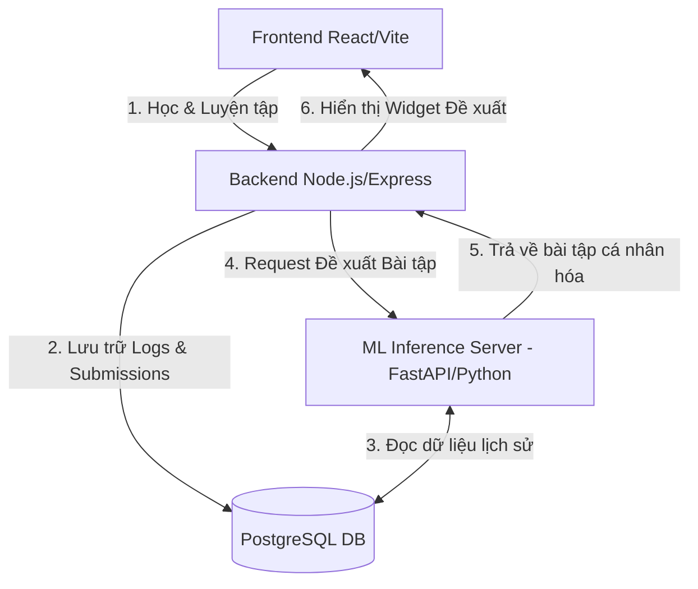

# ĐỀ XUẤT ĐỀ TÀI TỐT NGHIỆP: HỆ THỐNG HỌC TẬP THÍCH NGHI & CÁ NHÂN HÓA LỘ TRÌNH CHO NGƯỜI HỌC LẬP TRÌNH (VIBECODE AI)

Ý tưởng này được thiết kế để mở rộng nền tảng học và luyện tập lập trình MCODE/Vibecode hiện tại thành một hệ thống thông minh, có khả năng thấu hiểu hành vi của học viên và tự động điều chỉnh lộ trình hoặc đề xuất bài tập phù hợp nhằm tối ưu hóa hiệu quả học tập.

---

## 1. Thông tin chung về Đề tài

* **Các phương án Tên đề tài gợi ý (Bắt đầu bằng cụm từ "Xây dựng"):**
  * **Phương án 1: Khung mô hình PAL-Net (Programming Adaptive Learning Network)**
    * *Tiếng Việt*: **"Xây dựng hệ thống học tập lập trình trực tuyến thích ứng dựa trên khung mô hình PAL-Net"**
    * *Tiếng Anh*: **"Building an Adaptive Online Programming Learning System Based on the PAL-Net Framework"**
    * *Đặc trưng độc lập*: **PAL-Net** là sự kết hợp của mạng Neural lọc cộng tác (NCF) và phân nhóm hành vi, tạo ra một kiến trúc mạng riêng chuyên dùng cho giáo dục lập trình thích nghi.
  * **Phương án 2: Khung mô hình CodeFit (Code Performance and Adaptivity Fit Framework)**
    * *Tiếng Việt*: **"Xây dựng hệ thống đề xuất bài tập lập trình thông minh dựa trên khung mô hình CodeFit tích hợp đánh giá chất lượng mã nguồn"**
    * *Tiếng Anh*: **"Building a Smart Programming Exercise Recommendation System Based on the CodeFit Framework with Code Quality Evaluation"**
    * *Đặc trưng độc lập*: **CodeFit** tập trung vào sự "vừa vặn" (Fit) của bài tập với học viên, không chỉ dựa trên việc đúng/sai mà dựa trên chỉ số "Algorithm Efficiency" (độ tối ưu thời gian/không gian của code) để đề xuất bài tiếp theo.
  * **Phương án 3: Khung mô hình CogProg-Rec (Cognitive Programming Recommendation Engine)**
    * *Tiếng Việt*: **"Xây dựng hệ thống khuyến nghị lộ trình học lập trình cá nhân hóa sử dụng mô hình định vị nhận thức CogProg-Rec"**
    * *Tiếng Anh*: **"Building a Personalized Programming Path Recommendation System Using the CogProg-Rec Cognitive Student Modeling"**
    * *Đặc trưng độc lập*: **CogProg-Rec** là công cụ định hình khả năng nhận thức (cognitive level) của người học thông qua lịch sử tương tác chuỗi, từ đó tự động tối ưu hóa lộ trình từng bước một.
* **Tính thực tiễn (Practicality)**: Tận dụng trực tiếp dữ liệu nộp bài (submissions), mã nguồn, và thời gian chạy (runtime) thực tế của sandbox để phân tích.
* **Tính mới (Novelty)**: Đề xuất một mô hình/khung giải pháp tự đặt tên mang tính thương hiệu khoa học riêng biệt (PAL-Net, CodeFit, hoặc CogProg-Rec) thay vì chỉ sử dụng lại các thuật toán thô có sẵn.

---

## 2. Nguồn dữ liệu hiện có trong Hệ thống

Hệ thống Vibecode hiện tại đã sở hữu các trường dữ liệu quan trọng để huấn luyện mô hình Machine Learning:

| Trường Dữ liệu | Mô tả | Ý nghĩa đối với mô hình Học Máy (ML Feature) |
| :--- | :--- | :--- |
| **Lịch sử Nộp bài (Submission)** | Lưu trữ trạng thái `PASSED` / `FAILED` cho từng bài tập. | Đo mức độ hiểu bài và khả năng giải quyết vấn đề của học viên. |
| **Thời gian chạy (Runtime Ms)** | Thời gian chạy thực tế của code (O(N) vs O(N^2)). | Đánh giá trình độ tư duy tối ưu hóa thuật toán (Beginner vs Optimizer). |
| **Số lần nộp bài (Attempts)** | Số lần submit lại cho một bài toán cụ thể. | Thể hiện mức độ kiên trì và độ khó thực tế của bài tập đối với user đó. |
| **Ngôn ngữ Lập trình** | Lựa chọn Python, JavaScript, C++, C. | Nhận diện thói quen công nghệ và sở thích ngôn ngữ của người học. |
| **Thẻ chuyên đề (Tags)** | Array, Hash Table, String, Math,... | Xác định điểm mạnh/yếu của học viên đối với từng mảng kiến thức. |
| **Lịch trình học (Timeline)** | Khoảng cách thời gian giữa các phiên đăng nhập. | Đánh giá tần suất, thói quen và chu kỳ duy trì việc học của học viên. |

---

## 3. Kiến trúc Mô hình AI/ML Đề xuất (3 Tầng)

Để có một đề tài tốt nghiệp đạt điểm cao, hệ thống ML nên được chia làm 3 tầng xử lý từ dễ đến khó:

### Tầng 1: Phân nhóm Học viên (User Profiling & Clustering)
* **Thuật toán đề xuất**: K-Means Clustering hoặc DBSCAN.
* **Mục tiêu**: Nhóm các học viên có chung hành vi học tập thành các nhóm cụ thể (Profiles).
* **Các nhóm học viên dự kiến**:
  * *Nhóm 1: "Nguyên mẫu Optimizer"* - Thường xuyên tìm cách viết mã nguồn có thời gian chạy tối ưu, beats cao, ít lỗi cú pháp.
  * *Nhóm 2: "Người học Kiên trì"* - Số lần nộp bài thất bại (FAILED) cao nhưng vẫn tiếp tục thử lại cho đến khi pass.
  * *Nhóm 3: "Người học vội vã (Rusher)"* - Hay bị lỗi cú pháp hoặc runtime error do không test kỹ trước khi nộp.
  * *Nhóm 4: "Người học gặp khó khăn (Stuck)"* - Dễ dàng bỏ cuộc sau 1-2 lần submit lỗi trên các bài khó.

### Tầng 2: Mô hình Khuyến nghị Bài tập (Adaptive Recommendation System)
* **Thuật toán đề xuất**: Collaborative Filtering (Lọc cộng tác dựa trên ma trận User-Item), Matrix Factorization (như SVD) hoặc Neural Collaborative Filtering (NCF).
* **Mục tiêu**: Dự đoán xem học viên $U$ có khả năng giải được bài tập $P$ với độ khó thế nào trong lần thử đầu tiên.
* **Cơ chế gợi ý**:
  * Thay vì giới thiệu bài tập theo một danh sách cố định, hệ thống sẽ đề xuất các bài tập nằm trong "Vùng phát triển gần nhất" (Zone of Proximal Development - ZPD) — bài tập không quá dễ gây nhàm chán, và không quá khó gây nản lòng.

### Tầng 3: Đề xuất Lộ trình học (Path Generation & Content-Based Rules)
* **Mục tiêu**: Khi phát hiện học viên yếu ở một chủ đề (ví dụ: liên tục FAILED ở các bài tập về `Hash Table` nhưng PASS bài `Array`), hệ thống sẽ tự động chèn thêm các bài tập lý thuyết/thực hành cơ bản về `Hash Table` vào lộ trình tiếp theo của học viên đó trước khi cho phép tiếp cận các bài toán nâng cao hơn.

---

## 4. Kiến trúc Tích hợp Hệ thống (System Architecture)

Để đảm bảo dự án hoạt động mượt mà và không làm ảnh hưởng đến backend TypeScript/Node.js hiện tại, kiến trúc microservices được đề xuất:

* **ML Inference Server (Python)**: Xây dựng bằng **FastAPI** để tận dụng hệ sinh thái phong phú của Python (`scikit-learn`, `pandas`, `numpy`, `PyTorch`/`TensorFlow` nếu có).
* **Đồng bộ hóa**: Định kỳ hàng giờ/hàng ngày, một cronjob sẽ chạy để cập nhật trọng số và huấn luyện lại mô hình (retrain) dựa trên các bản ghi mới trong database.

---

## 5. Giá trị Học thuật & Khoa học cho Báo cáo Tốt nghiệp

Khi bảo vệ trước hội đồng khoa học, đề tài này sẽ được đánh giá cao nhờ các luận điểm sau:
1. **Giải quyết bài toán Dropout**: Tỷ lệ học viên bỏ cuộc khi học lập trình online rất cao. Hệ thống thích ứng giúp duy trì động lực bằng cách đưa ra thử thách phù hợp.
2. **Kiểm chứng thực nghiệm (Evaluation Metrics)**:
   * Đo lường độ chính xác của hệ thống đề xuất bằng các chỉ số ML tiêu chuẩn: **RMSE**, **MAE**, hoặc **Precision@K**.
   * So sánh sự tiến bộ của nhóm sinh viên được gợi ý bài tập thông minh (A/B testing) so với nhóm học theo lộ trình tuyến tính thông thường.
3. **Khả năng mở rộng**: Mô hình dễ dàng áp dụng sang các môn học khác không chỉ giới hạn ở lập trình.
